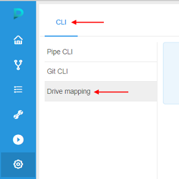

# Mount Cloud Data Storage to the local workstation

### Introduction

Cloud Pipeline platform allows to mount data storages, located in the Cloud, to the local workstation as a network drive.
This provides an easy way to manage files, that shall be processed in the Cloud or downloaded locally.

· Authenticate within Cloud Pipeline platform and obtain mapping token

· Map network drive to the Windows workstation

~~~
Please consider the following limitations and prerequisites to map a network drive:

1. Network drive mapping is only supported for Windows workstations
2. Internet Explorer 11 shall be used for Authentication section of this manual Once authentication is done - Chrome or other web-browser can be used to further work
3. Only NFS data storages (e.g. EFS/NFS/SMB) can be mapped to the local workstation. S3/AZ/GCP storages are not supported
4. The following limits are applied to the data transfer:
    1. Max 500 Mb per file
    2. Max transfer duration: 30 min
5. The following requirements shall be met for the user account:
    1. User shall be granted write permissions to any of the NFS data storages
~~~

# Authenticate within Cloud Pipeline platform and obtain mapping token

1. Open Internet Explorer web-browser 
2. Navigate to the Cloud Pipeline GUI https://<cloud pipeline adress>/pipeline/
3. Click "Settings" button in the left menu 
4. Navigate to the CLI tab and select Drive mapping section in the left menu

   
5. Authentication prompt will be shown

   
6. Click Authenticate button
7. If authentication succeeds you will see a popup window with a link to map a network drive Copy the URL shown in the popup, it will be used in the workstation configuration section

   

# Map network drive to the Windows workstation

1. Open This PC (My Computer) view
2. Click Map network drive button

   
3. A Map Network Drive dialog will be shown
    1. Select a Drive letter (it will be used to address a drive, e.g. Z:\) or keep the default value for the Drive: field
    2. Paste a mapping URL (obtained from the Cloud Pipeline authentication dialog) into Folder: field
    3. Tick Reconnect at logon checkbox
    4. Click Finish button
    
        
4. Drive will be mapped and opened. Further you can address it using a drive letter set at step.3 (e.g. Z:\)
    
    