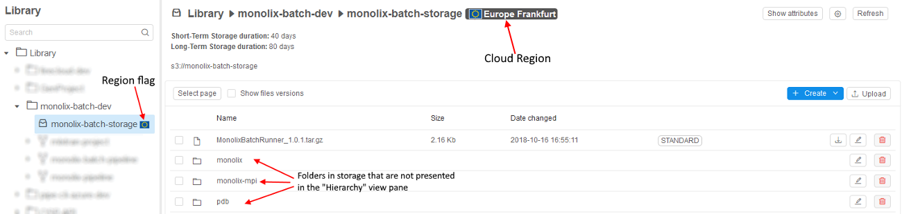
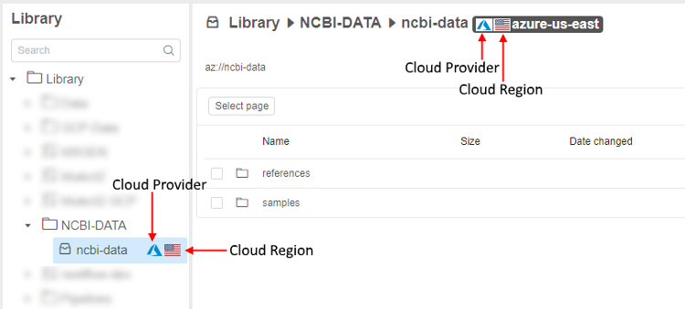
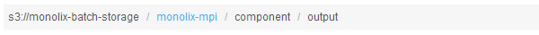
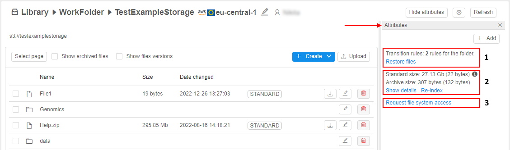
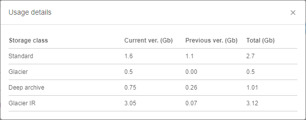
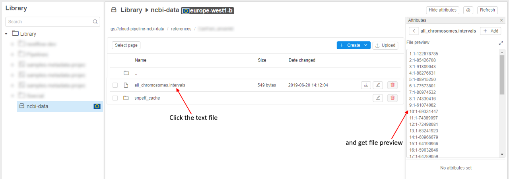

# 8. Manage Data Storage

**Data storage** is a Cloud Pipeline object that represents cloud storage and its content in a folder hierarchy.

- [Controls](#controls)
    - [Select page](#select-page)
    - [Show file versions](#show-file-versions)
    - [Remove all selected](#remove-all-selected)
    - [Generate URL](#generate-url)
    - [Show attributes/Hide attributes](#show-attributeshide-attributes)
    - ["Gear" icon](#gear-icon)
    - [Refresh](#refresh)
    - [+ Create](#create)
    - [Upload](#upload)
    - [Each-line controls](#each-line-controls)
- [Additional info and options](#additional-info-and-options)
- [View and edit a text file](#view-and-edit-a-text-file)
- [CLI Storage options](#cli-storage-options)

> Permissions management for a storage is described [here](../13_Permissions/13._Permissions.md).

**"Details view"** lists content of the storage: files that may be organized into folders. Clicking on the inside folder will open its content in the **"Details view"**.  
**_Note_**: storage's folders hierarchy will not be represented in the **"Hierarchy view"** panel.  
**_Note_**: you can move **Storage** to a new parent folder using drag and drop approach.

In **"Library tree view"** and **"Details view"** data storages are tagged with region flag to visually distinguish storage locations.  

> **_Note_**: if a specific platform deployment has a number of Cloud Providers registered (e.g. `AWS`+`Azure`, `GCP`+`Azure`) - in that case auxiliary Cloud Provider icons are additionally displayed, e.g.:  
> 

**Figure 1**  

Another option for navigation in the storage is to use ["breadcrumbs"](https://en.wikipedia.org/wiki/Breadcrumb_(navigation)) control at the top of the **"Details"** view (see picture above, **1**):

- Clicking an item will navigate to that folder.  
    
- Editing a path will allow to copy/paste a path and navigate to any custom location.  
    

## Controls

At the top of the **"Details"** view there are buttons:

### Select page

Clicking this control (see picture **Figure 1** above, item **2**), the whole file and folders on the current page will be selected. It allows to perform bulk operations like deleting.

### Show file versions

> This feature is available not for all Cloud Providers. Currently, it is supported by **AWS** and **GCP**.

Tick this checkbox (see picture **Figure 1** above, item **3**) and the view of a page will changed: the all file versions will be displayed. You can expand each version's list by clicking "**+**" in desired line.  
**_Note_**: the last version will be marked by "**(latest)**".

### Remove all selected

This is a bulk operation control. It is visible, if at least one of the data storage item (folder or file) is selected.  

### Generate URL

This control helps to generate URLs for a number of files and then download them manually one by one or via scripts. See details [here](8.2._Upload_Download_data.md).  
**_Note_**: the control is available, if only files are selected.

### Show attributes/Hide attributes

Allows see or edit a list of **key=value** attributes of the data storage (see picture **Figure 1** above, item **4**).  
**_Note_**: If selected storage has any defined attribute, **Attributes** pane is shown by default. See [17. CP objects tagging by additional attributes](../17_Tagging_by_attributes/17._CP_objects_tagging_by_additional_attributes.md).

Also, in the **Attributes** panel, there are additional options and info about the storage can be found - see details [below](#additional-info-and-options).

### "Gear" icon

Allows to edit the path, alias, description of the storage, manage its STS and LTS durations and enable versions control (see picture **Figure 1** above, item **5**). The delete option is also here (if storage contains only metadata, it will be deleted anyway). See [8.1. Create and edit storage](8.1._Create_and_edit_storage.md).

### Refresh

Allows updating representation of storage's contents (see picture **Figure 1** above, item **6**).

### + Create

You can also create new folders and files via this button (see picture **Figure 1** above, item **7**). See [8.3. Create and Edit text files](8.3._Create_and_Edit_text_files.md).

### Upload

This control allows uploading files to the storage (see picture **Figure 1** above, item **8**). See [8.2. Upload/Download data](8.2._Upload_Download_data.md).

### Each-line controls

| Control  | Description |
|---|---|
| **Download** | This control calls downloading of selected file. |
| **Edit** | Helps to rename a file or a folder. |
| **Delete** | Delete a file or a folder. |

## Additional info and options

You can view additional info about the storage and use the special abilities from the **Attributes** panel:  
    

Here, the following blocks are displayed:

- **1** - info block showing the number of [transition rules](8.10._Storage_lifecycle.md#create-transition-rule), configured for the current folder. These rules allow to configure the automatic data transition from standard storage to different types of archival storages by occurrence of a certain event and restore that data back as well if needed. See section [Storage lifecycle management](8.10._Storage_lifecycle.md) for details about transition rules and files restoring.
- **2** - info block with the size of different storage tiers:
    - _Standard_ size - summary size of all files of standard type in the storage. First number shows sum of all current and previous files versions. A number in the parenthesis shows summary size of previous files versions only.
    - _Archive_ size - summary size of all files of archived types in the storage. First number shows sum of all current and previous files versions. A number in the parenthesis shows summary size of previous files versions only. See details [here](8.10._Storage_lifecycle.md#view-archive-size).
    - **Show details** hyperlink - to view details about size of different storage tiers
    - **Re-index** hyperlink - to recalculate sizes of storage tiers - as tiers info can not be updated immediately during the changes, user can use this hyperlink for forcible recalculation of the storage volume
- **3** - the hyperlink to request a file system access to the current storage

Example of the storage details pop-up (appears by click the **Show details** hyperlink):  
      
Where:

- each row shows the volume of the specific storage tier
- columns:
    - **Storage class** - type of a storage tier. It can be standard or one of archive types. The type is presented in the table only if there are/were any versions of files of this storage type
    - **Current ver.** - the whole summary size in GB of all current versions of files of the specific type
    - **Previous ver.** - the whole summary size in GB of all previous versions of files of the specific type
    - **Total** - sum volume in GB of the current and previous files versions

For more details about versioning in storages see the corresponding [section](8.4._Control_File_versions.md).

## View and edit a text file

You can view and edit text files. For more details see [here](8.3._Create_and_Edit_text_files.md).  

## CLI Storage options

There are also several options that are only implemented in CLI but not in GUI:

- To move files and folders from one storage to another or between local file system and storage.
- To copy files from one storage to another.

See [here](../14_CLI/14.3._Manage_Storage_via_CLI.md) for more details.