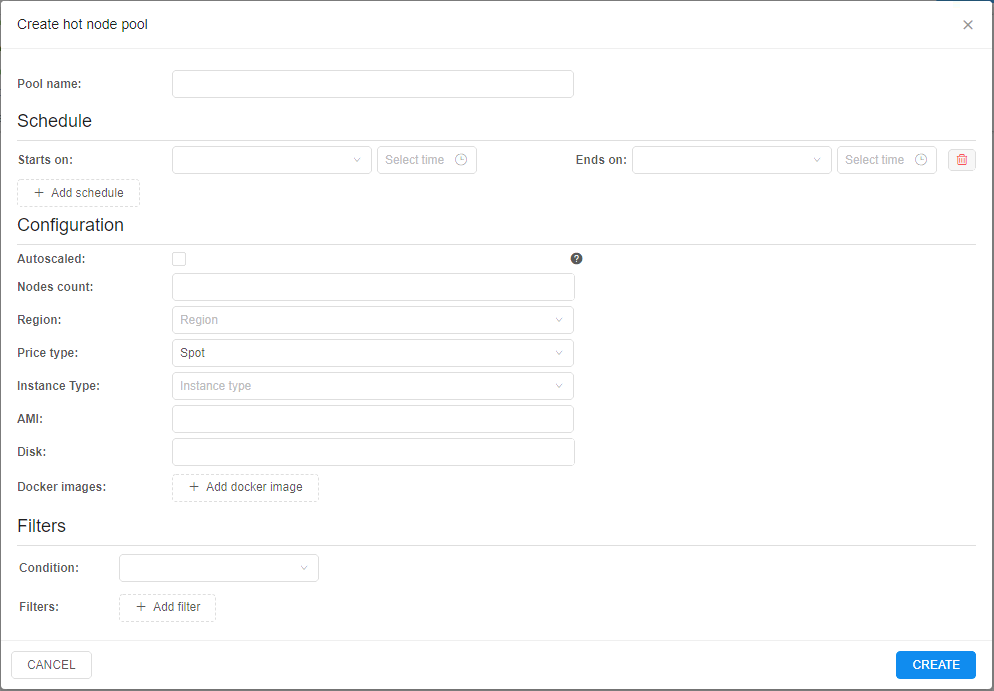
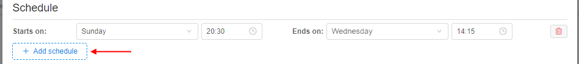
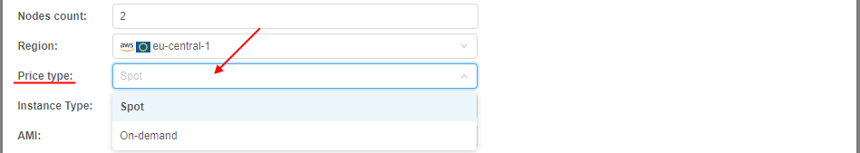
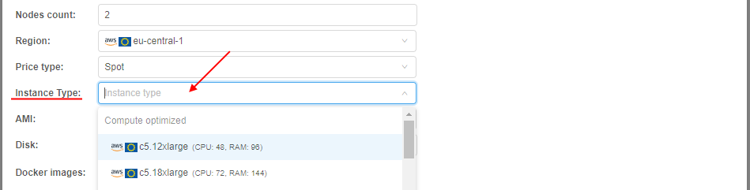
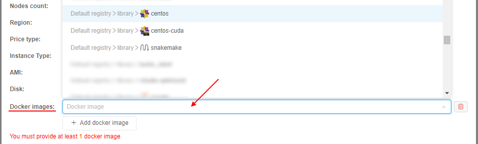
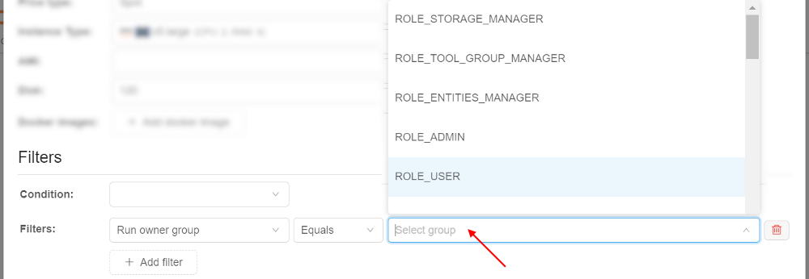
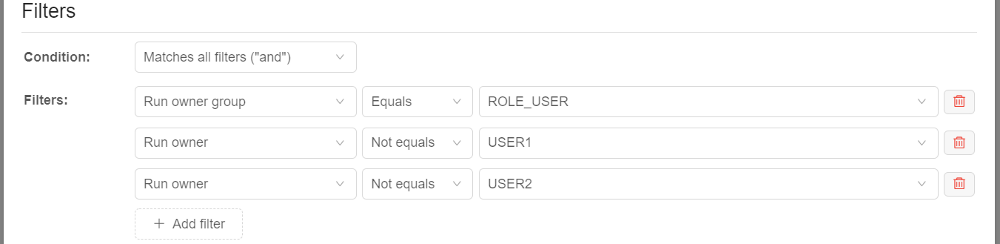

# 9.1. Hot node pools

- [Overview](#overview)
- [Node pools management](#node-pools-management)
    - [Pool creation](#pool-creation)
    - [View existing pools](#view-existing-pools)
    - [Edit existing pool](#edit-existing-pool)
- [Example of using](#example-of-using)

For some jobs, a waiting for a node launch can be too long. It is convenient to have some scope of the running nodes in the background that will be always or on schedule be available.

**Cloud Pipeline** allows controlling the number of persistent compute nodes in the cluster - i.e. a certain number (**`cluster.min.size`**) of the nodes of a specified size (**`cluster.instance.type`**/**`cluster.instance.hdd`**) will be always available in the cluster (even if there is no workload) - see details about System Preferences could be applied for the cluster [here](../12_Manage_Settings/12.10._Manage_system-level_settings.md#cluster).  
This is useful to speed up the compute instances creation process (as the nodes are already up and running).  
But this mechanism can be expanded and be a bit more flexible by another platform ability - it is the ability to create "**_hot node pools_**".

## Overview

Admin can create node pools:

- each pool contains _one or several identical nodes_ - admin specifies the node configuration (instance type, disk, Cloud Region, etc.) and a corresponding number of such nodes
- each pool has _the schedule of these nodes creation/termination_. E.g. the majority of the new compute jobs are started during the workday, so no need to keep these persistent instances over the weekends. For the pool, several schedules can be specified
- for each pool can be configured additional filters - to restrict its usage by the specific users/groups or for the specific pipelines/tools etc.

When the pool is created, corresponding nodes are being up (_according to pool's schedule(s)_) and waiting in background. If the user starts a job in this time and the instance requested for a job matches to the pool's node - such running node from the pool is automatically being assigned to the job.

**_Note_**: pools management is available only for admins. Usage of pool nodes is available for any user.

## Node pools management

For the node pools management a new tab is implemented in the **Cluster State** section - **HOT NODE POOLS** tab:  
    

### Pool creation

To create a new pool:

1. At the **HOT NODE POOLS** tab, click the "**+ Create**" button.
2. The pop-up appears:  
    
3. Specify the pool name
4. Specify the pool schedule - weekly time period during which the pool nodes will be up (running and waiting for the jobs):
    - specify the day of the week and the time of the day for the _beginning_ of the period, e.g.:  
        
    - specify the day of the week and the time of the day for the _finish_ of the period, e.g.:  
        
    - if you wish, you can add several schedule periods for the pool. For that, click the "**+ Add schedule**" button and repeats actions described above for a new period:  
        
    - remove the unnecessary schedule you can by the corresponding button  next to the schedule  
    **_Note_**: the pool shall have at least one schedule
5. Specify the pool nodes count, e.g.:  
      
    It is the number of nodes in the creating pool (nodes count that will be run according to the schedule and wait for jobs)
6. Specify the **Cloud Provider**/**Region** from where the pool nodes will be run:  
    
7. Specify the price type for the pool nodes (_Spot_ by default):  
    
8. Specify the instance type that will be used for the pool nodes:  
    
9. If you wish, you may specify the **AMI** that will be used for the pool nodes. It is non-required. Without specifying - the default deployment **AMI** will be used.
10. Specify the disk size (in `Gb`) for the pool nodes, e.g.:  
      
    **_Note_**: the pool node will be assign to the job only if user request for a job a smaller disk than pool node has. Also note that the _real_ disk size used for a job differs upwards from the user request - both these notes should be considered. E.g. if user requests 30 GB disk, _real_ node disk may be 40 GB. Then if the pool node has disk setting 35 GB - it will not be assigned to the user job (as the _real_ disk size 40 GB is more than the pool node disk size 35 GB). But if the pool node has disk setting 45 GB - it **will be** assigned normally to the user job. So, the pool disk should be set with a margin - of course, if the admin knows the disk size usually requested by the user.  
    On the other hand, the pool node disk size can be purposely set as a large volume. In that case, it would be inefficient to use such pool nodes for user "small" requests. For resolve that issue, the certain system preference is implemented - **`cluster.reassign.disk.delta`** - this delta sets the **max** possible difference that could be between the pool node disk size and the _real_ disk size requested by the user for a job. E.g. if the _real_ disk size requested by the user is 100 GB, the pool node has disk setting 500 GB and **`cluster.reassign.disk.delta`** is set 300 GB - the pool node will not be assigned to the such user requested job (as the difference is more than delta). But if the _real_ disk size requested by the user is 250 GB - the pool node **will be** assigned to the such requested job.
11. Specify Docker image(s) that should be pre-uploaded to the pool nodes:
    - click the "**+ Add docker image**" button:  
        
    - select the image in the appeared dropdown list, e.g.:  
        
    - select the image version in the appeared additional dropdown list:
        
    - you may add several images analogically as described above  
    **_Note_**: at least one Docker image shall be added. Select of these images means that they will be pre-uploaded to the pool nodes. But such nodes also can be assigned to other jobs (with non-selected images) if other pool settings match the user request. In this case necessary requested image will be uploaded during the job initialization (so, it will just take longer).
12. If you wish you can set additional filters for the pool usage. They can be customized at the **Filters** panel:  
      
    **Condition** field allows to set which condition will use for the set filters:  
          
    **Filters** section allows to add any count of additional filters for the created pool.  
    Click the button  to add a filter.  
    In the appeared field select a property that will be used for the filtering:  
          
    Possible properties:  
    - **Run owner** - allows to set user restrictions for the current pool usage
    - **Run owner group** - allows to set user group restrictions for the current pool usage
    - **Pipeline** - allows to set pipeline restrictions for the current pool usage
    - **Parameter** - allows to set parameter (and its value) restrictions for the current pool usage
    - **Run configuration** - allows to set detach configuration restrictions for the current pool usage
    - **Docker image** - allows to set docker image restrictions for the current pool usage  
    Set the desired property in the list, e.g.:  
          
    For the selected property set the condition:  
          
    For the selected property specify/select the value, e.g.:  
          
    You can select any count of properties in the same way as described above, e.g.:  
          
    In the example above, nodes from the pool will be assigned to the job only if it will be launched by any user (except _USER1_ and _USER2_) with the _ROLE\_USER_ role (of course, if other settings match).  
    To remove the filter use the corresponding button  in the filter row
13. To confirm the pool creation, click the **CREATE** button
14. Created pool will appear in the list:  
    

### View existing pools

At the **HOT NODE POOLS** tab, you can view all existing node pools, their schedules, settings, states.

Where:

- **a** - pool name
- **b** - pool nodes settings (instance type, price type, disk size)
- **c** - pool nodes **Cloud Provider** / **Region**
- **d** - the summary count of nodes in the pool
- **e** - the list of pre-uploaded docker images on the pool nodes
- **f** - the list of pool schedules
- **g** - the count of pool nodes assigned to jobs in the current moment or be assigned from the schedule period beginning
- **h** - the summary count of pool nodes running in the current moment (in background or assigned to jobs)
- **i** - controls to edit/remove the pool

To view the pool state, click it in the list, e.g.:  
    

The pool nodes list will appear:  
      
Nodes from the pool are marked by violet labels with the pool name.  
Pool nodes that are running in background but not assigned to jobs yet have _Run ID_ with format `P-<number>`.

### Edit existing pool

To edit the existing pool, click the corresponding button on its tile:  
    

The edit pop-up will be open:  
      
You can edit only pool name, pool schedules, pool nodes count and filters.

Make changes and click the **SAVE** button to confirm.

## Example of using

1. For example, there is the nodes pool that was created as described [above](#pool-creation):  
    
2. User launches the tool (in any time moment according to the schedule) with settings corresponding to pool nodes settings (same region, instance type, price type, smaller _real_ disk size and **in accordance with all configured filters**), e.g.:  
    
3. After the launch, the system checks if there are any empty nodes in the cluster. If not, then system checks are there any empty nodes in the "**hot node pools**" match the requested job - and uses such hot node pool if it matches:  
      
    So, the running node from the "hot node pool" is assigned to the job after just several seconds.  
    Please note, that the disk was changed according to the configured one for the pool node.
4. Click the **IP** hyperlink to open node info:  
    
5. At the node monitor page, you can see that it is the node from the pool:  
    
6. Open the **HOT NODE POOLS** tab of the **Cluster state** section:  
      
    See that the pool state is changed (one node from two is occupied).
