# Monitoring: core components

- [Core nodes](#core-nodes)
- [Core services](#core-services)
    - [Service details](#service-details)
    - [Service status](#service-status)
    - [Filters](#filters)

For the quick access to core nodes and services, a new tab was added to the **Cluster State** section - **CORE NODES** tab:  
   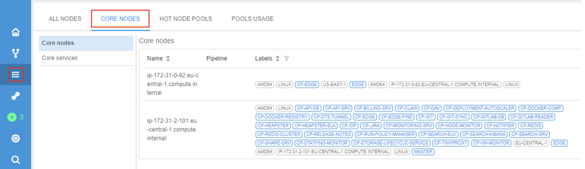

> To view **CORE NODES** tab you need to have the **ROLE\_ADMIN** role. For more information see [13. Permissions](../13_Permissions/13._Permissions.md).

This tab includes two subtabs:

- **Core nodes** - to view the list of all core nodes of the current platform deployment
- **Core services** - to view the list of all services on the core nodes and their state

## Core nodes

To view the list of platform core nodes:

1. Open the **Cluster State** section.
2. Navigate to the **CORE NODES** tab → **Core nodes** subtab:  
   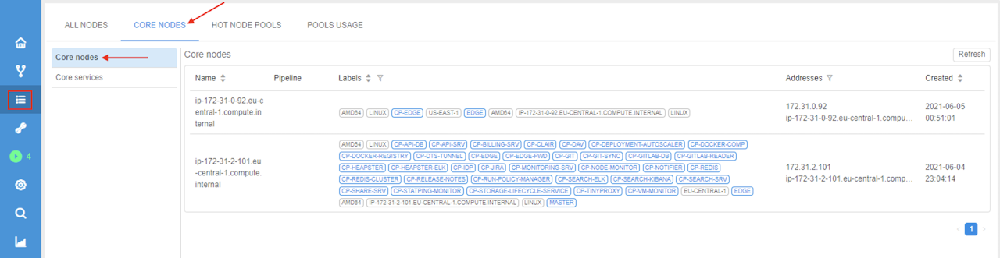

This subtab shows the table similar to the one for general active nodes (**ALL NODES** tab of the **Cluster State** section), but only for core nodes.

Displaying details:

- **Name** - name of the node
- **Pipeline** - currently assigned run on the node (usually not applicable)
- **Labels** - characteristics extracted from the parameters of the node.  
    There are common labels:  
    - node name
    - labels with details of compute instances used for nodes
    - labels of core services used by nodes
- **Addresses** - node addresses
- **Created** - date of the node creation

To get currently active nodes list, use the 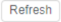 button in the right-upper corner of the nodes list.

To navigate to the detailed node information page, click its row in the table.

**Core nodes** table supports sorting by any of columns:

- _Name_
- _Labels_
- _Created_

To sort the table, click the sorting control near the column header.

**Core nodes** table supports filtering by any of columns:

- _Labels_
- _Addresses_

To filter the table:

1. Click the filter control near the column header:  
   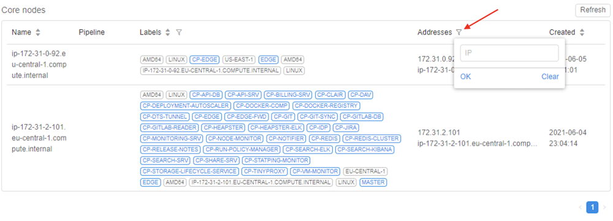
2. In the appeared filter, specify desired value and click the **OK** button, e.g.:  
   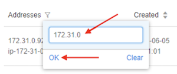
3. Table will be filtered:  
   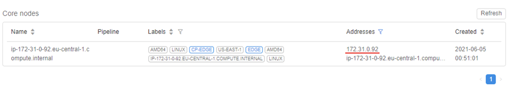

## Core services

To inspect the list of services of platform core nodes:

1. Open the **Cluster State** section.
2. Navigate to the **CORE NODES** tab → **Core services** subtab:  
   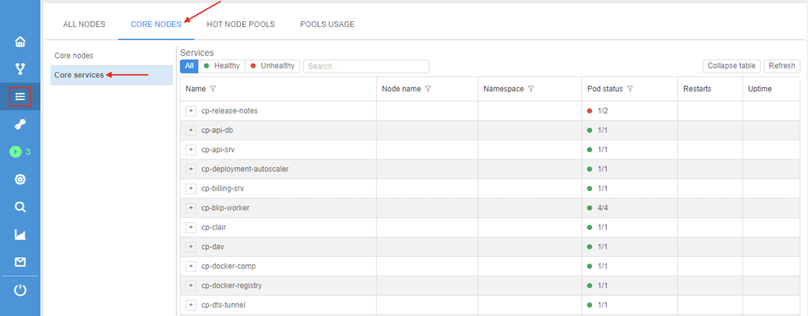

This subtab shows the list of services for core nodes.  
Each service presents an entity that can be expanded - via the plus button () near the service name.  

Inside the service entity, there is a list of service pods.  
Each pod entity can be expanded as well - via the plus button () near the pod name.

Inside the pod entity, there is a list of pod containers.

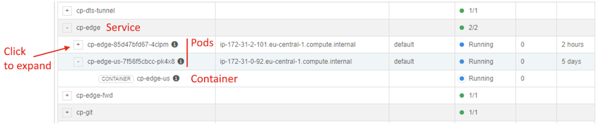

To collapse the entity, use the minus button () near the entity name.  
To collapse all expanded entities, use the corresponding button 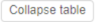 in the right-upper corner of the table.  
To get the current services list, use the  in the right-upper corner of the table.

Displaying details in the table:

- **Name** - name of the service/pod/container
- **Node name** - name of the pod's node
- **Namespace** - pod namespace
- **Pod status** - state of the service/pod/container
- **Restarts** - number of pod restarts
- **Uptime** - duration of the pod uptime

### Service details

You may view detailed info of a pod:

1. Expand the desired service.
2. Click the info icon near the pod name, e.g.:  
   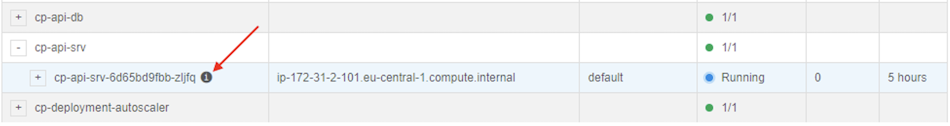
3. Pop-up with the pod info in JSON format will appear:  
   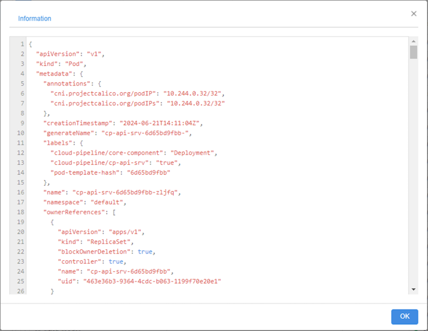
4. For some pods, that pop-up can include additional tab - **Events**, e.g.:  
   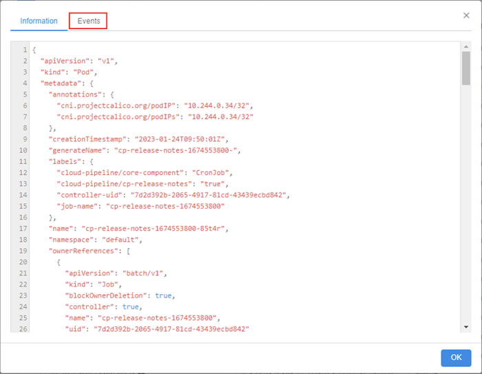
5. This tab includes pod events list, e.g.:  
   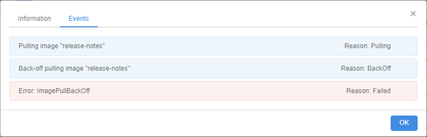

You may view logs of a container:

1. Expand the desired service.
2. Expand the pod.
3. Click the info icon near the container name, e.g.:  
   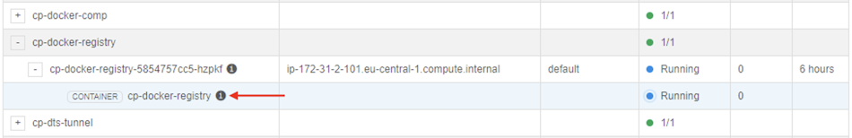
4. Pop-up with the container running logs will appear:  
   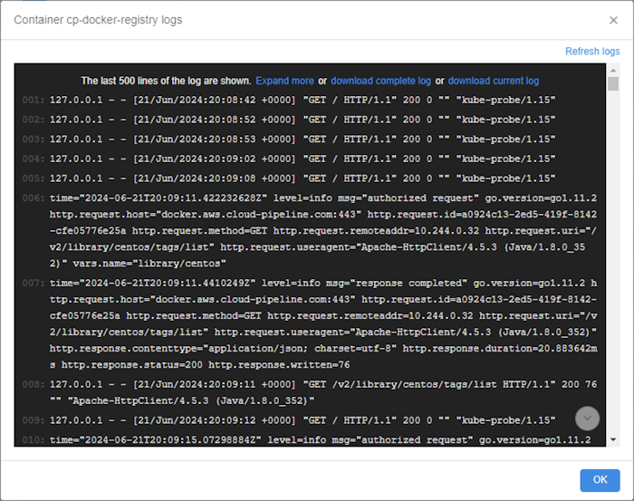
5. You may view/refresh such logs in the pop-up or download them to the local workstation via the corresponding buttons.

### Service status

Status shown in the **Pod status** column varies by the entity type.  
For _services_, status has the format **`[X]/[Y]`**, where:

- `[X]` - number of not-failed pods of the service. ***Note***: not-failed pods may be _running_, _succeeded_ or _pending_.
- `[Y]` - total number of the service pods

Additionally, there is a colorful icon that shows *service* status:

- **_Unhealthy_** services (i.e. services with at least one failed pod) has a red status circle
- **_Healthy_** services (i.e. services without failed pods) has a green status circle

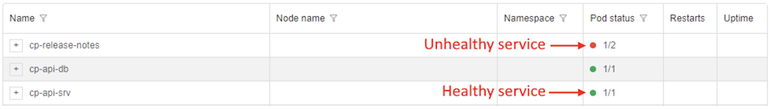

For _pods_, status may be one of the following:

- ***Pending***, status icon is orange
- ***Running***, status icon is blue
- ***Succeeded***, status icon is green
- ***Failed***, status icon is red

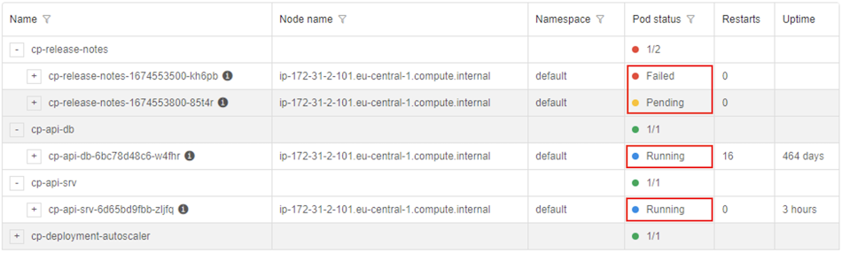

_Containers_ have statuses from the same categories as pods, with the corresponding icons. Name of these statuses may vary from the category names depending on the container state.

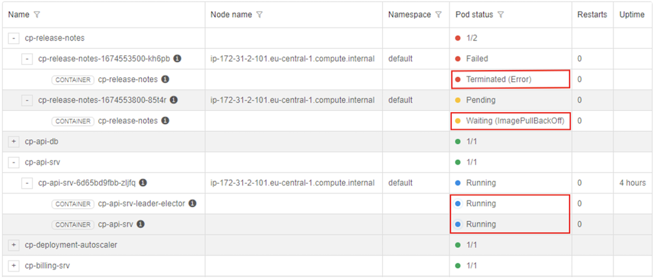

### Filters

There are several ways to filter core services:

- _Main filter_ - allows to show only **_healthy_** / **_unhealthy_** / **_all_** core services - this filter is located above the table and presents the corresponding control, e.g.:  
   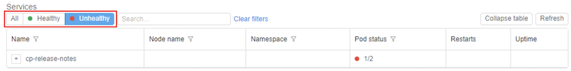

- _Column filter_ - allows to filter table by the specific value(s) in the desired column(s):
    - click the filter icon in the column header
    - specify/select the desired value in the filter field
    - table will be automatically filtered by the specified value, e.g.:  
    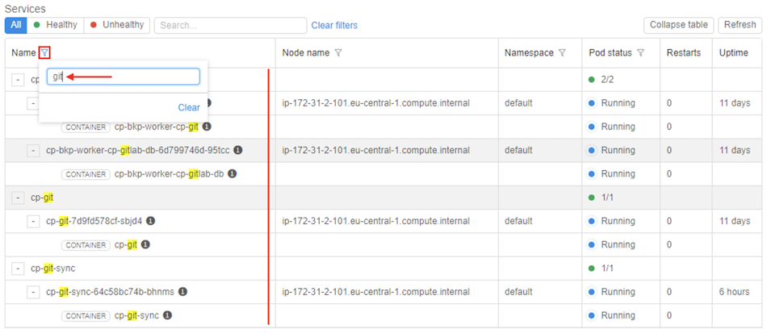

- _Search field_ - allows to perform the search over the whole services table, e.g.:  
   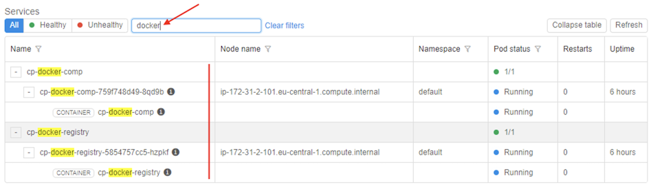

To reset all specified filters, click the button **Clear filters** in the top of the table.
