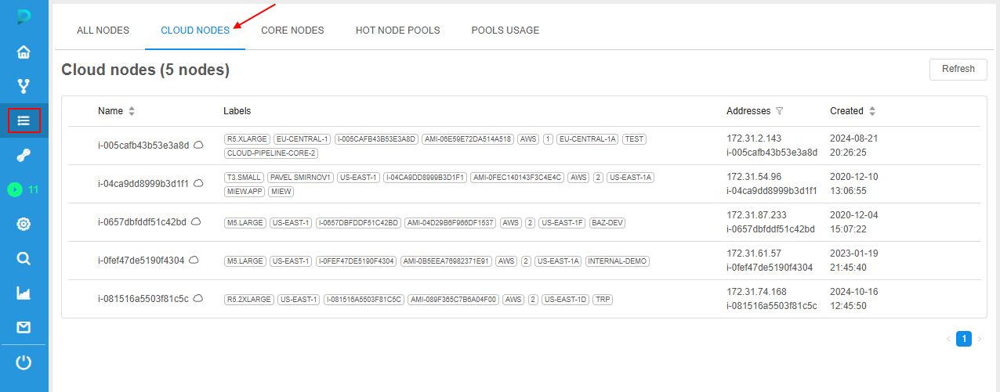
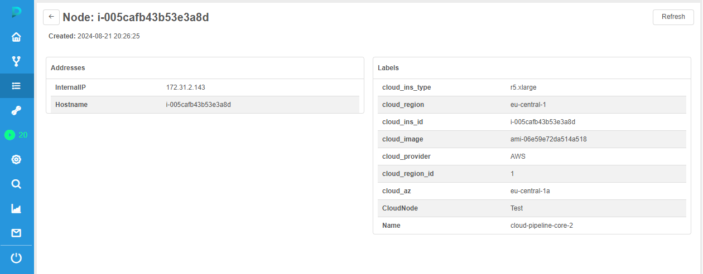
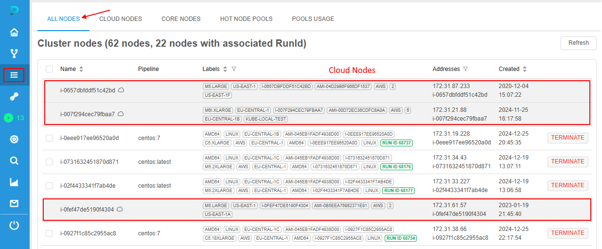
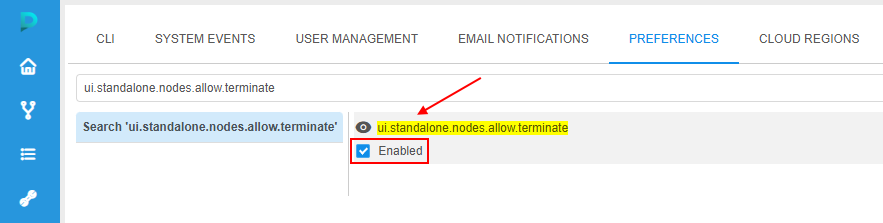
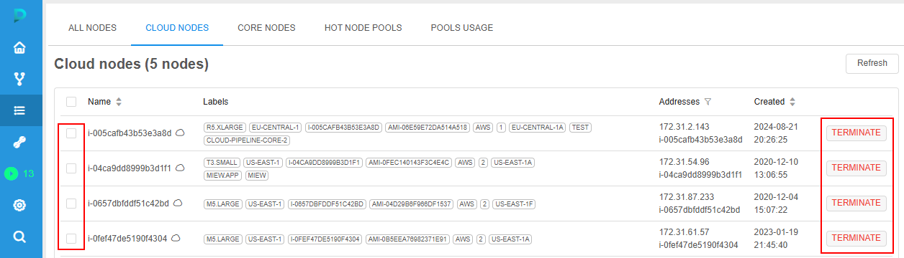
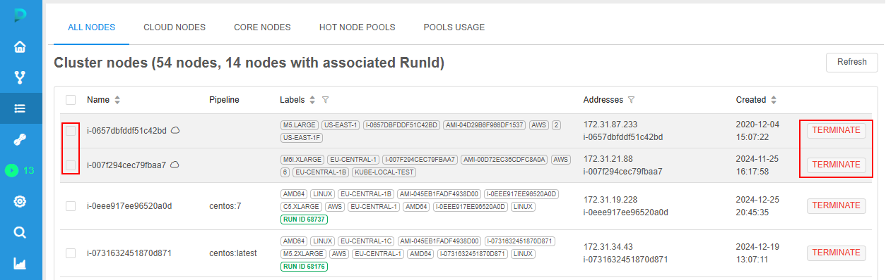

# 9.3. Cloud nodes

**Cloud Nodes** - instances in the Cloud that were launched via the Cloud-account of the Cloud Pipeline platform's deployment but not related to the platform directly.  
Most of these are different cloud instances for additional services.  
You can view Cloud Nodes using a separate tab on the **Cluster State** page - **Cloud Nodes** tab.

> To view **Cloud Nodes** tab you need to have the **ROLE\_ADMIN** role. For more information see [13. Permissions](../13_Permissions/13._Permissions.md).

Tab contains the list of Cloud Nodes with the following info:

- _Name_ - node name
- _Labels_ - list of metadata tag values associated with the node
- _Addresses_ - IP-address and ID of the node
- _Created_ - date and time of the node creation

Table data at this tab can be sorted and filtered - similar to the main [nodes table](9._Manage_Cluster_nodes.md#9-cluster-nodes).

To view node details, click the node row in the list. Node details page will be opened, e.g.:  
    

Details page contains two tables:

- _Addresses_ - IP-address and ID of the node
- _Labels_ - list of metadata tags associated with the node

Cloud Nodes are visible at the **All Nodes** tab of the **Cluster State** page as well:  
    

At this tab, Cloud Nodes are highlighted by grey and have additional cloud icon ().

## Cluster Node termination

By default, there is no ability to terminate Cloud Nodes from the UI - there are no corresponding buttons in their rows.  
But that behavior can be changed - via the special System Preference **`ui.standalone.nodes.allow.terminate`**.  
This preference allows to manage the availability of the Cluster Nodes termination. Default value of the preference - _disabled_.

To enable Cluster Nodes termination from UI, you shall:

1. Open System Preferences.
2. Find **`ui.standalone.nodes.allow.terminate`** preference and tick its checkbox:  
    
3. Save changes.
4. After, Cloud Nodes will become available for selection and termination:  
    
5. And at the **All Nodes** tab as well:  
    
