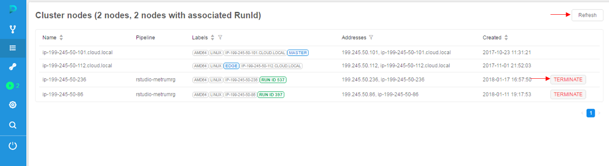
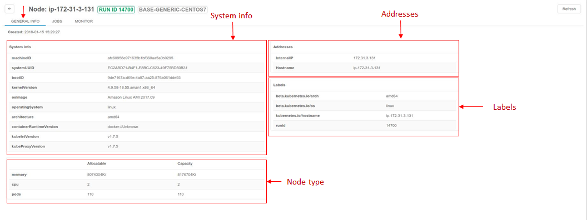
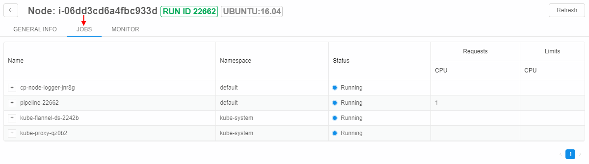
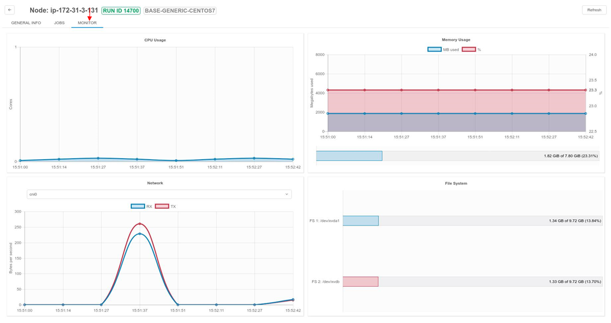

# 9. Manage Cluster nodes

"**Cluster nodes**" provides a list of working nodes. You can get information on nodes usage and terminate them in this tab.

- [Overview](#overview)
- [Controls](#controls)
- [Node information page](#node-information-page)
    - [GENERAL INFO](#general-info)
    - [JOBS](#jobs)
    - [MONITOR](#monitor)

**_Note_**:  Nodes remain for the time that is already paid for, even if all runs at the node finished execution. So if you restart pipeline, new nodes will not be initialized saving time and money.

## Overview

This tab shows **Active nodes** table that has information about:

- **Name** - a name of the node.
- **Pipeline** - a currently assigned run on the node.
- **Labels of the node** - characteristics extracted from the parameters of the node.  
    There are common labels: **RUN ID** - ID of currently assigned run, **MASTER/EDGE** - service labels, nodes with this labels may be viewed only by ADMIN users.
- **Addresses** - node addresses.
- **Created** - a date of creation.

## Controls

| Control | Description |
|---|---|
| **Terminate** | This control terminates node. |
| **Refresh** | To get currently active nodes list. |

## Node information page

Clicking on the row of the table will redirect you to detailed node information page. This page has three tabs.

### GENERAL INFO

This tab allows seeing general info about the node, including:

- **System information**;
- **Addresses** of internal network and domain name;
- **Labels** of the node automatically generated in accordance with system information;
- **Node type** - amounts of available and total memory, number of jobs and CPUs.

### JOBS

"JOBS" tab lists jobs being processed at the moment.

- **Name** of the job; clicking "**+**" icon next to the name expands a list of containers needed for the job.
- **Namespace** for a job to be executed at;
- **Status** of the job.

### MONITOR

"MONITOR" tab displays a dashboard with following diagrams:

| Diagram | Description |
|---|---|
| **CPU usage** | A diagram represents **CPU usage (cores) - time** graph. The graph is updated once in 15 seconds. |
| **Memory usage** | A diagram represents **memory usage - time** graph. The graph is updated once in 15 seconds. **Blue** graph represents usage in MB according to left vertical axis. **Red** graph represents usage in % of available amounts of memory according to right vertical axis. |
| **Network connection speed** | A diagram represents **connection speed (bytes) - time** graph. The graph is updated once in 15 seconds. **Blue** graph (**TX**) represents "transceiving" speed. **Red** graph (**RX**) represents "receive" speed. Drop-down at the top of the section allows changing connection protocol. |
| **File system load** | Represents all the disks of the machine and their loading. |

