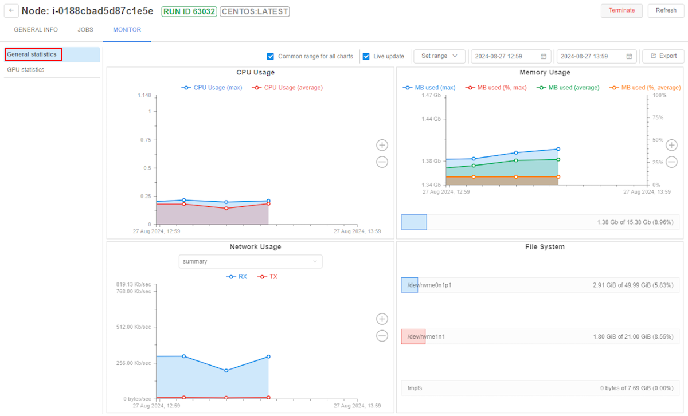

# 9. Manage Cluster nodes

"**Cluster nodes**" provides a list of working nodes. You can get information on nodes usage and terminate them in this tab.

- [Overview](#overview)
- [Controls](#controls)
- [Node information page](#node-information-page)
    - [GENERAL INFO](#general-info)
    - [JOBS](#jobs)
    - [MONITOR](#monitor)

**_Note_**:  Nodes remain for the time that is already paid for, even if all runs at the node finished execution. So if you restart pipeline, new nodes will not be initialized saving time and money.

## Overview

This tab shows **Active nodes** table that has information about:

- **Name** - a name of the node.
- **Pipeline** - a currently assigned run on the node.
- **Labels of the node** - characteristics extracted from the parameters of the node.  
    There are common labels: **RUN ID** - ID of currently assigned run, **MASTER/EDGE** - service labels, nodes with this labels may be viewed only by ADMIN users.
- **Addresses** - node addresses.
- **Created** - a date of creation.

## Controls

| Control | Description |
|---|---|
| **Terminate** | This control terminates node. |
| **Refresh** | To get currently active nodes list. |

> **_Note_**: You can also terminate a node via CLI. For more details see [here](../14_CLI/14.5._Manage_pipeline_executions_via_CLI.md#terminate-a-node).

## Node information page

> **_Note_**: You can also view node information via CLI. See [14.6. View cluster nodes via CLI](../14_CLI/14.6._View_cluster_nodes_via_CLI.md).

Clicking on the row of the table will redirect you to detailed node information page. This page has three tabs.

### GENERAL INFO

This tab allows seeing general info about the node, including:

- **System information**;
- **Addresses** of internal network and domain name;
- **Labels** of the node automatically generated in accordance with system information;
- **Node type** - amounts of available and total memory, number of jobs and CPUs.

### JOBS

"JOBS" tab lists jobs being processed at the moment.

- **Name** of the job; clicking "**+**" icon next to the name expands a list of containers needed for the job.
- **Namespace** for a job to be executed at;
- **Status** of the job.

### MONITOR

"MONITOR" tab displays a dashboard with following diagrams:

| Diagram | Description |
|---|---|
| **CPU usage** | A diagram represents **CPU usage (cores) - time** graph.|
| **Memory usage** | A diagram represents **memory usage - time** graph. The graph is updated once in 15 seconds. **Blue** graph represents usage in MB according to left vertical axis. **Red** graph represents usage in % of available amounts of memory according to right vertical axis. |
| **Network connection speed** | A diagram represents **connection speed (bytes) - time** graph. The graph is updated once in 15 seconds. **Blue** graph (**TX**) represents "transceiving" speed. **Red** graph (**RX**) represents "receive" speed. Drop-down at the top of the section allows changing connection protocol. |
| **File system load** | Represents all the disks of the machine and their loading. |

#### Filters

User can manage plots date configurations. For this purpose the system has number of filters:  

1. *Common range for all charts*  
    User can synchronize the time period for all charts. To do so user should mark the "Common range for all charts" filter.  
    If this filter is unmarked, user can zoom any plot without any change for others.
2. *Live update*  
    If this checkbox is marked the charts data will be updated every 5 seconds in a real-time manner. The fields with dates will be updated as well.
    This filter can be marked only in pair with *Common range for all charts* filter.  
    If both checkboxes were unmarked and user set *Live update* filter active, the system would mark both checkboxes.
3. *Set range*  
    User can select the predefined time range for all plots from the list:
    - Whole range
    - Last week
    - Last day
    - Last hour

    This filter works in pair with *Common range for all charts* filter. If user sets the date range, the system will mark *Common range for all charts* checkbox, if it wasn't. So the data in all charts will be filtered by the selected range.  
4. *Date filter*  
    User can specify the Start and the End dates for plots. The system will substitute the node creating date as the Start date and current date for the End date, if user doesn't select anything.  
    To change the Start or the End dates user should click on the date field. After that, the calendar will be displayed for the user. The dates before the node was created and the dates after today will be unavailable to selecting:  
    
    
    If user focuses on the calendar icon or the whole field at the Start or the End date fields the "Cross" button will be displayed.  
        
          
    After clicking on this button in the Start date field the node creating date will be substituted to the filter. If user does this operation with the End date, the date will be erased and the system will interpret it as the current date.

#### Zooming and scrolling features

In addition, user can scroll plots.  
To do so just focus on the plot, hold the left mouse button and move the mouse in the desired direction.
If *Common range for all charts* folter is on, all charts will be moving simultaneously.

Another feature is zooming charts.  
To zoom a chart hold the Shift button on the keyboard and scroll the plot via mouse. The area will be highlighted:  
  
Then release Shift button and the highlighted area will be zoomed.  
Another way of zooming plot - using the right panel. There are Plus and Minus buttons for such purpose on it:  
  
Just click on the needed button and the chart will be zoomed.