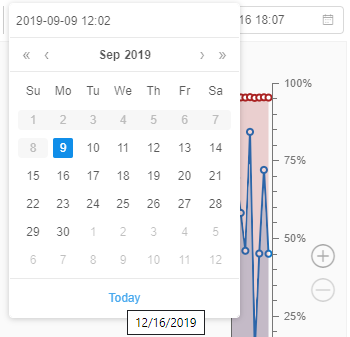
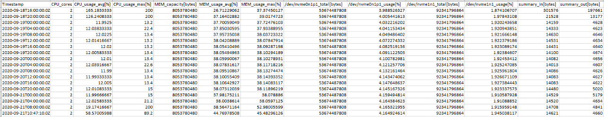

# 9. Manage Cluster nodes

"**Cluster nodes**" provides a list of working nodes. You can get information on nodes usage and terminate them in this tab.

- [Overview](#overview)
- [Controls](#controls)
- [Node information page](#node-information-page)
    - [GENERAL INFO](#general-info)
    - [JOBS](#jobs)
    - [MONITOR](#monitor)
        - [Filters](#filters)
        - [Zoom and scroll](#zooming-and-scrolling-features)
        - [Export data](#export-utilization-data)

**_Note_**:  Nodes remain for the time that is already paid for, even if all runs at the node finished execution. So if you restart pipeline, new nodes will not be initialized saving time and money.

## Overview

This tab shows **Active nodes** table that has information about:

- **Name** - a name of the node.
- **Pipeline** - a currently assigned run on the node.
- **Labels of the node** - characteristics extracted from the parameters of the node.  
    There are common labels: **RUN ID** - ID of currently assigned run, **MASTER/EDGE** - service labels, nodes with this labels may be viewed only by ADMIN users.
- **Addresses** - node addresses.
- **Created** - a date of creation.

## Controls

| Control | Description |
|---|---|
| **Terminate** | This control terminates node. |
| **Refresh** | To get currently active nodes list. |

> **_Note_**: You can also terminate a node via CLI. For more details see [here](../14_CLI/14.5._Manage_pipeline_executions_via_CLI.md#terminate-a-node).

## Node information page

> **_Note_**: You can also view node information via CLI. See [14.6. View cluster nodes via CLI](../14_CLI/14.6._View_cluster_nodes_via_CLI.md).

Clicking on the row of the table will redirect you to detailed node information page. This page has three tabs.

### GENERAL INFO

This tab allows seeing general info about the node, including:

- **System information**;
- **Addresses** of internal network and domain name;
- **Labels** of the node automatically generated in accordance with system information;
- **Node type** - amounts of available and total memory, number of jobs and CPUs.

### JOBS

"JOBS" tab lists jobs being processed at the moment.

- **Name** of the job; clicking "**+**" icon next to the name expands a list of containers needed for the job.
- **Namespace** for a job to be executed at;
- **Status** of the job;
- **Requests** and **Limits** of resources for the job.

### MONITOR

"MONITOR" tab displays a dashboard with following diagrams:

| Diagram | Description |
|---|---|
| **CPU usage** | A diagram represents **CPU usage (cores) - time** graph. The usage is displayed in fractions according to left vertical axis. There are two lines (data-series) - the first displays `max` value of the CPU usage in each moment and the second shows the `average` value of the usage during the time  |
| **Memory usage** | A diagram represents **memory usage - time** graph. One type of graph represents usage in MB according to left vertical axis (includes two lines - first shows the `max` value in each moment and another shows the `average` values during the time). Another type of graph represents usage in % of available amounts of memory according to right vertical axis (analogically, includes two lines - `max` and `average`). |
| **Network connection speed** | A diagram represents **connection speed (bytes) - time** graph. **Blue** graph (**TX**) represents "transceiving" speed. **Red** graph (**RX**) represents "receive" speed. Drop-down at the top of the section allows changing connection protocol. |
| **File system load** | Represents all the disks of the machine and their loading. |

The current state of the resources utilization is available for all active runs.  
The maximum storage period for this data is set by the system preference **`system.resource.monitoring.stats.retention.period`** (in days, by default - 5).  
So, any utilization data older than that period is unavailable for users (no matter the run duration).

The historical resources utilization is also available for completed runs (during the specified time storage period). It can be useful for debugging/optimization purposes.  
To view the monitor of resources utilization for the completed run:

1. Open the **COMPLETED RUNS** page. Click the run you wish to view the resources utilization data, e.g.:  
    
2. At the opened **Run logs** page expand the "Instance" section:  
      
    Click the node IP hyperlink.
3. The monitor of the node resources utilization will appear:  
    

> Please note, the resources utilization data for the completed run is available during **`system.resource.monitoring.stats.retention.period`** days.  
> If you'll try to view monitor of the completed run after the specified period is over - the monitor will be empty.

#### Filters

User can manage plots date configurations. For this purpose the system has number of filters:  

**Common range for all charts (1)**  
User can synchronize the time period for all charts. To do so user should mark this filter.  
If this filter is unmarked, user can zoom or scroll any plot without any change for others.

**Live update (2)**  
If this checkbox is marked the charts data will be updated every 5 seconds in a real-time manner. The fields with dates will be updated as well.  
This filter can be marked only in pair with the **Common range for all charts** filter.  
If both checkboxes were unmarked and user set the **Live update** filter active, the system would mark both checkboxes.

> This feature is available only for active runs.

**Set range (3)**  
User can select the predefined time range for all plots from the list:

- Whole range
- Last week
- Last day
- Last hour

This filter works in pair with the **Common range for all charts** filter. If user sets the date range, the system will mark the **Common range for all charts** checkbox, if it wasn't. So the data in all charts will be filtered by the selected range.

**Date filter (4)**  
User can specify the _Start_ and the _End_ dates for plots using this filter.  
By default, the _Start_ date (the left field of the filter) is the node creating datetime, the _End_ date (the right field of the filter) is the current datetime.  
To change the _Start_\/_End_ date the user should:

- click the corresponding date field, e.g.:  
    
- the calendar will be displayed:  
      
    The dates before the node creation and after today will be unavailable to select:  
    
- click the specific available date in the calendar. Selected date will appear in the date field. Charts will be automatically redrawn according to the new set period.

If the user focuses on the calendar icon or the whole field at any of date fields the "Cross" button will be displayed:  
      
      
If click this button in the _Start_ date field - the node creation date will be substituted into that filter.  
If click this button in the _End_ date field - the date in that field will be erased and the system will interpret it as the current datetime.

#### Zooming and scrolling features

In addition, user can _scroll_ plots.  
To do so:

- focus on the plot, hold the left mouse button and move the mouse in the desired direction (left or right)
- **_Note_**: if **Common range for all charts** filter is on, all charts will be moving simultaneously

Another feature is chart _zooming_.  
To zoom a chart:

- hold the Shift key and scroll the plot via mouse. The area will be highlighted:  
      
    Then release the Shift key and the highlighted area will be automatically zoomed.
- another way of zooming plot - using the right panel. There are **Plus** and **Minus** buttons for such purpose on it:  
      
    Click the desired button and the chart will be zoomed.

#### Export utilization data

Users have the ability to export the utilization information into a `.csv` file.  
This can be useful, if the user wants to keep locally the information for a longer period of time than defined by the preference **`system.resource.monitoring.stats.retention.period`**.

To export resources utilization data at the **Monitor** page of the node:

1. Hover over the **Export** button in the right upper corner of the page:  
    
2. In the appeared list (the list size depends on the run duration) select the interval of resources utilization statistics you wish to export, e.g.:  
    
3. The corresponding `.csv` file will be downloaded automatically. Example of such file:  
    
