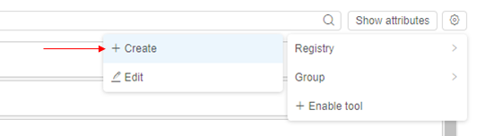
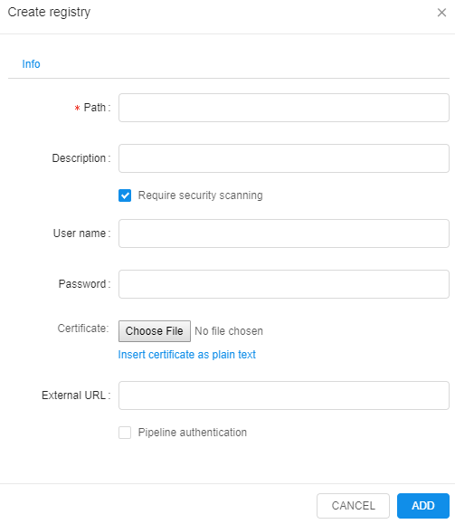
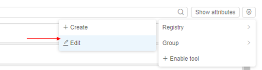
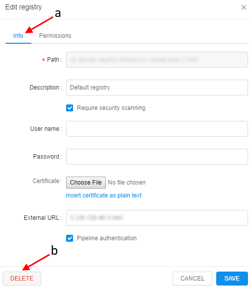

# 10.1. Add/Edit a Docker registry

- [Add registry](#add-registry)
- [Edit registry](#edit-registry)
    - [Customize registry permissions](#customize-registry-permissions)

A docker registry is a storage and content delivery system, holding named Docker images, available in different tagged versions. This page describes the process of adding and editing Docker registries to the **Cloud Pipeline**. Also here you will find information about permission management for Docker registries.

> Only administrators can create Docker registries. To edit its parameters you need to have **WRITE** permissions. For more information see [13. Permissions](../13_Permissions/13._Permissions.md).

## Add registry

Configured Docker registry can be added to the Cloud Pipeline with the following commands:

1. In the **Tools** tab click the **Gear** icon → **Registry** → **+ Create**.  
    
2. Then set the registry parameters:
    - **Path** (mandatory field) - IP address/domain name of the machine with configured Docker registry.
    - **Description** - registry description.
    - **Require security scanning** - tick the box to allow scheduled security scanning procedure for the Tools in the registry. For more information see [10.6. Tool security check](10.6._Tool_security_check.md).
    - **User name**\* and **Password**\* (optional field) - if the registry is closed, you have to set a username and a password.
    - **Certificate**\* - if Docker registry uses a self-signed certificate, upload it with the **Choose file** button to set HTTPS access to the registry.
    - **External URL**\* -  URL that can be exploited to push/pull Docker images to/from a registry.
    - **Pipeline authentication**\* - tick to make registry use Cloud Pipeline authentication system.

        \* _click Edit credentials to get these fields._

        

3. You'll see a new registry in the registry list.

## Edit registry

To edit/view registry attributes - see [17. CP objects tagging by additional attributes](../17_Tagging_by_attributes/17._CP_objects_tagging_by_additional_attributes.md).

1. Choose registry from the registry list and click the **Gear** icon → **Registry** → **Edit**.  
    
2. You'll be able to modify registry parameters in the **Info** tab (**a**).  
    **_Note_**: you can modify all registry parameters except **Path**.  
    
3. If you wish to detach registry from the CP - click the **Delete** button (**b**).

### Customize registry permissions

Users with **ROLE\_ADMIN** or **OWNER** rights can modify permissions for a registry. For detailed instruction refer to [this document](../13_Permissions/13._Permissions.md).