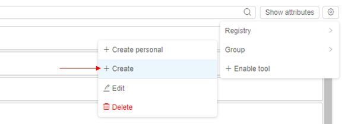
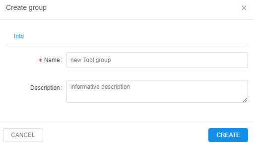
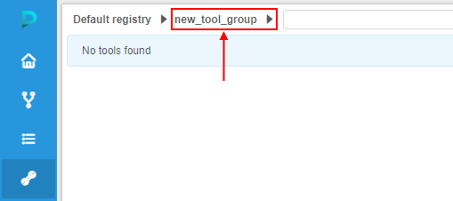
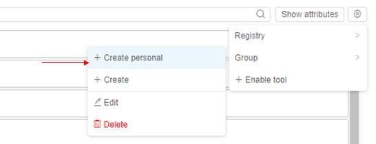
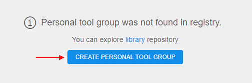
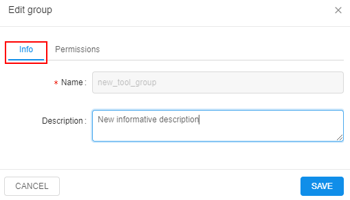

# 10.2. Add/Edit a Tool group

- [Add a generic Tool group](#add-a-generic-tool-group)
- [Add a personal Tool group](#add-a-personal-tool-group)
- [Edit a Tool group](#edit-a-tool-group)
    - [Customize Tool group permissions](#customize-tool-group-permissions)

A Tool group is an object of the Cloud Pipeline that allows to organize Tools into groups. This page describes the process of adding and editing Tool groups. Also here you will find information about permission management for Tool groups.

> To create a Tool group, user need to have **WRITE** permission for a Docker registry and the **ROLE\_TOOL\_GROUP\_MANAGER** role. To edit Tool group parameters you need to have **WRITE** permissions for it. For more information see [13. Permissions](../13_Permissions/13._Permissions.md).

## Add a generic Tool group

A Tool group can be added to a Docker registry in the following way:

1. In the **Tools** tab click the **Gear** icon → **Group → + Create**.  
    
2. Give your Tool group a **name** and an optional **description**.  
    
3. You'll be automatically redirected to the new Tool group in the current Docker registry.  
    

## Add a personal Tool group

1. In the **Tools** tab click the **Gear** icon → **Group → + Create personal**.  
    
2. Another way to do that is to select **personal** Tool group from the Tool group list  
      
    And then press the **Create personal tool group** button.  
      
    After that you'll be able to upload Tools to your personal Tool group.

## Edit a Tool group

1. Choose a Tool group and click the **Gear** icon → **Group → Edit**.  
    
2. You'll be able to modify Tool group description in the **Info** tab.  
    
3. If you wish to delete a Tool group - click the **Gear** icon → **Group → Delete**.

### Customize Tool group permissions

Users with **ROLE\_ADMIN** or **OWNER** rights can modify permissions for this Tool group. It is convenient when you want to manage access for the whole Tool group and not for the individual Tools. For more details see [here](../13_Permissions/13._Permissions.md).