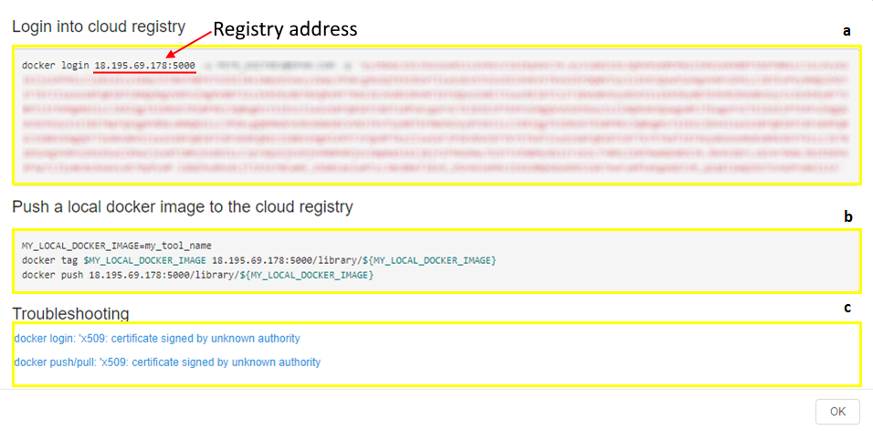

# 10.3. Add a Tool

This page describes the process of adding new Docker image to the Docker registry.

> **Docker CLI** has to be installed.
>
> A registry has to be configured to use **Cloud Pipeline (CP) authentication system** (see [10.1. Add/Edit a Docker registry](10.1._Add_Edit_a_Docker_registry.md)). In case of registry doesn't use CP authentication system - contact your system administrators for registry access details.

1. Go to the **Tools** tab and choose a registry.
2. Click the **Gear** icon → **How to configure?**
3. Copy and paste a command from the **Login into cloud registry** section (**a**) into the Terminal, then run it. This command installs registry certificate and uses docker login command to access the registry.  
    **_Note_**: this command requires "root" rights.  
    

    Copy and run instructions from the **Push a local docker image to the cloud registry** section (**b**) consequentially to add the Tool to the registry:

    1. Create environment variable (**`MY_LOCAL_DOCKER_IMAGE`**) that holds the name of the Docker image;
    2. Tag the image you want to push with the domain name or IP address and the port of the Docker registry;
    3. Push the image to the registry.  
        Here we push "**hello-world**" image to the registry "**18.195.69.178:5000**", "**library**" Tool group.  
        

    **Troubleshooting** section (**c**) contains information about fixing common problems that may appear during the execution of **docker login** or **docker pull/push** commands.

4. Make sure that image was pushed to the registry and enabled in the **Tools** tab.  
    **_Note_**: Tool will be automatically enabled only if CP authentication is configured for the registry.  
    

**_Note_**: If registry doesn't use CP authentication system, after the image was pushed do the following:

1. Navigate to the **Tools** tab.
2. Choose a **Registry** and a **Tool group**.
3. Click the **Gear** icon → **+ Enable Tool**.  
4. Write the name of the pushed image. Registry and Tool group will be already written for you.  
    