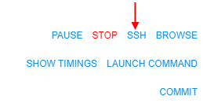
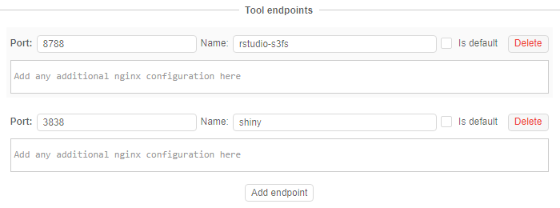

# 10.4. Edit a Tool

- [Edit a Tool description](#edit-a-tool-description)
- [Edit a Tool version](#edit-a-tool-version)
    - [Run/Delete a Tool](#rundelete-a-tool)
    - [Commit a Tool](#commit-a-tool)
- [Edit a Tool settings](#edit-a-tool-settings)

> To view and edit tool's attributes see [17. CP objects tagging by additional attributes](../17_Tagging_by_attributes/17._CP_objects_tagging_by_additional_attributes.md).

## Edit a Tool description

Select a Tool and click its name. Navigate to the **Description** tab of a Tool. Click the **Edit** buttons on the right side of the screen to modify the **Short description** and **Full description** of the Tool.  

## Edit a Tool version

In this tab, you can run a Tool version with custom settings or delete a Tool version. To see an example of a launching a Tool with custom settings see [here](10.5._Launch_a_Tool.md).

### Run/Delete a Tool

1. Navigate to the **Versions** tab of a Tool.
2. Click on the arrow near the **Run** button.
3. Select **Custom settings** option to configure run parameters.
4. If you want to delete a Tool version, click the **Delete** button.  
    

### Commit a Tool

Commit function allows modifying existing Tools.

1. Launch a Tool in the **sleep infinity** mode. See an example [here](10.5._Launch_a_Tool.md).
2. SSH into it via **SSH** button.  
    
3. Change something.  
    _Example_: here we install a biopython package into this Docker image. **Wait for the installation to complete!**  
    
4. Go back to the **Logs** tab and click the **COMMIT** button.
    - Choose a Docker registry and a Tool group.
    - Change a name for the modified image or add a new version to the current Tool by typing the version name in a separate box.  
        **_Note_**: **to add a new version to the existing Tool don't change the original name of the Tool!**  
        **_Note_**: image name and a version name should be written according to the following rules:  
        - May contain lowercase letters, digits, and separators.
        - A separator is defined as a period, one or two underscores, or one or more dashes.
        - A name component may not start or end with a separator.
    - Tick boxes if needed:  
        - **Delete runtime files** box - to delete all files from **/runs/\[pipeline name\]** folder before committing.  
        - **Stop pipeline** box - to stop the current run after committing.  
In this example, we will change "base-generic-centos7" to "base-generic-centos7-biopython".  
  
5. Committing may take some time. When it is complete COMMITING status on the right side of the screen will change to **COMMIT SUCCEEDED**.  
      
6. Find a modified Tool in the registry.  
    

## Edit a Tool settings

Settings in this tab are applied to all Tool versions (i.e. these settings will be a default for all Tool version).

1. Navigate to the **Settings** tab.  
    
2. Specify **Endpoints** for a Tool by click "**Add endpoint**" button:  
      
    In the example below: the port is `8788` and the endpoint name is `rstudio-s3fs`:  
      
    Let's look at the endpoint closer:
    - **"nginx"** - type of the endpoints (only **nginx** is currently supported)
    - **"port":`XXXX`** - an application will be deployed on this port on the pipeline node.
    - You can specify additional nginx configuration for that endpoint in the text field bottom in [JSON](https://en.wikipedia.org/wiki/JSON) format.  
        **_Note_**: optional **path** parameter may be required in case your application starts on &lt;host:port:&gt;/**path**.  
        **_Note_**: optional **additional** parameter may be required in case you need to specify nginx location settings. See more information [here](https://nginx.ru/en/docs/http/ngx_http_core_module.html#location).
    - **"name"** - this value will be visible as a hyperlink in the UI. It is especially convenient when user sets more than one endpoint configuration for an interactive tool (learn more about interactive services - [15. Interactive services](../15_Interactive_services/15._Interactive_services.md)).  
    In the example below, we name one endpoint as **"rstudio-s3fs"** and another one as **"shiny"**.  
      
    This is how everything will look in the **Run log** window:  
    
3. Click the **+ New Label** button and add a label to the Tool (e.g. "Awesome Tool").  
    
4. Specify "**Execution defaults**":
    - **Instance type** (e.g. "m4.large")
    - **Price type** (e.g. "Spot")
    - **Disk** size in Gb (e.g. "20")
    - select available storages
    - configure cluster, if it's necessary for your Tool
    - write the **Default command** for the Tool execution (e.g. `echo "Hello world!"`)  
    
5. If it's necessary for your Tool - add system or custom parameters. For more details see [6.1. Create and configure pipeline](../06_Manage_Pipeline/6.1._Create_and_configure_pipeline.md).
6. Click **Save** button to save these settings.  
    