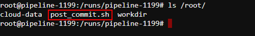
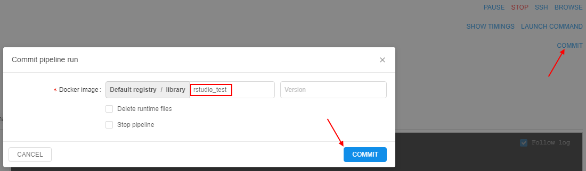
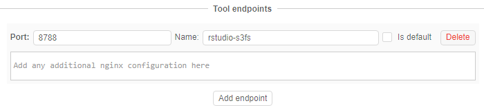

# 10.4. Edit a Tool

- [Edit a Tool description](#edit-a-tool-description)
- [Edit a Tool version](#edit-a-tool-version)
    - [Run/Delete a Tool version](#rundelete-a-tool-version)
    - [Commit a Tool](#commit-a-tool)
- [Edit a Tool settings](#edit-a-tool-settings)
- [Delete a Tool](#delete-a-tool)

> To view and edit tool's attributes see [17. CP objects tagging by additional attributes](../17_Tagging_by_attributes/17._CP_objects_tagging_by_additional_attributes.md).

## Edit a Tool description

Select a Tool and click its name. Navigate to the **Description** tab of a Tool. Click the **Edit** buttons on the right side of the screen to modify the **Short description** and **Full description** of the Tool.  

## Edit a Tool version

In this tab, you can run a Tool version with custom settings or delete a Tool version. To see an example of a launching a Tool with custom settings see [here](10.5._Launch_a_Tool.md).

### Run/Delete a Tool version

1. Navigate to the **Versions** tab of a Tool.
2. Click on the arrow near the **Run** button.
3. Select **Custom settings** option to configure run parameters.
4. If you want to delete a Tool version, click the **Delete** button.

### Commit a Tool

Commit function allows modifying existing Tools.

1. Launch a Tool in the **sleep infinity** mode. See an example [here](10.5._Launch_a_Tool.md).
2. SSH into it via the **SSH** button at the "**Run logs**" page.  
    
3. Change something.  
    _Example_: here we install a biopython package into this Docker image. **Wait for the installation to complete!**  
    
4. Go back to the **Logs** tab and click the **COMMIT** button.
    - Choose a Docker registry and a Tool group.
    - Change a name for the modified image or add a new version to the current Tool by typing the version name in a separate box.  
        **_Note_**: **to add a new version to the existing Tool don't change the original name of the Tool!**  
        **_Note_**: image name and a version name should be written according to the following rules:  
        - May contain lowercase letters, digits, and separators.
        - A separator is defined as a period, one or two underscores, or one or more dashes.
        - A name component may not start or end with a separator.
    - Tick boxes if needed:  
        - **Delete runtime files** box - to delete all files from **/runs/\[pipeline name\]** folder before committing.  
        - **Stop pipeline** box - to stop the current run after committing.  
In this example, we will change "base-generic-centos7" to "base-generic-centos7-biopython".  
  
5. Committing may take some time:  
      
When it is complete COMMITING status on the right side of the screen will change to **COMMIT SUCCEEDED**. In round brackets the date/time of the latest commit is shown:  
      
6. Find a modified Tool in the registry.  
    

#### Committing features

In certain use-cases, extra steps shall be executed before/after running the commit command in the container. For example, to avoid warning messages about terminating the previous session (which was committed) of the tool application in a non-graceful manner. Some applications may require extra cleanup to be performed before the termination.

To workaround such issues in the **Cloud Pipeline** an approach of "**pre/post-commit hooks**" is implemented. That allows to perform some graceful cleanup/restore before/after performing the commit itself.

> **_Note_**: Those hooks are valid only for the specific images and therefore shall be contained within those images. **Cloud Pipeline** itself only performs the calls to the hooks if they exist.

There are two preferences from system-level settings that determine a behavior of the "**pre/post-commit hooks**" approach:  

- **`commit.pre.command.path`**: specified a path to a script within a docker image, that will be executed in a currently running container, **_before_** docker commit occurs (default value: `/root/pre_commit.sh`).
    - This option is useful if any operations shall be performed with the running processes (e.g. send a signal), because in the subsequent **post** operation - only filesystem operations will be available.  
    **_Note_**: any changes done at this stage will affect the running container.
- **`commit.post.command.path`**: specified a path to a script within a docker image, that will be executed in a committed image, **_after_** docker commit occurs (default value: `/root/post_commit.sh`).
    - This hook can be used to perform any filesystem cleanup or other operations, that shall not affect the currently running processes.

> **_Note_**: User shall have **ROLE\_ADMIN** to read and update system-level settings.

So, when you try to commit some tool, the **Cloud Pipeline** will check preferences described above and execute scripts with the specified names, if that scripts files exist in a docker image. If a corresponding pre/post script is not found in the docker image - it will not be executed.

Consider an example with **RStudio** tool, that **Cloud Pipeline** provides "out of the box". RStudio Docker image contains a post-commit script that cleans the session after the commit:

1. Open the **Tools** page, launch **RStudio**.
2. SSH to the launched run via the **SSH** control in the upper-right corner of the run logs page.
3. Check that `post_commit.sh` script exists in the Docker image - use the command `ls /root/`:  
    
4. View the contents of that script. It looks like that:  
      
    **_Note_**: `/etc/cp_env.sh` is a special Cloud Pipeline script, that sets all environment variables of the current docker container.  
    So, as you can see from the code, as the result of that script launch will be a cleanup (removing) of the RStudio active session from the user home directory.
5. Close SSH tab and try to do a commit - click the **COMMIT** control in the upper-right corner of the run logs page. Specify a new name for the committed tool, e.g. `rstudio-test`:  
    
6. While image is being committed, you can see the follow-up log for the `CommitPipelineRun` task:  
      
    Here:  
    - (**1**) pre-commit script is not found in the docker image - nothing will be executed before commit
    - (**2**) post-commit script is found at the specified path in the docker image - and it is being executed
    - (**3**) post-commit script was performed successfully

## Edit a Tool settings

Settings in this tab are applied to all Tool versions (i.e. these settings will be a default for all Tool version).

1. Navigate to the **Settings** tab.  
    
2. Specify **Endpoints** for a Tool by click "**Add endpoint**" button:  
      
    In the example below: the port is `8788` and the endpoint name is `rstudio-s3fs`:  
      
    Let's look at the endpoint closer:
    - **"nginx"** - type of the endpoints (only **nginx** is currently supported)
    - **"port":`XXXX`** - an application will be deployed on this port on the pipeline node.
    - You can specify additional nginx configuration for that endpoint in the text field bottom in [JSON](https://en.wikipedia.org/wiki/JSON) format.  
        **_Note_**: optional **path** parameter may be required in case your application starts on &lt;host:port:&gt;/**path**.  
        **_Note_**: optional **additional** parameter may be required in case you need to specify nginx location settings. See more information [here](https://nginx.ru/en/docs/http/ngx_http_core_module.html#location).
    - **"name"** - this value will be visible as a hyperlink in the UI. It is especially convenient when user sets more than one endpoint configuration for an interactive tool (learn more about interactive services - [15. Interactive services](../15_Interactive_services/15._Interactive_services.md)).  
    In the example below, we name one endpoint as **"rstudio-s3fs"** and another one as **"shiny"**.  
      
    This is how everything will look in the **Run log** window:  
    
3. Click the **+ New Label** button and add a label to the Tool (e.g. "Awesome Tool").  
    
4. Specify "**Execution defaults**":
    - **Instance type** (e.g. "m4.large")
    - **Price type** (e.g. "Spot")
    - **Disk** size in Gb (e.g. "20")
    - select available storages
    - configure cluster, if it's necessary for your Tool
    - write the **Default command** for the Tool execution (e.g. `echo "Hello world!"`)  
    
5. If it's necessary for your Tool - add system or custom parameters. For more details see [6.1. Create and configure pipeline](../06_Manage_Pipeline/6.1._Create_and_configure_pipeline.md).
6. Click **Save** button to save these settings.  
    

## Delete a Tool

To detach a Tool from the Cloud Pipeline:

1. Open the Tool you wish to detach
2. Hover over the **gear** icon in the right upper corner and click the "Delete tool" item in the appeared list:  
    
3. Click the **Delete** button to confirm:  
    

> **_Note_**: if you try to delete a tool/version, but there is/are active job(s) using it - the corresponding warning notification will be shown, e.g.:  
    
