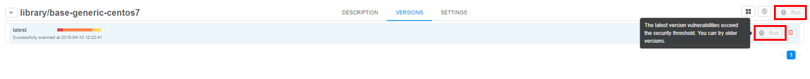
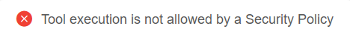

# 10.6. Tool security check

- [Force a security scanning procedure](#force-a-security-scanning-procedure)
- [Show/hide unscanned Tool versions](#showhide-unscanned-tool-versions)
- ["White list" for Tool versions](#white-list-for-tool-versions)

A registry may potentially contain tools with vulnerable software which may cause damage. To prevent this issue, Cloud Pipeline performs **Security scanning** feature of the tools that are provided by users and restrict usage of not secure Tools.

> User shall have **ROLE\_ADMIN** to force a security scanning procedure or to run unscanned Tools/Tools with critical number of vulnerabilities. For more information see [13. Permissions](../13_Permissions/13._Permissions.md).

## Force a security scanning procedure

In the Cloud Pipeline security scanning is performed on a scheduled basis - every N minutes (configurable parameter). However, a user with an administrator role can manually run a security scanning procedure:

1. Select a Tool and navigate to the **Versions** tab.
2. Click the **SCAN** button of a Tool version.  
      
    **_Note_**: If scan results for version are against the security politics (i.e. vulnerabilities number exceeds the threshold) the **Run** button for version will be deactivated. Only users with **ROLE\_ADMIN** role will be able to run this Tool. Generic users can run this version of Tool only if it is checked with a "white list" flag (see [below](#white-list-for-tool-versions)) or if its "grace" period is not elapsed yet (see **`security.tools.grace.hours`** setting here [v.0.14 - 12.10. Manage system-level settings](../12_Manage_Settings/12.10._Manage_system-level_settings.md#docker-security)).  
    **_Note_**: If scan results for the latest version are against the security politics (i.e. vulnerabilities number exceeds the threshold) the **Run** button for Tool will be deactivated. Only users with **ROLE\_ADMIN** role will be able to run this Tool. Generic users can run this version of Tool only if it is checked with a "white list" flag (see [below](#white-list-for-tool-versions)) or if its "grace" period is not elapsed yet (see **`security.tools.grace.hours`** setting here [v.0.14 - 12.10. Manage system-level settings](../12_Manage_Settings/12.10._Manage_system-level_settings.md#docker-security)).  
    

## Show/hide unscanned Tool versions

1. Select a Tool and navigate to the **Versions** tab.
2. Press the **View unscanned versions** control.  
    
3. Unscanned version(s) will appear in the list of Tool versions.  
      
    **_Note_**: for users with **ADMIN** role **Run** button of unscanned version contains "warning" sign. Hover over that button and you'll see a suggestion that the version shall be scanned for vulnerabilities. Generic users won't be able to run unscanned Tools (except when they're checked with a "white list" flag - see [below](#white-list-for-tool-versions) or if "grace" period for this version of Tool is not elapsed yet (see **`security.tools.grace.hours`** setting here [v.0.14 - 12.10. Manage system-level settings](../12_Manage_Settings/12.10._Manage_system-level_settings.md#docker-security))).  
      
    If you are user with **ADMIN** role and press the **Run** button anyway, you'll see another warning:  
    
4. Hide unscanned Tool versions by clicking **Hide unscanned versions** control.  
    

## "White list" for Tool versions

Generic users can't run tools with vulnerable software or unscanned tools because it may cause damage. But admin may allow users to run certain docker versions even if they are vulnerable/unscanned. For do that admin has to check a such docker version with a special "white list" flag.

> User shall have **ROLE\_ADMIN** to set a "white list" flag for an unscanned Tools or Tools with critical number of vulnerabilities.

To "add" a Tool version into the "white list":

1. Open **Versions** tab on main tool's page.
2. Click **Add to white list** button in the row of the version you want allow users to run in spite of possible damage:  
    
3. The version with a "white list" flag will be shown in green:
    
4. Now, if user will try to launch this version of docker image, it will be run without any errors during launch time and viewing.
5. If user will try to launch any other "danger" version of this tool without a "white list" flag, error message will be shown, tool won't be run:  
    

To "delete" a Tool version from the "white list":

1. Open **Versions** tab on the main tool's page.
2. Click **Remove from white list** button in the row of the version with a set "white list" flag:
    