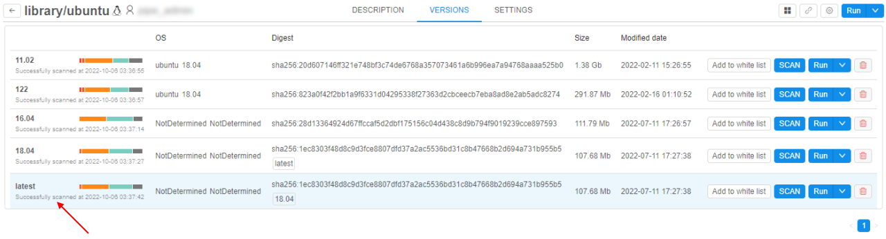
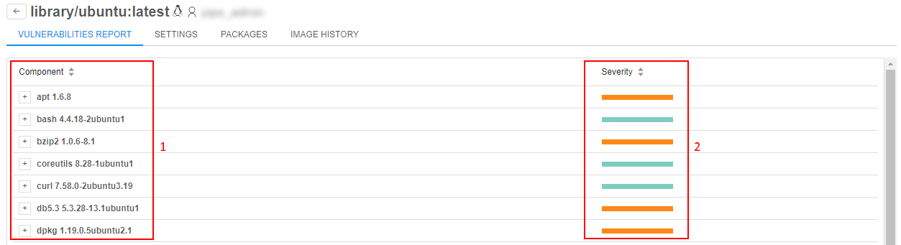
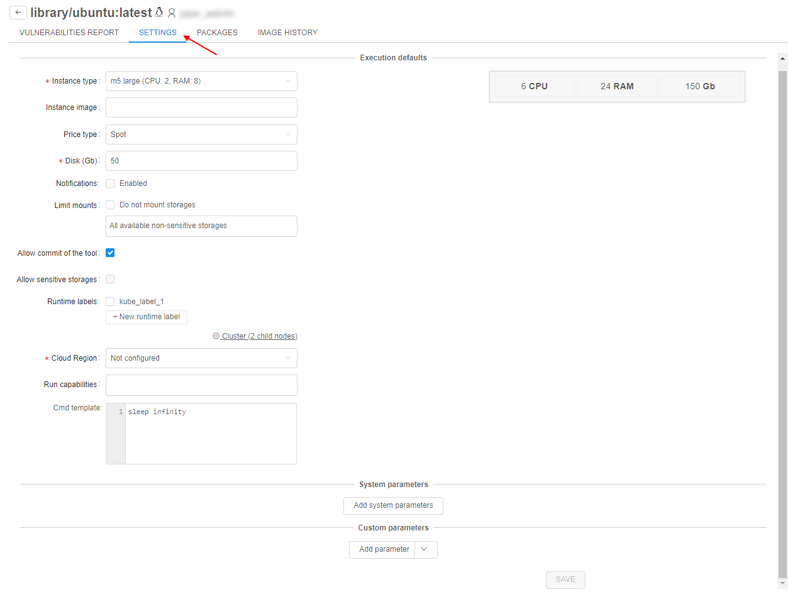
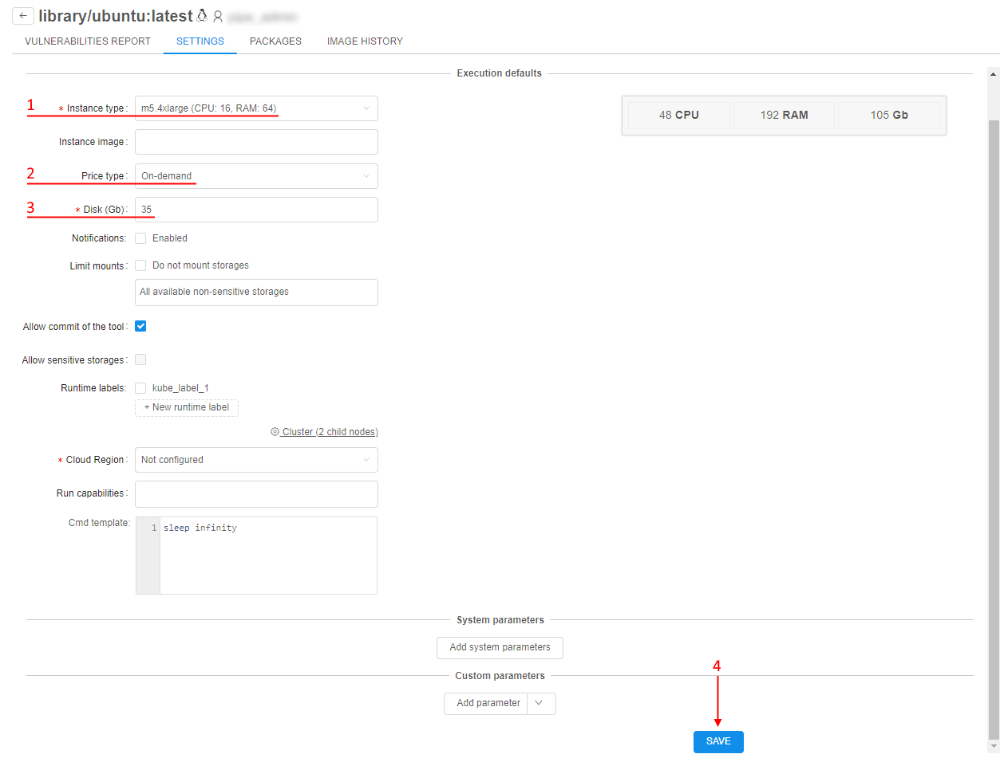
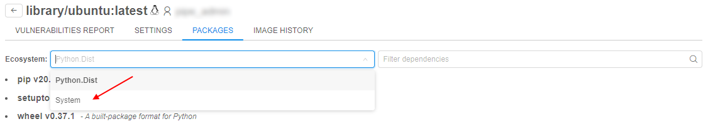
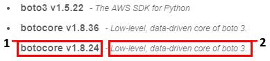
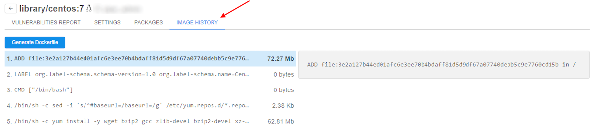
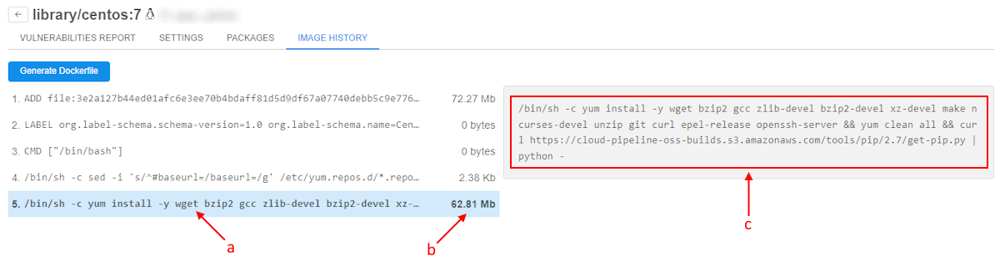
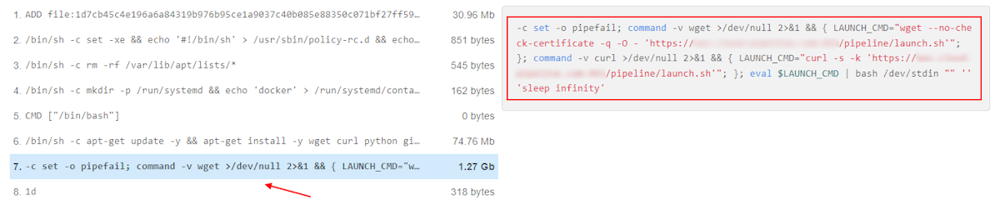

# 10.7. Tool version menu

- [Vulnerabilities report](#vulnerabilities-report)
- [Version settings](#version-settings)
- [Version packages](#version-packages)
- [Image history](#image-history)

To see the detailed info of Docker image version:

1. Click any **Tool version**:  
    
2. Tool version menu will be shown:  
    

## Vulnerabilities report

This tab contains the detailed info of the Docker image's scanning results.  
Here you can see vulnerable components (**1**). Each component has severity estimation (**2**):  

Expand each component details by clicking the "**Plus**" icon to see more information about it:  
**a**) link to a page of the vulnerability description  
**b**) the component version in which this vulnerability was fixed  
**c**) severity level  
**d**) short description of the vulnerability (it appears when hovering mouse pointer over the link **a**)  

Sort components alphabetically, or by their severity:  

## Version settings

On this tab version-level settings are defined. If these settings are specified - they will be applied to each run of the docker image version. If version-level settings are not defined: docker-level settings will be applied for launch. If docker-level settings are not defined: global defaults will be applied.  
There are 3 groups of parameters that user can specify (they are analogical to the "Execution environment" of tool settings, for more details see [here](10._Manage_Tools.md#settings-tab)):

- **Execution defaults**
- **System parameters**
- **Custom parameters**

For change version-level settings, e.g.:

1. Select an **Instance type**.
2. Set the **Price type**.
3. Input the **Disk** size.
4. Click **Save** button:  
    
5. Click  button to return into the tool menu.
6. Click **Run → Custom settings** for the changed tool version.
7. Check that version-level settings are applied:  
    

> **_Note_**: via the **Cloud Region** field at the **Version Settings** tab, the admin/tool owner can select a specific **Cloud Provider**/**Region** to enforce users to run that tool version in it:  
>   
> By default, it has **`Not configured`** value. This means, that a tool version will be launched in a _Default region_ (configured in the global settings) or a user can set any allowed **Cloud Region**/**Provider** manually.

## Version packages

On this tab user can see the full list software packages installed into a specific Docker image.  
List of packages is generated from the docker version together with vulnerabilities scanning.  
This occurs nightly (all dockers are scanned) or if admin explicitly requests scanning by clicking **SCAN** button for a specific version.

Currently the following types of software packages can be scanned:

- System package manager's database (i.e. **yum**, **apt**)
- R packages
- Python packages

Software packages are combined into groups named "**Ecosystems**".  
To view content of any ecosystem, select it in the dropdown list:  

Information about each package contains:

1. Package name
2. Package description (*if available*)  
    

For filter/search packages type some text into a search-query field. Search will be done automatically across all **ecosystems**:  
    

## Image history

**Cloud Pipeline** is able to display the exact commands, used to build the image.  
To view the list of the "Docker layers" and corresponding commands, which were used to generate those layers, use the **Image history** tab of the tool version menu.

This tab contains a list of the Docker layers. Each layer corresponds to a separate command from the initial `Dockerfile`, used to create the docker image.  
Each layer entry shows:

- **a** - Short command text
- **b** - Size of the layer (in Mb) - this is a resulting filesystem volume, consumed by the layer. Overall docker image size is a sum of all the layers. Some of the layers might have zero size, typically these are commands which perform some environment configuration (like `ENV` and `CMD`)
- **c** - the full command text of the selected layer in the right panel

> **_Notes_**:
> 
> - The list of the layers is a full stack of the docker image, which includes the layers from the parent images as well.
> - "Image history" feature works fine for the images, which are built using Dockerfiles - then the commands and layers are listed correctly.  
>   But if the docker image was created using the "**COMMIT**" operation from the **Cloud Pipeline** capabilities - this will generate only one layer with the predefined command, e.g.:  
>     
>   So if the docker layers list ends with the similar content - it means that an image was committed and it's not possible to determine the exact shell commands.
