# 10.8. "Symlinked" tools

The majority of the tools for general users are managed by the administrators and are available via the **_library_** tool group.
But for some of the users it is convenient to have separate tool groups, which contain a mix of the custom tools (managed by the users themselves) and the **_library_** tools (managed by the admins).

For the latter ones the ability to create "_symlinks_" into the other tool groups exists.

"Symlinked" tools are displayed in that users' tool groups as the original tools but can't be edited/updated. When a run is started with "symlinked" tool as docker image it is being replaced with original image for `Kubernetes` pod spec.  
The following behavior is implemented:

- to create a "symlink" to the tool, the user shall have _READ_ access to the source tool and _WRITE_ access to the destination tool group
- for the "symlinked" tool all the same description, icon, settings as in the source image are displayed. It isn't possible to make any changes to the "symlink" data (description, icon, settings, attributes, issues, etc.), even for the admins
- image owners and admins are able to manage the permissions for the "symlinked" tools. Permissions on the "symlinked" tools are configured separately from the original tool
- two levels of "symlinks" is not possible ("symlink" to the "symlinked" tool can't be created)
- it isn't possible to "push" into the "symlinked" tool

## Creation and usage of a "symlink" to the tool

A "symlink" to the tool can be created by any user with the **ROLE\_TOOL\_GROUP\_MANAGER** role, that has read access to the original (source) tool and write access to the destination tool group.

To create a "symlink" to the tool:

1. Open the **Tools** page.
2. Open the tool you wish to create the "symlink".
3. Click the **link** icon in the upper-right corner:  
    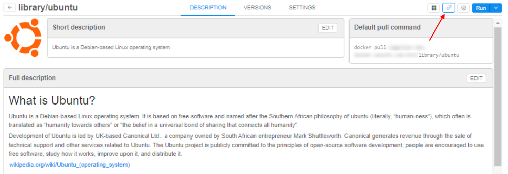
4. In the opened popup select the destination _Registry_ and _Tool group_ where you wish to create the "symlink", e.g.:  
    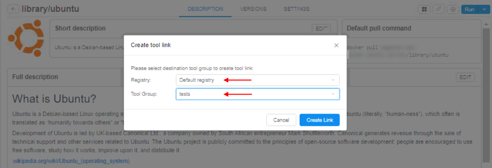  
5. Click the **Create Link** button to confirm.
6. Just-created "symlinked" tool will be open automatically:  
    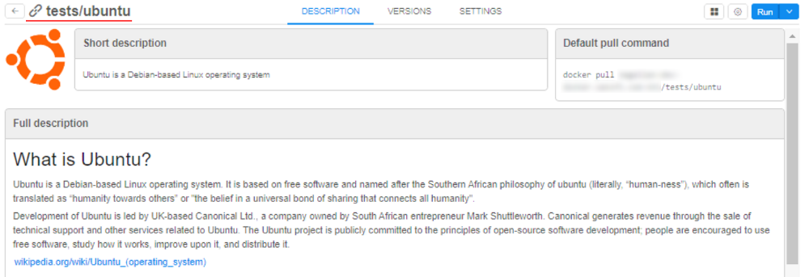  
    The **link** icon before the tool name indicates a "symlink".  
    In the tool group, "symlinked" tool is displayed with the same icon:  
    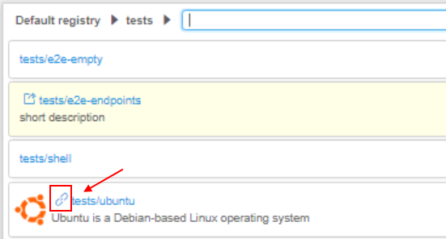
7. Please note, that all "edit" functions are unavailable even for the "symlink" **OWNER**. All settings, descriptions, icon, attributes, issues are loaded from the original tool:  
    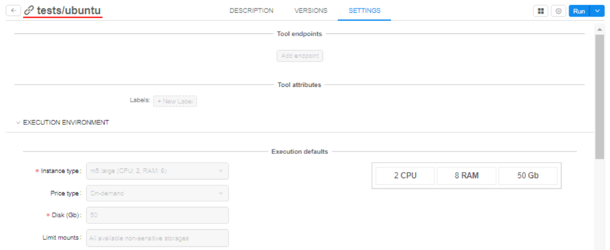
8. Version management (update/delete versions/attributes/settings/scan/vulnerabilities) is unavailable. Necessary data is also loaded from the original tool, e.g.:  
    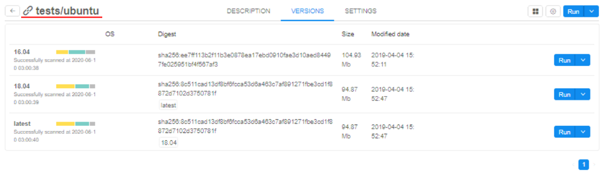
9. Run of the "symlinked" tool/its version is being performed as for usual tool.
10. Commit of the launched "symlinked" tool can be performed only to the non-"symlinked" tool (no matter - new or existing):  
    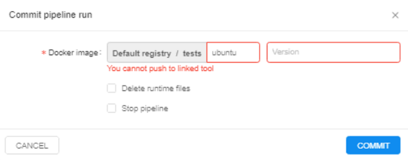

## Management of a "symlinked" tool

"Symlinked" tool can't be edited. Possible operations for OWNERs/admins:

- set the permissions on the "symlink"
- delete the "symlink"

### Set permissions

Permissions are being set by the way as for general tools:

1. Click the **gear** icon in the right-upper corner of the "symlinked" tool page.
2. Click the **Permissions** item:  
    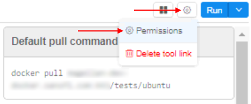
3. In the opened popup configure desired permissions:  
    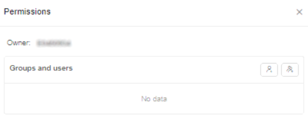  
    **_Note_**: configured permissions are valid only for the "symlink". Permissions for the original tool shall be configured separately at the original tool page

### Remove a "symlinked" tool 

To delete a "symlinked" tool:

1. Click the **gear** icon in the right-upper corner of the "symlinked" tool page.
2. Click the **Delete tool** link item:  
    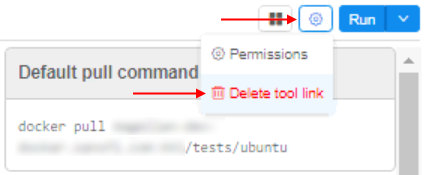
3. Confirm the deletion:  
    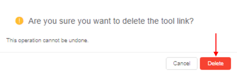
