# 10.9. Run capabilities

- [Disable Hyper-Threading](#disable-hyper-threading)
- [Custom capabilities](#custom-capabilities)
    - [Create capability](#createedit-capability)
    - [Example of usage](#usage-of-the-custom-capability)

Users always can launch tool runs with default settings (as they are configured in the tool/tool version's settings).  
On the other hand, there are cases when for the run specific custom settings shall be specified.  
In addition to the general frequently-used settings (like instance type and disk size), the platform allows you to customize special system behavior/capabilities.  
Some of these capabilities can be configured via System parameters, but more convenient way - to use the GUI control "**Run capabilities**" and select necessary items from the list.

Ways to set such capabilities for a **Tool** run:

- at the **Launch** page in the "Exec environment" section, before the run, e.g.:  
    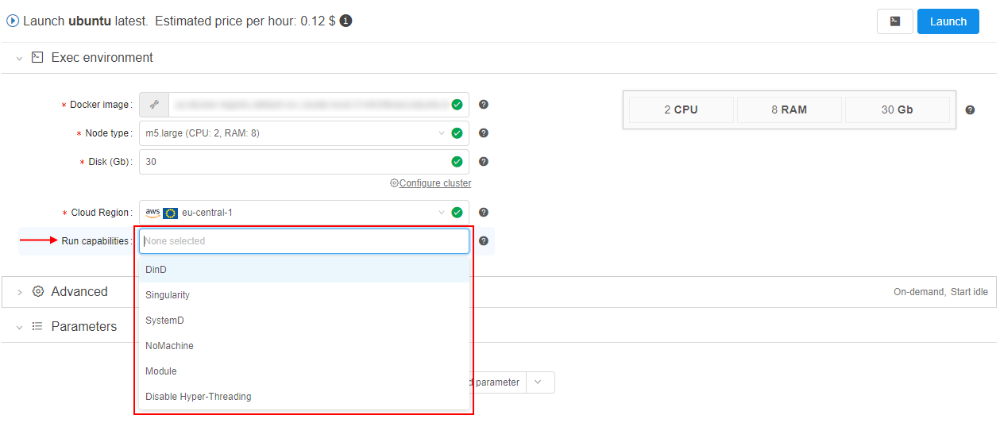  
    In such case, selected capabilities will be applied only for the upcoming run.  
    **_Note_**: for a run, several capabilities can be selected (multi-select for the dropdown list is supported)
- at the **Tool** settings page, e.g.:  
    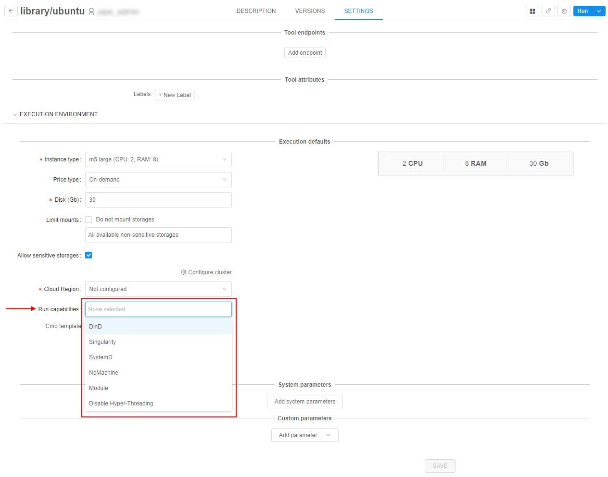  
    In such case, selected capabilities will be applied for all runs of that tool launched with default settings.  
    **_Note_**: several capabilities can be selected (multi-select for the dropdown list is supported)
- at the **Tool version's** settings page, e.g.:  
      
    In such case, selected capabilities will be applied for all runs of that tool version launched with default settings.  
    **_Note_**: several capabilities can be selected (multi-select for the dropdown list is supported)

> Same capabilities can be also configured for pipeline runs and detach configuration runs. In all cases the behavior is configured in the similar way - by the selecting of necessary items in the "**Run capabilities**" dropdown list before the run - in configuration or at the **Launch** page.

Below you can find descriptions and using examples of the separate capabilities.

## Disable Hyper-Threading

**Hyper-Threading technology** makes a single physical processor appear as multiple logical processors. To do this, there is one copy of the architecture state for each logical processor, and the logical processors share a single set of physical execution resources.

Hyper-Threading technology is enabled by default for Cloud instances launched in Cloud Pipeline deployment.  
But for some cases, users want to disable Hyper-Treading technology for specific runs as it may slow the computation.

So, this technology can be turned off via "**Run capabilities**", as is best for a particular application at the user's discretion.

**_Note_**: also the Hyper-Treading technology can be disabled manually by setting the parameter `CP_DISABLE_HYPER_THREADING` with `true` value before the run

> In Cloud Provider environment, each vCPU is a thread of a physical processor core. All cores of the instance has two threads. Disabling of Hyper-Threading disables the set of vCPUs that are relied to the second thread, set of first thread vCPUs stays enabled.
>
> For example, instance with enabled Hyper-Threading:  
> 
>
> The same instance with disabled Hyper-Threading:  
> 

Example of disabling Hyper-Threading:

1. Open any tool you wish to run with disabled Hyper-Threading.
2. Select "**Run**" → "**Custom settings**".
3. At the **Launch** page, expand the "**Exec environment**" section.
4. Set the instance type with several CPUs (we will use the instance with 8 CPUs).
5. Select the item "_Disable Hyper-Threading_" in the "**Run capabilities**" dropdown list:  
    
6. Launch the run.
7. Open the **Run logs** page of the just-launched run, expand the "**Parameters**" section:  
    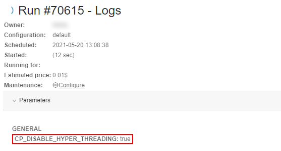  
    Check that the parameter to disable Hyper-Threading was set.
8. Wait until the **SSH** hyperlink appears. Click it.
9. In the web-terminal perform the command `lscpu`:  
    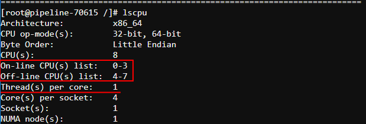  
    Here you can check that Hyper-Threading is disabled (only 1 thread per core is set) and virtual CPUs 4-7 are offline. So, only one thread is enabled (set of CPUs 0-3).

## Custom capabilities

Except of the selection a predefined set of capabilities in the GUI for a job or a tool, **Cloud Pipeline** allows to create own non-complex scripts and use them via the **Run capabilities** menu.

**_Note_**: only admins can create and edit custom run capabilities. But use them for a job/tool run all users can.

### Create/edit capability

Managing of the custom capabilities is being performed via the **`launch.capabilities`** system preference.  
This preference contains an array of capability descriptions in `JSON`-format and has the following structure:

``` json
{
  "<capability_name_1>": {
    "description": "<Description of the capability>",
    "commands": [
        "<command_1>",
        "<command_2>",
        ...
    ],
    "params": {
        "<parameter_1>": "<value_1>",
        "<parameter_2>": "<value_2>",
        ...
    },
    "os": "all"
  },
  "<capability_name_2": {
      ...
  },
  ...
}
```

Where:

- `<capability_name>` - defines the capability name. This name will be displayed on the GUI, in the **Run capabilities** dropdown list
- `description` - defines the description of the capability. This description will be displayed on the GUI, when hovering the capability in the list
- `commands` - block defines the array of the `shell` commands that will be performed during the job launch
- `params` - block defines the array of key-value pairs. Each of those pair will be set as a parameter for a job
- `os` - parameter that defines for which docker image(s) the capability is allowed. Possible values:  
    - `all` - capability is allowed for all docker images without restrictions
    - list of comma-separated docker image names. Each item in the list can be specified in one of the following formats:  
        - `<docker_image_name>` - capability is allowed for any version of the docker image.  
        Example: `"os": "ubuntu"` - capability with such parameter will be allowed only for the `ubuntu` images (for any version)
        - `<docker_image_name> <version_mask>` - capability is allowed only for specific versions of a certain docker image. Versions are being defined by the mask, mask can include version name or its part, and `*` symbol for masking.  
        Examples: `"os": "centos 7*, ubuntu 16.04"` - capability with such parameter will be allowed only for all `centos 7` versions (e.g. `centos 7.0-1406` and `centos 7.2-1511`) and for `ubuntu 16.04` as well.
    - if `os` is not specified at all (skipped) - capability is allowed for all docker images without restrictions (same behavior as `"os": "all"`)

### Usage of the custom capability

Let's create a custom capability that will set Docker-in-Docker mode for a job and perform a couple of simple commands.

1. Open the System settings
2. Navigate to the **Preference** tab
3. Find **`launch.capabilities`** parameter:  
    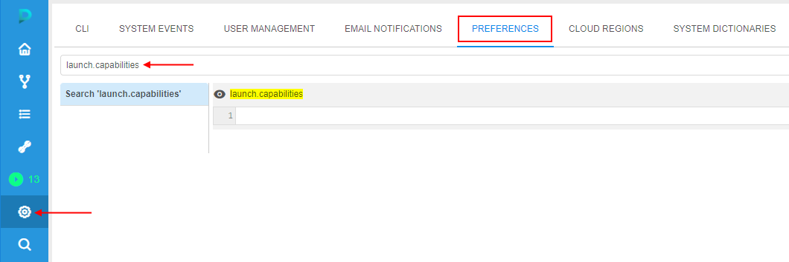
4. Add a new custom capability, e.g.:  
    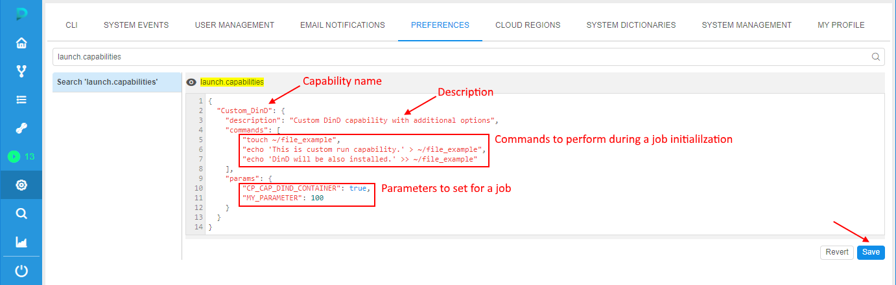  
    Here, we added the Docker-in-Docker setup via the system parameter `CP_CAP_DIND_CONTAINER` and the performing a couple of simple commands that write an example text file.  
    After the capability specifying, click the **Save** button
5. Open any tool (for our example, the _Ubuntu_ will be used)
6. Click **v** button near the **Run** button, select the **Custom settings** item
7. At the **Launch** page, expand the **Exec environment** section:  
    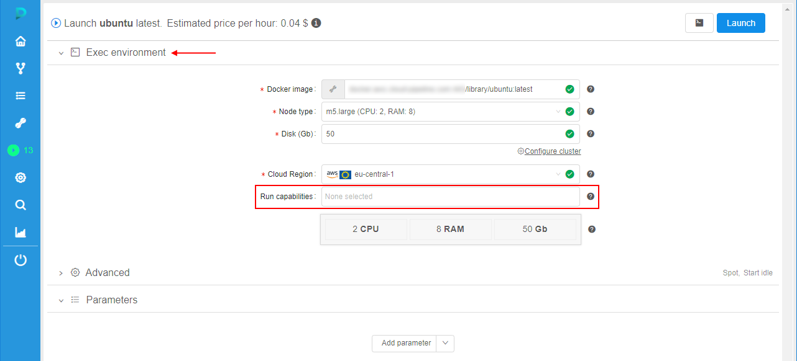  
    Click the **Run capabilities** dropdown list
8. Check that in the list, there is a custom item with the name specified at step 4:  
    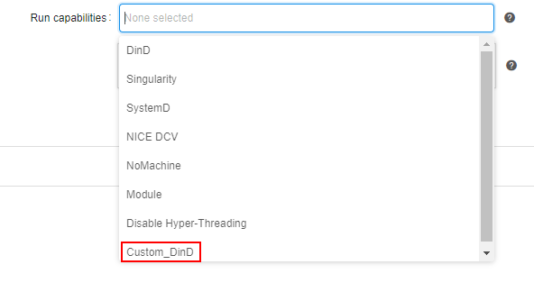
9. Hover over this item - in a tooltip, the description specified at step 4 will appear:  
    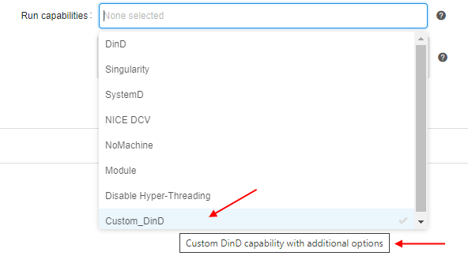
10. Select this item:  
    
11. Launch the run
12. Open the just-launched run
13. At the **Run logs** page, expand the **Parameters** section:  
      
    All parameters specified at step 4 are displayed.  
    Also, here you can see - each selected run capability is set as an environment variable in the format: `CP_CAP_CUSTOM_{CAPABILITY_NAME}` with `true` value
14. Wait until all initialization tasks are done. Check that Docker-in-Docker was setup:  
    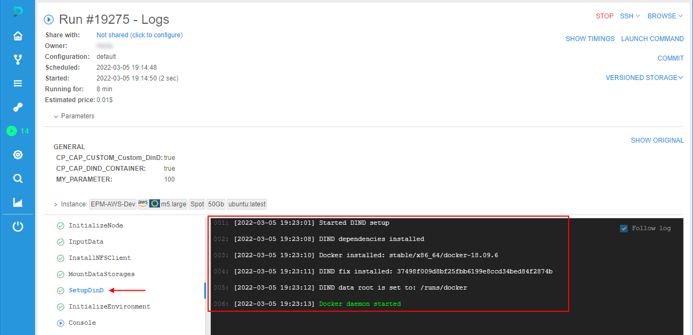
15. Check in the **Console** that capability commands specified at step 4 were also performed:  
    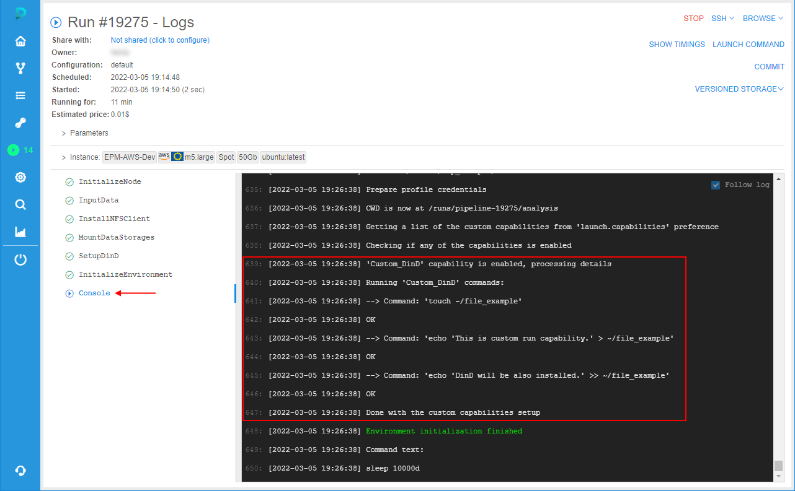
16. Click the **SSH** hyperlink. In the web-terminal, check the result of the commands performing:  
    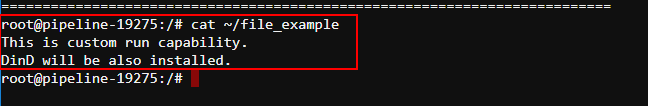
