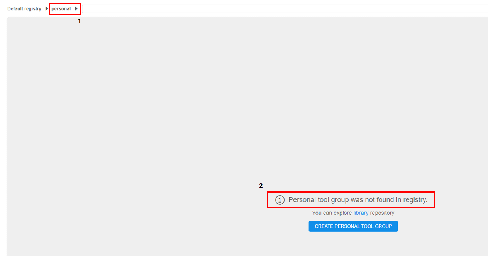
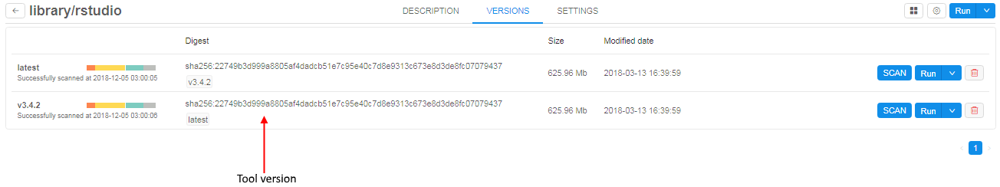
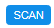
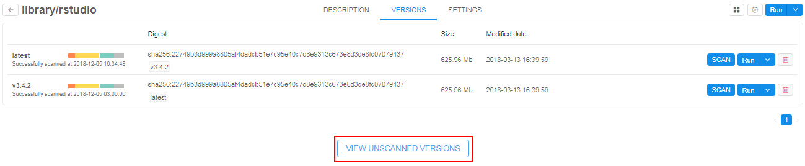
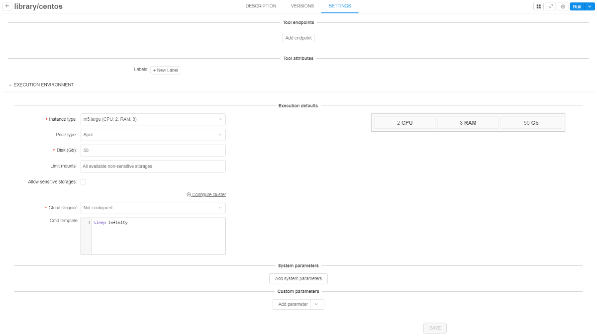
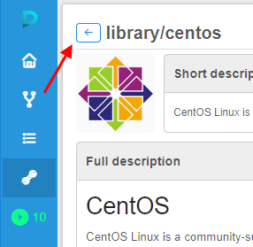

# 10. Manage Tools

- [Overview](#overview)
- ["Details" view pane](#details-view-pane)
    - [Registry](#registry)
    - [Tool group](#tool-group)
        - [Search](#search-field)
        - [Show attributes/Hide attributes](#show-attributeshide-attributes)
        - ["Gear" icon](#gear-icon)
        - [Personal Docker repository (Tool group)](#personal-docker-repository-tool-group)
        - [List of Tools](#list-of-tools)
        - [Tool information page](#tool-information-page)
            - [Description tab](#description-tab)
            - [Versions tab](#versions-tab)
        - [Settings tab](#settings-tab)

> For more information about Docker container lifecycle and instance lifecycle see at [Appendix A. Instance and Docker container lifecycles](../Appendix_A/Appendix_A._Instance_and_Docker_container_lifecycles.md).

## Overview

The **Tools** tab represents a list of available docker registries and docker images that contain tools. Using Docker images allows you to configure the same processing environment on each node regardless of the node type.  
Every **Tool** object in the Cloud Pipeline is a representation of Docker image.

## "Details" view pane

At the top of the page, you'll see the basic objects of the "Tools" space.

### Registry

Click on the registry name to see a drop-down list of available **Docker registries** and choose one.

### Tool group

Press under the arrow to see a list of available **Tool groups** or to search **Tool group** by the name. Only the lower-case alphanumeric string is allowed for a **Tool group** name.  
**_Note_**: when you navigate to the Docker registry, the Tool group shown by default will be chosen based on the following conditions:

1. If a user is included into some group (e.g. "cancer") and a Tool group with the same name exists, it will be shown by default. See more about user groups [here](../13_Permissions/13._Permissions.md).
2. If the first condition isn't met, "**library**" group will be shown by default.
3. If "**library**" group doesn't exist, "**default**" group will be shown by default.
4. If the "**default**" group doesn't exist either, "**personal**" group will be shown.
5. If none of the above groups doesn't exist/user doesn't have access to them, the first Tool group from the list will be shown by default.

#### Search field

This field helps to find a **Tool** by name in particular **Tool group** in a registry.

#### Show attributes/Hide attributes

**Show attributes/Hide attributes** opens the **Attributes** pane, where you can see and edit a list of **key=value** attributes of the tool group. See [17. CP objects tagging by additional attributes](../17_Tagging_by_attributes/17._CP_objects_tagging_by_additional_attributes.md).

#### "Gear" icon

The following options are available:

| Option | Description |
|---|---|
| **Registry** | This button allows to create a new registry or Edit/Delete current. |
| **Group** | Allows creating new Tool group or Edit/Delete current. |
| **+ Enable Tool** | Enables a Tool in a registry. |
| **How to configure** | Configures the Docker client to push/pull images to/from a registry. **_Note_**: Docker client needs to be installed. For installation instructions refer to <https://docs.docker.com/install/>. |

#### Personal Docker repository (Tool group)

All tools within such repository are named as **&lt;user\_name&gt;/&lt;tool\_name&gt;**.  
**_Note_**: If a user loads a registry and there is no **"personal"** group in it, it shall be checked whether he has **WRITE** access to the registry.

- If **No** - do not display **"personal"** section **(1)** in the registry.
- If **Yes** - a user will see the message "Personal tool group was not found in registry" **(2)**. On top of that, you'll see a suggestion to explore **library** Tool group.  
      
    See how to create personal Tool group [here](10.2._Add_Edit_a_Tool_group.md#add-a-personal-tool-group).

#### List of Tools

Tools list will be shown after you select group and registry.  

#### Tool information page

Click on a Tool's name to open **Tool information** page. In the top right corner you can find the following buttons:

| Control | Description |
|---|---|
| **"Displays" icon** | This icon includes:<ul><li>**Show attributes/Hide attributes** This button is used to show attributes of a Tool. **_Note_**: If selected Tool has any defined attribute, attributes pane is shown by default. For more details see [17. CP objects tagging by additional attributes](../17_Tagging_by_attributes/17._CP_objects_tagging_by_additional_attributes.md).</li><li>**"Show issues/Hide issues"** shows/hides the issues of the current Tool to discuss. To learn more see [here](../16_Issues/16._Issues.md).</li></ul> |
| **"Gear" icon** | Manage Tool permissions or delete a Tool. |
| **Run** | Run an instance with this Tool. |

Tool information page is divided into 3 tabs.

##### Description tab

This tab shows Tool description.  

For registries with **Pipeline authentication** option, you'll also see the **Docker pull command** on this tab if you have **READ** access to a Tool.

##### Versions tab

Choose this tab to see a list of Tool versions.  

> About internal Tool version menu see [10.7. Tool version menu](10.7._Tool_version_menu.md).

Each version has the following icons and controls:  

| Control/Label | Description |  |
|---|---|---|
| **Name** | Name of version |  |
| **Scanning status** | <ul><li>If the security scanning is forced, you'll see the status "**in progress**" of security scanning.</li><li>If the security scanning is failed, you'll see the status "**failed**".</li></ul> |  |
| **Last successful scan:** | The label shows if a version is successfully scanned at any time. The label contains date and time of the last successful attempt. |  |
| **Last scan date** | The label shows if a version scanning is failed. The label contains date and time of the last scanning attempt. |  |
| **Colored bars** | Hover over the colored bars to see scan status - a number of vulnerabilities grouped by severity (e.g. Critical, High, Medium, ...). |  |
| **Digest** | The label shows unique identifier of docker image. |  |
| **Corresponding aliases** | The label shows aliases of docker image (e.g. if some digest has more than one alias). |  |
| **Image size** | The label shows the size of docker image. **_Note_**: this value is provided for the "gzipped" docker image. When pulled to the local workstation or the cloud instance - the size of the image will be greater. | |
| **Modified date** | The label shows modified date of docker image. |  |
| **SCAN** | Control forces the security scanning process. Available only for users with **ROLE_ADMIN** role. |  |
| **Run** | Allow to run the particular Tool version with default settings or customize it. |  |
| **Delete** | Delete the particular Tool version. |  |

In addition, the **Version** tab contains **View unscanned version** control. The control is visible if unscanned versions exist.  

More about **Security scan** feature you could learn [here](10.6._Tool_security_check.md).

##### Settings tab

Navigate to this tab to see Tool attributes and execution defaults:  

1. **Tool endpoints** - specify an endpoint for the service launched in a Tool.
2. **Tool attributes** - tool labels to briefly describe the Tool.
3. **Execution defaults** - execution environment settings with which tool will be run by default:  
    - **Instance type** - An instance type in terms of Cloud Provider with specifying amounts of CPU, RAM and GPU.
    - **Price type** - spot or on-demand type of instance.
    - **Disk** - instance disk size in Gb.
    - **Limit mounts** - available storages for Tool execution.
    - **Configure cluster** - by clicking on this button cluster can be configured (for more details see [here](../06_Manage_Pipeline/6._Manage_Pipeline.md#configuration)).
    - **Cmd template** - default command for Tool execution.
4. **System parameters** - system parameters that can be used during Tool execution.
5. **Custom parameters** - specific parameters that can be used during Tool execution.

Navigate back to the **Tools group** page from the Tool description with the arrow button on the top-left corner.  
