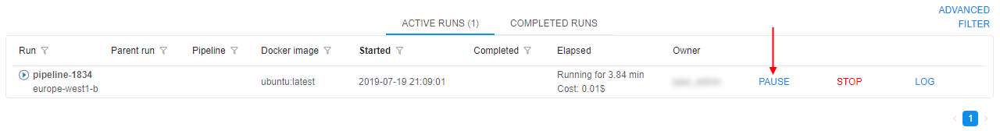
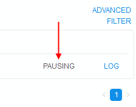
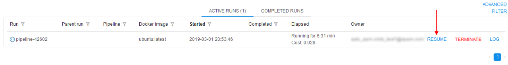
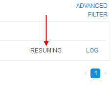
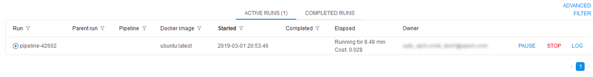
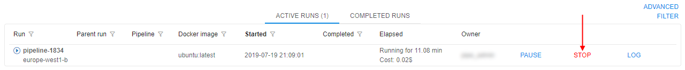
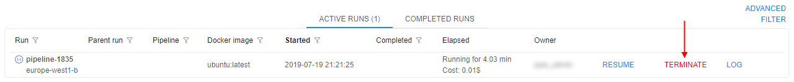
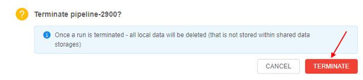

# 11.1. Manage runs lifecycles

> Only users with **ROLE\_ADMIN** or **OWNERS** can manage runs lifecycles (pause/resume/stop/terminate).

Cloud Platform currently provides functionality to launch and access services on Cloud hosted calculation nodes. Launching a service takes up to several minutes depending on multiple factors. When work with service is done, instance is terminated and all the local data and environment (installed tools, settings) are completely lost. In order to store the data it should be uploaded to Cloud data storage before service termination, to save service environment user may user **COMMIT** option to update a service or create a new one, but for some use cases, e.g. script development in _RStudio_, these options may be inconvenient.

**PAUSE** and **RESUME** options allow to reduce time to start a service, have an option to store service state and to reduce expenses for idle services. Stopped instances cost less than running instances.  
**_Note_**: pause/resume options are available only for on-demand instances. **Price type** can be set during Run configuration in the **Advanced** tab.

## Pause/resume run

1. Find a run you want to pause in the **Active runs** tab and press **Pause**.  
    
2. Confirm pausing.
3. A Run will have status **PAUSING** for a short period of time.  
      
    Then **RESUME** option will appear.  
    
4. To resume the Run press the **Resume** button and confirm this action.
5. A Run will have status **RESUMING** for a short period of time.  
      
    Then a Run will continue working again.  
    

## Stop/terminate run

**STOP** option allows to stop a run execution forcibly. Once a run is stopped - all its local data will be deleted, this action couldn't be undone.  
**_Note_**: This option is available only for initializing/executing runs, not for paused ones.  
**_Note_**: This action only stops run and doesn't terminate cluster node.

1. Find a run you want to stop in the **Active runs** tab and press **STOP**.  
    
2. Confirm action by click "**STOP**" button.
3. After that, run execution will be stopped and run with "Stopped" state will appear at "COMPLETED RUNS" tab.  
    

Some of the jobs, that were paused (either manually, or by the automated service), may be not needed anymore. In that case, user is more convenient to use **TERMINATE** option.  
**TERMINATE** option allows to terminate compute node of a paused run without its resuming.  
**_Note_**: This option is shown only for paused runs.  
**_Note_**: This action terminates cluster node and marks run as "Stopped".

1. Find a paused run you want to terminate in the **Active runs** tab and press **TERMINATE**.  
    
2. Confirm terminating.  
    
3. After that, cluster node of that run will be terminated and run with "Stopped" state will appear at "COMPLETED RUNS" tab.  
    