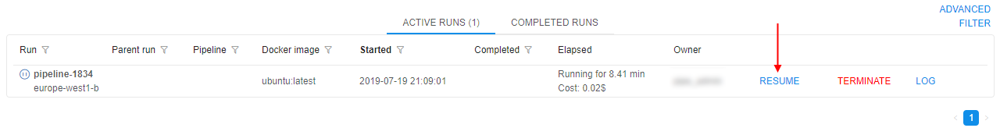
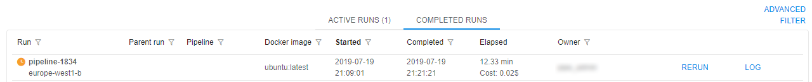
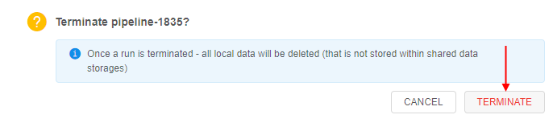
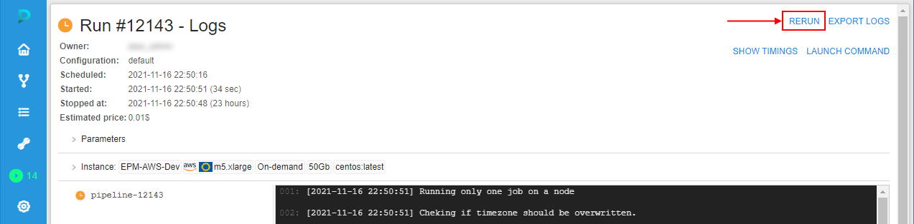
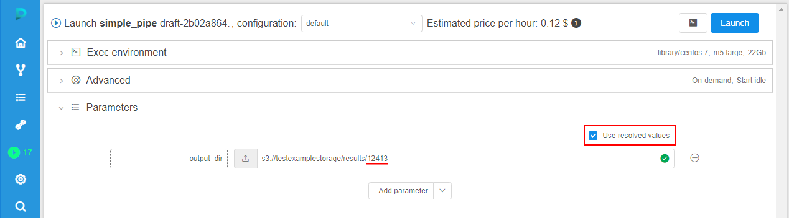

# 11.1. Manage runs lifecycles

- [Pause/resume run](#pauseresume-run)
- [Stop/terminate run](#stopterminate-run)
- [Rerun](#rerun)
    - [Resolve variables for a rerun](#resolve-variables-for-a-rerun)
    - [Preselect metadata instances for a rerun](#preselect-metadata-instances-for-a-rerun)

> Only users with **ROLE\_ADMIN** or **OWNERS** can manage runs lifecycles (pause/resume/stop/terminate).

Cloud Platform currently provides functionality to launch and access services on Cloud hosted calculation nodes. Launching a service takes up to several minutes depending on multiple factors. When work with service is done, instance is terminated and all the local data and environment (installed tools, settings) are completely lost. In order to store the data it should be uploaded to Cloud data storage before service termination, to save service environment user may user **COMMIT** option to update a service or create a new one, but for some use cases, e.g. script development in _RStudio_, these options may be inconvenient.

**PAUSE** and **RESUME** options allow to reduce time to start a service, have an option to store service state and to reduce expenses for idle services. Stopped instances cost less than running instances.  
**_Note_**: pause/resume options are available only for on-demand instances. **Price type** can be set during Run configuration in the **Advanced** tab.  
**_Note_**: you can't pause/resume cluster runs even with **On-demand** price type.  

## Pause/resume run

1. Find a run you want to pause in the **Active runs** tab and press **Pause**.  
    
2. Confirm pausing.
3. A Run will have status **PAUSING** for a short period of time.  
      
    Then **RESUME** option will appear.  
    
4. To resume the Run press the **Resume** button and confirm this action.
5. A Run will have status **RESUMING** for a short period of time.  
      
    Then a Run will continue working again.  
    

> **_Note_**: Not always paused run could be resumed. _E.g. user may hit a situation of resource limits - instance type was available when run was initially launched, but at the moment of resume operation provider has no sufficient capacity for this type._
> In such cases, run will be returned to the `Paused` state. User will be notified about that - by the hint message near the **RESUME** button:  
> 
>
> Or at the **Run information page**:  
> 
>
> Or at the **ACTIVE RUNS** panel of the main Dashboard:  
> 

## Stop/terminate run

**STOP** option allows to stop a run execution forcibly. Once a run is stopped - all its local data will be deleted, this action couldn't be undone.  
**_Note_**: This option is available only for initializing/executing runs, not for paused ones.  
**_Note_**: This action only stops run and doesn't terminate cluster node.

1. Find a run you want to stop in the **Active runs** tab and press **STOP**.  
    
2. Confirm action by click "**STOP**" button.
3. After that, run execution will be stopped and run with "Stopped" state will appear at "COMPLETED RUNS" tab.  
    

> **_Note_**: also you can stop a run via CLI. For more details see [here](../14_CLI/14.5._Manage_pipeline_executions_via_CLI.md#stop-a-pipeline-execution).

Some of the jobs, that were paused (either manually, or by the automated service), may be not needed anymore. In that case, user is more convenient to use **TERMINATE** option.  
**TERMINATE** option allows to terminate compute node of a paused run without its resuming.  
**_Note_**: This option is shown only for paused runs.  
**_Note_**: This action terminates cluster node and marks run as "Stopped".

1. Find a paused run you want to terminate in the **Active runs** tab and press **TERMINATE**.  
    
2. Confirm terminating.  
    
3. After that, cluster node of that run will be terminated and run with "Stopped" state will appear at "COMPLETED RUNS" tab.  
    

## Rerun

Often, users may want to launch a run with all the same settings as another run that already have been launched before. It can be useful, for example, if the job was failed by any outside reasons and user need to launch all the same job again.  
For such cases, the **RERUN** option is available in the **Cloud Pipeline**.  
It allows to re-launch a completed run, i.e. to launch a new run with all the same settings (execution environments, advanced settings, parameters) that this completed run had.

Rerun can be performed from the **Run logs** page of the completed run, e.g.:  
      
Or from the **COMPLETED RUNS** page, e.g.:  
    

Example:

1. Open the completed run you wish to rerun, pay attention to the instance settings and parameters, e.g.:  
    
2. Click the **Rerun** button in the right-upper corner.
3. The **Launch** page will be opened:  
      
    All settings (execution environments, advanced settings, parameters) are automatically set as they were in the completed run.
4. If you need, change the desired launch parameters.
5. To continue - click the **Launch** button and confirm the launch in the pop-up that will appear.
6. Re-launched run will appear at the **Runs** page:  
      
    Click it.
7. At the **Run logs** page, you can see that all settings are the same as were set for the run opened at step 1:  
    

### Resolve variables for a rerun

If the initial run configuration contains environment variables in its parameters - these variables will have new values after resolving during the rerun (default behavior).  
But also users can manually make a choice for a rerun: to resolve such variables or not and use their initial values.

For example:

1. Launch any run that uses an environment variable in parameters, e.g. `$RUN_ID` in `output` path for the results storing:  
    
2. Open the launched run:  
    
3. Expand the **Parameters** section, check that the environment variable in parameters was resolved (instead `$RUN_ID` the ID of the current run is substituted):  
    
4. Wait until the run will be completed or manually stop it. The **RERUN** button will appear in the right-upper corner. Click it:  
    
5. The **Launch** form will appear similar to the shown at step 1. All settings for the coming run are set as they were for the initial run. The only difference - the checkbox "**Use resolved values**" appeared in the **Parameters** section:  
      
    By default, this checkbox is disabled. In this case, all environment variables are shown as is and will be resolved only during the new (re-launched) run - with the values corresponding to this new run.
6. Tick the checkbox "**Use resolved values**":  
      
    In this case, all environment variables will be resolved with the values of the initial run (that was launched at steps 1-2). Correspondingly, parameters that use environment variables will not be changed during the new launch.
7. So, by this checkbox you can choice to resolve environment variable or not and then perform a launch.  

### Preselect metadata instances for a rerun

If the initial run configuration contains [expansion expressions](../07_Manage_Detached_configuration/7.3._Expansion_Expressions.md) in its parameters for using metadata instances - in case of rerun, these expressions will be resolved with the same values as in the initial run (default behavior).  
But also users can manually make a choice - to rerun with the same resolved expressions values from the initial run or preselect another metadata instance(s) for a coming rerun.

For example:

1. Create a [Project](../Appendix_B/Appendix_B._Working_with_a_Project.md). Upload a [metadata](../05_Manage_Metadata/5.2._Upload_metadata.md) to this Project, e.g.:  
    
2. Create a [Detach configuration](../07_Manage_Detached_configuration/7.1._Create_and_customize_Detached_configuration.md) in this Project, e.g.:  
      
    In this configuration, add a parameter that uses expansion expression - as the parameter `SName` on the picture above that will be resolved as `SampleName` attribute value of the metadata instance for which the run will be launched.
3. Click the **Run** button.
4. The pop-up will appear where you should select a metadata instance for which the run will be launched:  
    
5. Expand your metadata object and select an instance, e.g.:  
    
6. Click the **OK** button and confirm the launch.
7. Open the launched run:  
    
8. Expand the **Parameters** section, check that the expansion expression in parameters was resolved (instead `this.SampleName` for the `SName` parameter, the name of the sample selected for the run is substituted):  
    
9. Wait until the run will be completed or manually stop it. The **RERUN** button will appear in the right-upper corner. Click it:  
    
10. The **Launch** form will appear. All settings for the coming run are set as they were for the initial run. Parameters are substituted fully the same as they were in the initial run:  
      
    If click the **Launch** button in this case - during the rerun, all parameter(s) that use expansion expression(s) will use their resolved values from the initial run.
11. But if you wish, you can preselect another metadata instance for the re-launch. For that, click "**v**" button near the launch button and in the appeared list click "**Select metadata entries and launch**" item:  
    
12. The pop-up will appear where you can select a metadata instance for which the rerun will be launched:  
      
    In this case - during the rerun, all parameter(s) that use expansion expression(s) will be resolved according to a new selected metadata instance(s).
13. So, by this additional control at the re-launch form, you can choice - to use resolved expansion expression value(s) from the initial run or to select another metadata instance(s) for the rerun.
