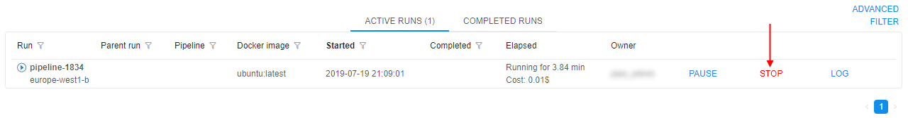
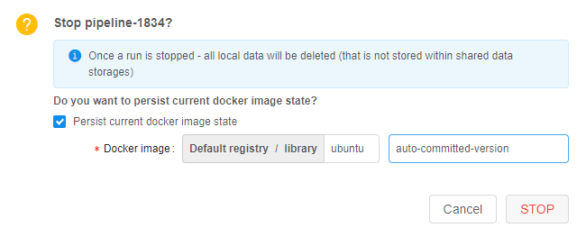

# 11.2. Auto-commit Docker image

> User shall have **ROLE\_ADMIN** role or be an **OWNER** of the Run to stop it and auto-commit Docker image.

Auto-committing is a useful Cloud Pipeline option that allows to save current Docker image state before stopping a Run.

1. In the **Active runs** tab select a Run and press **STOP**  
    
2. Select the checkbox **Persist current docker image state**, give that Docker image a **name** and a **version** (optional), e.g. **auto-committed-version**). Press **STOP**.  
    
3. After that a Run will have a COMMITTING status for a short period of time. And then it will be stopped.  
    