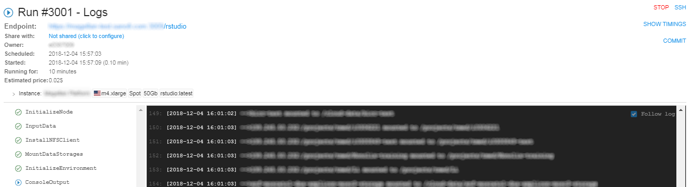
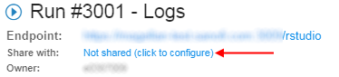
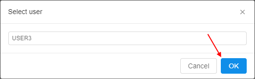
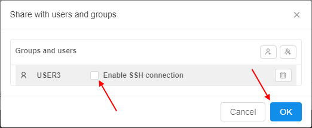
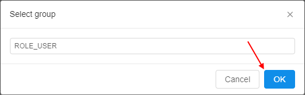
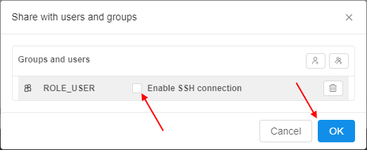
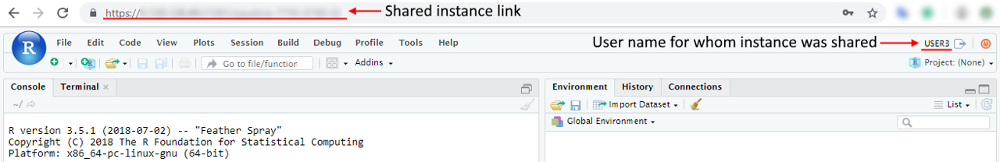
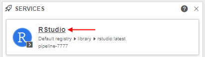

# 11.3. Sharing with other users or groups of users

- [Overview](#overview)
- [Sharing a run with user(s)](#sharing-a-run-with-users)
- [Sharing a run with users group(s)](#sharing-a-run-with-users-groups)
- [Work with a sharing running instance (for not owners)](#work-with-a-sharing-running-instance-for-not-owners)

## Overview

For certain use cases it is beneficial to be able to share applications with other users/groups. Cloud platform allows ability when runs environments will be accessed for several users, not only for the user, who launched the run (**OWNER**).  
Please note that sharing of a run - allows to share only the interactive tools endpoints (e.g. _rstudio_, _jupyter_, _nomachine_, etc.). SSH sessions cannot be shared.

## Sharing a run with user(s)

In this example we will share a run with other user(s).  
**_Note_**: for do that, user account shall be registered within CP users catalog and granted **READ** & **EXECUTE** for the pipeline/tool. User must be an **OWNER** of the running instance.  
**_Note_**: in the example we will share a run of the rstudio Tool, that running with "friendly" URL (for more information about launching Tools see [10.5. Launch a Tool](../10_Manage_Tools/10.5._Launch_a_Tool.md).

1. Open run logs of the instance:  
    
2. Click on the link opposite the label "**Share with**":  
    
3. In opened pop-up window click  button.
4. In appeared window enter user name, for whom you want to share running instance. Confirm selected user by clicking "**Ok**" button:  
    
5. If necessary, add more users. When finished, click "**Ok**" button:  
    
6. In run logs, users names, for which you shared running instance, will be appeared opposite the label "**Share with**":  
    
7. Copy the link opposite the label "**Endpoint**", send it to user(s), for whom (which) you shared the instance:  
    

## Sharing a run with users group(s)

In this example we will share a run with other users group(s).  
**_Note_**: for do that, user account shall be registered within CP users catalog and granted **READ** & **EXECUTE** for the pipeline/tool. User must be an **OWNER** of the running instance.  
**_Note_**: in the example we will share a run of the rstudio Tool, that running with "friendly" URL (for more information about launching Tools see [10.5. Launch a Tool](../10_Manage_Tools/10.5._Launch_a_Tool.md).

1. Open run logs of the instance:  
    
2. Click on the link opposite the label "**Share with**":  
    
3. In opened pop-up window click  button.
4. In appeared window enter users group name, for whom you want to share running instance. Confirm selected users group by clicking "**OK**" button:  
    
5. If necessary, add more groups. When finished, click "**OK**" button:  
    
6. In run logs, users groups names, for which you shared running instance, will be appeared opposite the label "**Share with**":  
    
7. Copy the link opposite the label "**Endpoint**", send it to users, for which group(s) you shared the instance:  
    

## Work with a sharing running instance (for not owners)

A current user can be accessed to a service, without running own jobs, if that service was shared for a current user.  
**_Note_**: for do that, user account shall be registered within CP users catalog and granted "sharing" permission for the instance.

### Way 1

1. Log in at CP. Open new tab in browser and input the link of sharing running instance, that you received.
2. The GUI of the Tool, of that running instance was shared, will be displayed. For example, described above, it will be the RStudio GUI:  
    

### Way 2

1. On home Dashboard click  button.
2. In opened pop-up window enable check-box "**Services**" and click "**OK**" button:  
    
3. On appeared "**Services**" widget at the **Home dashboard** page "shared" service will be displayed:  
    
4. Click on it. The GUI of the Tool, of that running instance was shared, will be displayed.