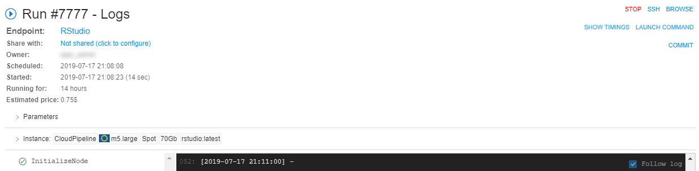
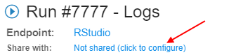

# 11.3. Sharing with other users or groups of users

- [Overview](#overview)
- [Sharing a run with user(s)](#sharing-a-run-with-users)
- [Sharing a run with users group(s)](#sharing-a-run-with-users-groups)
- [Work with a sharing running instance (for not owners/admins)](#work-with-a-sharing-running-instance-for-not-ownersadmins)
- [Sharing runs with the anonymous users](#sharing-runs-with-the-anonymous-users)

## Overview

For certain use cases it is beneficial to be able to share applications with other users/groups. Cloud platform allows ability when runs environments will be accessed for several users, not only for the user, who launched the run (**OWNER**).  
Sharing of a run - allows to share as the interactive tools endpoints (e.g. _rstudio_, _jupyter_, _nomachine_, etc.) and SSH sessions too.

## Sharing a run with user(s)

In this example we will share a run with other user(s).  
> **_Note_**: for do that, user account shall be registered within CP users catalog and granted **READ** & **EXECUTE** for the pipeline/tool. User must be an **OWNER** of the running instance.

**_Note_**: in the example we will share a run of the RStudio tool (for more information about launching Tools see [10.5. Launch a Tool](../10_Manage_Tools/10.5._Launch_a_Tool.md)).

1. Open run logs of the instance:  
    
2. Click the link near the label "**Share with**":  
    
3. In the opened pop-up window click  button.
4. In the appeared window enter user name, for whom you want to share running instance. Confirm selected user by clicking the **OK** button:  
    
5. If necessary, add more users.  
    If you want to give a SSH-access to the instance - set the **Enable SSH connection** checkbox. If this checkbox is not set, only the interactive tools endpoints will be shared.  
    When finished, click the **Ok** button:  
    
6. In the run logs, users names for whom you shared running instance will appear near the label **Share with**:  
    
7. Copy the link near the label **Endpoint**, send it to users, for whom you shared the instance:  
    

> To share the SSH-access to a non-interactive run for the user - use the similar steps.  
> For a non-interactive run the "share" pop-up looks slightly different ("**Enable SSH connection**" checkboxes are missed):  
> 

## Sharing a run with users group(s)

In this example we will share a run with other users group(s).  
> **_Note_**: for do that, user account shall be registered within CP users catalog and granted **READ** & **EXECUTE** for the pipeline/tool. User must be an **OWNER** of the running instance.

**_Note_**: in the example we will share a run of the RStudio tool (for more information about launching Tools see [10.5. Launch a Tool](../10_Manage_Tools/10.5._Launch_a_Tool.md)).

1. Open run logs of the instance:  
    
2. Click the link near the label **Share with**:  
    
3. In the opened pop-up window click  button.
4. In the appeared window enter user group's name, for which you want to share running instance. Confirm selected user group by click the **OK** button:  
    
5. If necessary, add more groups.  
    If you want to give a SSH-access to the instance - set the **Enable SSH connection** checkbox. If this checkbox is not set, only the interactive tools endpoints will be shared.  
    When finished, click the **OK** button:  
    
6. In the run logs, user group names, for which you shared running instance, will appear near the label **Share with**:  
    
7. Copy the link near the label **Endpoint**, send it to users, for which group(s) you shared the instance:  
    

> To share the SSH-access to a non-interactive run for the user group - use the similar steps.  
> For a non-interactive run the "share" pop-up looks slightly different ("**Enable SSH connection**" checkboxes are missed):  
> 

## Work with a sharing running instance (for not owners/admins)

A current user can be accessed to a service, without running own jobs, if that service was shared for a current user or his group(s).  
**_Note_**: for do that, user account shall be registered within CP users catalog and granted "sharing" permission for the instance.

### Way 1

1. Log in at the Cloud Pipeline. Open a new tab in a browser and input the link of the sharing running instance, that you received.
2. The GUI of the Tool, of that running instance was shared, will be displayed. For example described above, it will be the RStudio GUI:  
    

### Way 2

1. On the **Home dashboard** click  button.
2. In the opened popup enable the checkbox **SERVICES** and click the **OK** button:  
    
3. On the appeared **SERVICES** widget at the **Home dashboard** page accessible "shared" services will be displayed:  
    
4. Click it. The GUI of the Tool of the running shared instance will be displayed.  
    

### Way 3. For the runs with the shared SSH-access

If **Enable SSH connection** checkbox was set at the sharing configure form (for the interactive run) or the non-interactive run was shared with a current user or his group(s), the SSH-access to the running instance can be obtained. For that - hover over the service "card" in the **SERVICES** widget at the **Home dashboard** page and click the **SSH** hyperlink:  
      
    A new page with the **Terminal access** to the shared instance will appear:  
    

## Sharing runs with the anonymous users

For certain use-cases, it is required to allow such type of access for any user, who has successfully passed the IdP authentication but is not registered in the Cloud Pipeline and also such users shall not be automatically registered at all and remain `Anonymous`.  
To enable such behavior, the following application properties have to be specified before the deployment:

- `saml.user.auto.create=EXPLICIT_GROUP`
- `saml.user.allow.anonymous=true`

Once anonymous access is enabled system-wide each run that requires to be accessible by `Anonymous` has to be configured to share endpoints with the following user group - `ROLE_ANONYMOUS_USER`.

It could be performed in the following way:

- Cloud Pipeline user launches the run whose interactive endpoint he wishes to share.
- The user opens the **Run logs** page of the launched run
- Then clicks the link near the **Share with** label:  
    
- In the opened popup clicks the corresponding button to share with a group/role:  
    
- In the appeared window, the user should select the `ROLE_ANONYMOUS_USER` role:  
    
- Sharing with the `Anonymous` will be displayed at the Run logs page:  
    
- The user should copy the Endpoint-link of the run and send it to the `Anonymous` user he wants to share.

`Anonymous` user should open a new tab in a browser and just input the link of the sharing running instance, that he has received. If that user passes `SAML` authentication, he will get access to the endpoint. Attempts to open any other Platform pages will fail.

**_Note_**: a user is treated as `Anonymous` if he is logging in and the `SAML` response is valid, but the user is not registered in the Platform and the auto-registration (of any kind) is not enabled.
