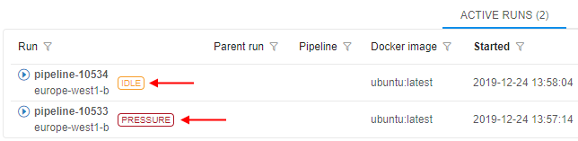
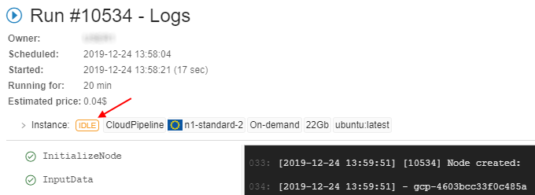
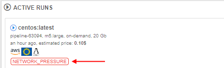
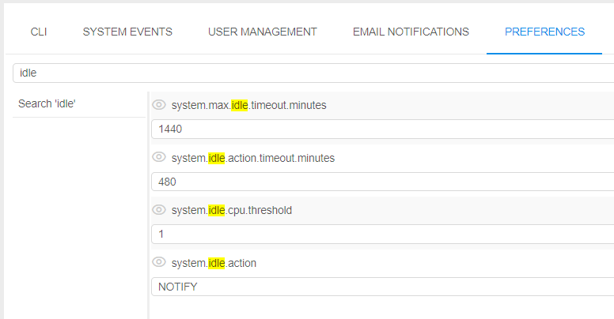
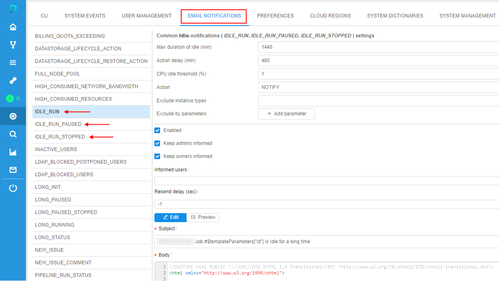
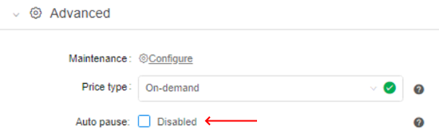
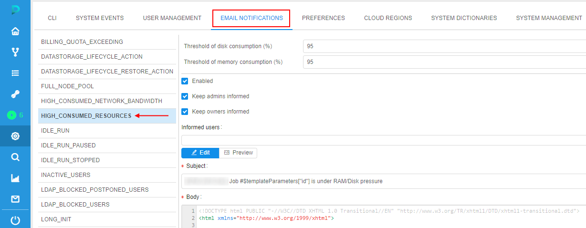

# Automatic actions with runs

In this section, let's consider the configurable behavior of automatic actions/notifications for the launched runs that are being in "idle" or "under pressure" state for a long time.

The following view of high-level metrics information for the Active Runs is implemented:

-  - this auxiliary label is shown when node's CPU consumption is lower than a certain level, defined by the admin. This label should attract the users attention cause such run may produce extra costs.  
-  - this auxiliary label is shown when node's Memory/Disk consumption is higher than a certain level, defined by the admin. This label should attract the users attention cause such run may accidentally fail.

These labels are displayed:

- at the **Runs** page  
    
- at the **Run logs** page  
    
- at the main dashboard (the **ACTIVE RUNS** panel)  
    

If a user clicks that label from the **Runs** or the **Run logs** page the _Cluster node Monitor_ will be opened to view the current node consumption.

Admins can configure the emergence of these labels and system actions for each run state ("Idle"/"Pressure") by the system-level parameters.

## "Idle" runs

The system behavior for the "idle" runs is defined by the set of the following System-level parameters ([Preferences](../12_Manage_Settings/12.10._Manage_system-level_settings.md#system)):

| Preference name | Description |
|-|-|
| **`system.max.idle.timeout.minutes`** | Specifies the duration in minutes after that the system should check node's activity. If after this duration node's CPU utilization will be below **`system.idle.cpu.threshold`** - email notification _IDLE\_RUN_ will be sent to the user and the run itself will be marked by the  label |
| **`system.idle.action.timeout.minutes`** | Specifies the duration in minutes. If node's CPU utilization is below **`system.idle.cpu.threshold`** for this duration after the **`system.max.idle.timeout.minutes`** is over - an action, specified in **`system.idle.action`** will be performed |
| **`system.idle.cpu.threshold`** | Specifies percentage of the node's CPU utilization, below which an action shall be taken |
| **`system.idle.action`** | Sets which action to perform with the node, that has the CPU utilization below than **`system.idle.cpu.threshold`**: <ul><li><b><i>NOTIFY</i></b> - only send email notification <i>IDLE_RUN</i>. This action will be repeated every <b><code>system.idle.action.timeout.minutes</b></code> if the node's CPU utilization will be still below than <b><code>system.idle.cpu.threshold</code></b></li><li><b><i>PAUSE</i></b> - pause an instance if possible (only if the instance is <i>On-Demand</i>, <i>Spot</i> instances are skipped) and send single email notification <i>IDLE\_RUN\_PAUSED</i></li><li><b><i>PAUSE_OR_STOP</i></b> - pause an instance if it is <i>On-Demand</i> or stop an instance if it is <i>Spot</i> and send the corresponding single email notification <i>IDLE\_RUN\_PAUSED</i>/<i>IDLE\_RUN\_STOPPED</i></li><li><b><i>STOP</i></b> - Stop an instance, disregarding price-type, and send single email notification <i>IDLE\_RUN\_STOPPED</i></li></ul> |
| **`system.resource.monitoring.period`** | Specifies period (in milliseconds) between the scannings of running instances to collect the monitoring metrics. After each such period, it's defined to display  label for the specific instance or not |

Example of these settings:

In general, the behavior will be the following:

1. User launches a run
2. After **`system.max.idle.timeout.minutes`** period, the system starts to check the node's activity.
3. If the node's CPU utilization becomes below **`system.idle.cpu.threshold`**: email notification _IDLE\_RUN_ is being sent, the run itself is being marked by the  label
4. After **`system.idle.action.timeout.minutes`**, if the node's CPU utilization is still below **`system.idle.cpu.threshold`**:
    - email notification _IDLE\_RUN_ is being sent (in case when **`system.idle.action`** is set as **_NOTIFY_**)
    - run is being paused/stopped and the corresponding email notification _IDLE\_RUN\_PAUSED_ or _IDLE\_RUN\_STOPPED_ is being sent (in case when **`system.idle.action`** is set as _PAUSE_/_PAUSE\_OR\_STOP_/_STOP_)
5. In case when **`system.idle.action`** is set as **_NOTIFY_**, email notifications _IDLE\_RUN_ continue to be sent every **`system.idle.action.timeout.minutes`**, if the node's CPU utilization remains below the **`system.idle.cpu.threshold`**
6. The state of the  label (to display or not) is checked every **`system.resource.monitoring.period`**
7. The settings of the email notifications (message, the list of informed users, etc.) the admin can configure via the corresponding tab [Email notifications](../12_Manage_Settings/12._Manage_Settings.md#email-notifications) of the system-level settings:  
    

**_Note_**: users can manually disable the automatic pausing of on-demand instances if they aren't used. For that the "**Auto pause**" checkbox at the **Launch** page shall be unchecked before the run:  
    

This action cancels only the auto pause, but the _RUN\_IDLE_ email notifications will be being sent (if the corresponding conditions will be met).

## "Pressure" runs

The system behavior for the runs "under pressure" (high-consumed) is defined by the set of the following System-level parameters ([Preferences](../12_Manage_Settings/12.10._Manage_system-level_settings.md#system)):

| Preference name | Description |
|-|-|
| **`system.disk.consume.threshold`** | Specifies the node's disk threshold (in %) above which the email notification _HIGH\_CONSUMED\_RESOURCES_ will be sent and the corresponding run will be marked by the  label |
| **`system.memory.consume.threshold`** | Specifies the node's memory threshold (in %) above which the email notification _HIGH\_CONSUMED\_RESOURCES_ will be sent and the corresponding run will be marked by the  label |

Example of these settings:  
    

So, when memory or disk consuming will be higher than a threshold value for a specified period of time (in average) - a notification will be sent (and resent after a delay, if the problem is still in place. The default repeat delay is 30 minutes, it could be configured before the stand deployment).

Preferences of the notification could be configured at the _HIGH\_CONSUMED\_RESOURCES_ section of the [Email notifications](../12_Manage_Settings/12._Manage_Settings.md#email-notifications) of the system-level settings:  
    
