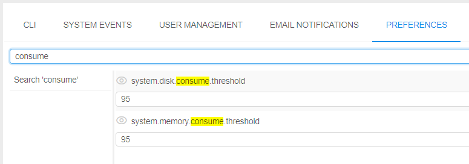

# Automatic actions with runs

In this section, let's consider the configurable behavior of automatic actions/notifications for the launched runs that are being in "idle", "under pressure" or "network pressure" state for a long time.

- ["Idle" runs](#idle-runs)
- ["Pressure" runs](#pressure-runs)
- ["Network pressure" runs](#network-pressure-runs)
    - [Limit pod's network bandwidth](#limit-pods-network-bandwidth)

The following view of high-level metrics information for the Active Runs is implemented:

-  - this auxiliary label is shown when node's CPU consumption is lower than a certain level, defined by the admin. This label should attract the users attention cause such run may produce extra costs.  
-  - this auxiliary label is shown when node's Memory/Disk consumption is higher than a certain level, defined by the admin. This label should attract the users attention cause such run may accidentally fail.
-  - this auxiliary label is shown when node's network consuming is higher than a certain level, defined by the admin. This label should attract the users attention cause such run may lead to network failures.

These labels are displayed:

- at the **Runs** page  
    
- at the **Run logs** page  
    
- at the main dashboard (the **ACTIVE RUNS** panel)  
    

By click that label, the _Cluster node Monitor_ will be opened to view the current node consumption.

Admins can configure the emergence of these labels and system actions by the system-level parameters or **Cloud Pipeline** API.

## "Idle" runs

The system behavior for the "idle" runs is defined by the set of the following System-level parameters ([Preferences](../12_Manage_Settings/12.10._Manage_system-level_settings.md#system)):

| Preference name | Description |
|-|-|
| **`system.max.idle.timeout.minutes`** | Specifies the duration in minutes after that the system should check node's activity. If after this duration node's CPU utilization will be below **`system.idle.cpu.threshold`** - email notification _IDLE\_RUN_ will be sent to the user and the run itself will be marked by the  label |
| **`system.idle.action.timeout.minutes`** | Specifies the duration in minutes. If node's CPU utilization is below **`system.idle.cpu.threshold`** for this duration after the **`system.max.idle.timeout.minutes`** is over - an action, specified in **`system.idle.action`** will be performed |
| **`system.idle.cpu.threshold`** | Specifies percentage of the node's CPU utilization, below which an action shall be taken |
| **`system.idle.action`** | Sets which action to perform with the node, that has the CPU utilization below than **`system.idle.cpu.threshold`**: <ul><li><b><i>NOTIFY</i></b> - only send email notification <i>IDLE_RUN</i>. Action is being repeated every <b><code>system.idle.action.timeout.minutes</b></code> if the node's CPU utilization will be still below than <b><code>system.idle.cpu.threshold</code></b></li><li><b><i>PAUSE</i></b> - pause an instance if possible (only if the instance is <i>On-Demand</i>, <i>Spot</i> instances are skipped) and send single email notification <i>IDLE\_RUN\_PAUSED</i></li><li><b><i>PAUSE_OR_STOP</i></b> - pause an instance if it is <i>On-Demand</i> or stop an instance if it is <i>Spot</i> and send the corresponding single email notification <i>IDLE\_RUN\_PAUSED</i>/<i>IDLE\_RUN\_STOPPED</i></li><li><b><i>STOP</i></b> - Stop an instance, disregarding price-type, and send single email notification <i>IDLE\_RUN\_STOPPED</i></li></ul> |
| **`system.resource.monitoring.period`** | Specifies period (in milliseconds) between the scannings of running instances to collect the monitoring metrics. After each such period, it's defined to display  label for the specific instance or not |

Example of these settings:

In general, the behavior will be the following:

1. User launches a run
2. After **`system.max.idle.timeout.minutes`** period, the system starts to check the node's activity.
3. If the node's CPU utilization becomes below **`system.idle.cpu.threshold`**: email notification _IDLE\_RUN_ is being sent, the run itself is being marked by the  label
4. After **`system.idle.action.timeout.minutes`**, if the node's CPU utilization is still below **`system.idle.cpu.threshold`**:
    - email notification _IDLE\_RUN_ is being sent (in case when **`system.idle.action`** is set as **_NOTIFY_**)
    - run is being paused/stopped and the corresponding email notification _IDLE\_RUN\_PAUSED_ or _IDLE\_RUN\_STOPPED_ is being sent (in case when **`system.idle.action`** is set as _PAUSE_/_PAUSE\_OR\_STOP_/_STOP_)
5. In case when **`system.idle.action`** is set as **_NOTIFY_**, email notifications _IDLE\_RUN_ continue to be sent every **`system.idle.action.timeout.minutes`**, if the node's CPU utilization remains below the **`system.idle.cpu.threshold`**
6. The state of the  label (to display or not) is checked every **`system.resource.monitoring.period`**
7. The settings of the email notifications (message, the list of informed users, etc.) the admin can configure via the corresponding tab [Email notifications](../12_Manage_Settings/12.9._Change_email_notification.md#idle-runs) of the system-level settings:  
    

**_Note_**: users can manually disable the automatic pausing of on-demand instances if they aren't used. For that the "**Auto pause**" checkbox at the **Launch** page shall be unchecked before the run:  
    

This action cancels only the auto pause, but the _RUN\_IDLE_ email notifications will be being sent (if the corresponding conditions will be met).

## "Pressure" runs

The system behavior for the runs "under pressure" (high-consumed) is defined by the set of the following System-level parameters ([Preferences](../12_Manage_Settings/12.10._Manage_system-level_settings.md#system)):

| Preference name | Description |
|-|-|
| **`system.disk.consume.threshold`** | Specifies the node's disk threshold (in %) above which the email notification _HIGH\_CONSUMED\_RESOURCES_ will be sent and the corresponding run will be marked by the  label |
| **`system.memory.consume.threshold`** | Specifies the node's memory threshold (in %) above which the email notification _HIGH\_CONSUMED\_RESOURCES_ will be sent and the corresponding run will be marked by the  label |

Example of these settings:  
    

So, when memory or disk consuming will be higher than a threshold value for a specified period of time (in average) - a notification will be sent (and resent after a delay, if the problem is still in place. The default repeat delay is 30 minutes, it could be configured before the stand deployment).

Preferences of the notification could be configured at the _HIGH\_CONSUMED\_RESOURCES_ section of the [Email notifications](../12_Manage_Settings/12.9._Change_email_notification.md#high-consumed-runs) of the system-level settings:  
    

## "Network pressure" runs

The system behavior for the "network pressure" runs is defined by the set of the following System-level parameters ([Preferences](../12_Manage_Settings/12.10._Manage_system-level_settings.md#system)):

| Preference name | Description |
|-|-|
| **`system.pod.bandwidth.limit`** | Defines the network bandwidth limit (in bytes/sec). Default value is `0` - this means there is no limit. |
| **`system.max.pod.bandwidth.minutes`** | Specifies the duration in minutes after which the system will check pod's network consuming in case when **`system.pod.bandwidth.limit`** > `0`. If after this duration pod's network consuming is still higher than **`system.pod.bandwidth.limit`** - email notification _HIGH\_CONSUMED\_NETWORK\_BANDWIDTH_ will be sent to the user and the run itself will be marked by the  label. |
| **`system.pod.bandwidth.action.backoff.period`** | Specifies the duration in minutes. If pod's network consuming is higher than **`system.pod.bandwidth.limit`** for this duration of time after the **`system.max.pod.bandwidth.minutes`** is over - an action, specified in **`system.pod.bandwidth.action`** will be performed. |
| **`system.pod.bandwidth.action`** | Sets which action to perform with the pod, that has the network consuming higher than **`system.pod.bandwidth.limit`**. Currently, possible actions:<ul><li><b><i>NOTIFY</i></b> - sends the email notification <i>_HIGH\_CONSUMED\_NETWORK\_BANDWIDTH_</i>. This action will be repeated every <b><code>system.pod.bandwidth.action.backoff.period</b></code> if the network consuming will be still higher than <b><code>system.pod.bandwidth.limit</code></b></li><li><b><i>LIMIT_BANDWIDTH</i></b> (not applicable yet) - limits pod's bandwidth</li></ul> |
| **`system.pod.bandwidth.monitor.delay`** | Specifies period (in milliseconds) between the scannings of running pods to collect the monitoring metrics. After each such period, it's defined to display  label for the specific instance or not |
| **`limit.network.bandwidth.command.timeout`** | Specifies the duration in seconds. Till this duration platform will try to perform the limit network bandwidth command in case when admin sets the network limit boundary manually via API - see details [below](#limit-pod-bandwidth). |

Example of these settings:

In general, the behavior will be the following:

1. User launches a run
2. If **`system.pod.bandwidth.limit`** > `0`, then after **`system.max.pod.bandwidth.minutes`** period, the system starts to check pod's network consuming.
3. If the pod's network consuming is higher than **`system.pod.bandwidth.limit`**:
    - email notification _HIGH\_CONSUMED\_NETWORK\_BANDWIDTH_ is being sent
    - the run itself is being marked by the  label
4. After **`system.pod.bandwidth.action.backoff.period`**, if the pod's network consuming is still higher than **`system.pod.bandwidth.limit`** and **`system.pod.bandwidth.action`** is set as **_NOTIFY_**, email notification _HIGH\_CONSUMED\_NETWORK\_BANDWIDTH_ is being sent again.
5. Email notifications _HIGH\_CONSUMED\_NETWORK\_BANDWIDTH_ continue to be sent every **`system.pod.bandwidth.action.backoff.period`**, if the pod's network consuming remains higher than **`system.pod.bandwidth.limit`**.
6. The state of the  label (to display or not) is checked every **`system.pod.bandwidth.monitor.delay`**.
7. The settings of the email notifications (message, the list of informed users, etc.) can be configured by admins via the corresponding tab [Email notifications](../12_Manage_Settings/12.9._Change_email_notification.md#high-consumed-network-bandwidth-runs) of the system-level settings:  
    

### Limit pod's network bandwidth

Admins can restrict specific pod's bandwidth to avoid high network consuming - through **Cloud Pipeline** API.  
Currently, setting of the restriction through GUI is not supported.

API method to set a bandwidth limit: `POST /run/{runId}/network/limit?enable=<boolean>&boundary=<int>`.  
Where:

- `{runId}` - run ID
- `enable=<boolean>` - option that enables/disables a bandwidth limit for a specific pod
- `boundary=<int>` - option that sets a size of bandwidth boundary limit in bytes/sec

This method sets a special tag for a run based on specified boundary limit: `NETWORK_LIMIT: <boundary>`. Setting of such tag initializes bandwidth limitation process.  
Only admins are able to call this method.

General journey of pod's bandwidth limitation looks like:

1. Admin sets the bandwidth boundary limit for a run via API method `POST /run/{runId}/network/limit`, specifying:
    - run ID
    - `enable` option as `true`
    - bandwidth boundary limit as integer value  
    
2. In case of successful method call, after approximately the **`system.pod.bandwidth.monitor.delay`** period of time:
    - at the run logs page, the warning message appears with the bandwidth limit and datetime when this limit will be applied to the the pod
    - in run logs, the task `LimitNetworkBandwidth` appears. This task contains logs of the bandwidth limit applying  
      
    **_Note_**: in case when server can't perform bandwidth boundary limitation commands from the first time, it will retry to perform commands until **`limit.network.bandwidth.command.timeout`** period is over.
3. From the time moment, displayed in the warning message of bandwidth limit at the run logs page, pod bandwidth will be limited. It can be observed via the instance monitoring:  
      
    In the example above, the same large file was downloaded twice:  
    - First time (see area 1) - without any bandwidth limitations.
    - Second time (see area 2) - with the bandwidth limitation that was set at the first step (`1000000` bytes/sec).
4. Also, at the main Dashboard (**Active Runs** section) and at the **Runs** page, additional label will appear for a run - `NETWORK_LIMIT`, e.g.:  
    
5. To remove a bandwidth boundary limit for a pod, call API method `POST /run/{runId}/network/limit` with `enable` option as `false`:  
    
6. After the removing a bandwidth boundary limit:
    - label  will disappear from the main Dashboard (Active Runs section) and from the Runs page    
    - at the run logs page, the warning message about the bandwidth limit will disappear
    - in the run logs (task `LimitNetworkBandwidth`), corresponding log will appear
    
