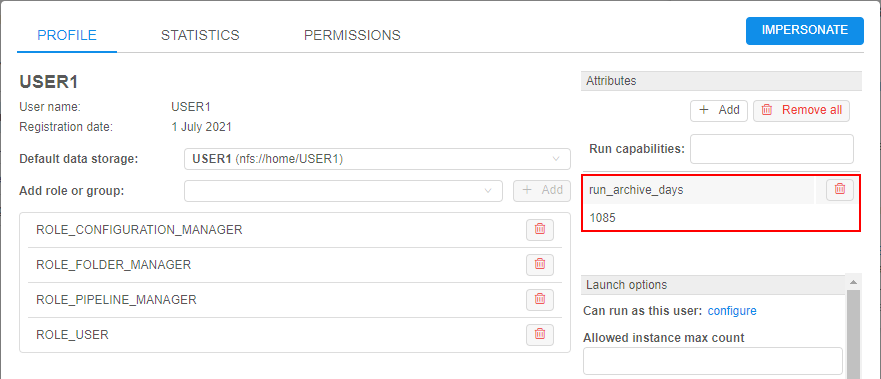

# Archive completed runs

> User shall have the **ROLE\_ADMIN** role to be able to manage runs archiving.

Currently, **Cloud Pipeline** does not allow to remove runs. But platform supports a mechanism of the runs archiving.  
That mechanism allows:

- to place records of the completed runs and their statuses into special DB tables for archived runs. Archived runs are not available via the platform GUI 
- to define users and/or groups which runs shall be archived
- to define the storing period for runs after which they will be archived

> **_Note_**: currently there is no mechanism to "return back" runs from archive. There is a way to get info about archived runs - via specific API methods - but you haven't the ability to place back archived runs to DB tables of regular runs and view them via the GUI again.

## Setting up archiving behavior

The behavior of the runs archiving mechanism is defined by the following [System Preferences](../12_Manage_Settings/12.10._Manage_system-level_settings.md):

| Preference name | Description |
|-|-|
| **`monitoring.archive.runs.enable`** | Enables archiving mechanism for completed runs |
| **`monitoring.archive.runs.delay`** | Manipulates the frequency of archiving operations. Operations of runs archiving are asynchronous and performed after each period of time specified via this preference. Unit of the preference value - _milliseconds_. Default value - `86400000` (24 hours in milliseconds) |
| **`system.archive.run.metadata.key`** | Defines the name of the metadata key that shall be specified for users/groups which runs shall be archived. Default value - `run_archive_days` |
| **`system.archive.run.owners.chunk.size`** | Defines the chunk size by which the data of completed runs to archive shall be divided. It allows to load runs data to DB tables of archived runs partially - to prevent performance or DB query issues. Data is divided by users count (runs owners count). Default value - `100` |
| **`system.archive.run.runs.chunk.size`** | Defines the chunk size by which the data of completed runs to archive shall be divided. It allows to load runs data to DB tables of archived runs partially - to prevent performance or DB query issues. Data is divided by master runs count. Default value - `1000` |

In a nutshell, the archiving mechanism is working by the following way:

- **`monitoring.archive.runs.enable`** shall be enabled
- runs archiving monitor is being activated every **`monitoring.archive.runs.delay`** period of time:
    - for all users and/or users of groups that have `run_archive_days` metadata key (or another key that specified in **`system.archive.run.metadata.key`**), archiving monitor checks their completed runs
    - all runs of such users that were finished more than `N` days ago (where `N` is value of the `run_archive_days` metadata key) will be archived and will disappear from the completed runs.  
    Under the hood, these runs will be placed into special DB tables for archived runs

### Specify storing period before archiving

To define the storing period for runs after which they will be archived, specify the key that defined in the preference **`system.archive.run.metadata.key`** in user/group attributes, e.g.:  
    

By default, it is `run_archive_days` metadata key as shown at the image above.  
Value of that metadata key defines the _storing_ period for runs of this user. I.e. all runs of this user, that were completed early than specified number of days ago, will be archived in case of enabled archiving monitor.  
In this way, for the user from the image above, all his runs completed more than 1085 days ago will be archived.

In case, when `run_archive_days` metadata key is set for a group, all runs of that group users will be archived if they were completed more than specified period of days ago.

Besides, the following priority rules are being applied:

- if user has an own runs archive metadata - this value will be used regardless of whether the runs archive metadata in any group of that user
- if user has no own runs archive metadata and belongs to multiple groups that have runs archive metadata - the minimal value of days count among these groups will be used

## Example of usage

In our example, we will set up archiving of completed runs older than 2 years for a specific user:

1. Navigate to the **System Settings** -> **Preferences** tab
2. Find the preference **`monitoring.archive.runs.enable`** and enable it:  
    
3. Find the preference **`monitoring.archive.runs.delay`** and set the monitoring frequency delay (e.g. in our example it will run every 6 hours):  
    
4. Save preference changes.
5. Find the preference **`system.archive.run.metadata.key`** and copy its value:  
    
6. Navigate to the **System Settings** -> **User management** tab -> **Users** subtab
7. Select the user to which you will setup runs archiving.
8. Open user's settings.
9. Click the **+ Add** button in the **Attributes** section to add a new metadata:  
    
10. Specify the metadata key that you copied at step 5 (value of the preference **`system.archive.run.metadata.key`**):  
    
11. Specify the value for the metadata that will be the maximal storing period for completed runs of this user. In our example it will be 730 days (i.e. 2 years). Click the **Add** button to confirm metadata creation:  
    
12. Save user's settings changes.

After the delay specified at step 3, you can check that old completed runs of that user disappeared from the **Completed runs** table lists (i.e. were archived).

For example, before the archiving:  
      
After the archiving, old runs that were completed more than specified at step 11 count of days ago will disappear:  
    

## Additional details

If you need to get billing info including archived data, you may use the API method `GET run/activity` with enabled `archive` flag.  
In such case, runs data will be loaded from DB tables of regular runs and from DB tables of archived runs for requested period. Default state of this flag: `off`.

More about **Cloud Pipeline** API see [here](../../api/API_tutorials/API_tutorials.md).
