# Visualization of Nextflow pipeline execution

- [General information](#general-information)
- [Controls](#controls)
- [Run details tabset](#run-details-tabset)
    - [Nextflow tasks](#tasks-tab)
        - [Processes](#processes)
        - [Tasks statuses](#tasks-statuses)
        - [Tasks](#tasks)
            - [Task details](#task-details)
    - [Configuration](#configuration-tab)
        - [Instance](#instance)
        - [Parameters](#parameters)
    - [Logs](#logs-tab)
    - [Reports](#reports-tab)
        - [Document preview](#document-preview)
    - [Launch command](#launch-command-tab)
- [Visualization setup](#visualization-setup)

**Run logs** page of the Cloud Pipeline platform allows to view different information about the run, e.g.:

- general run information
- instance info
- run parameters and their values
- list and timings of the separate tasks performed during the run execution
- detailed console output of the performed tasks
- etc.

These details are displayed similarly for all runs - see [Run logs](11._Manage_Runs.md#run-information-page) page for more information.  
But for [Nextflow](https://www.nextflow.io/) pipeline runs, this page has a different view and allows to view as mentioned and additional information:  
    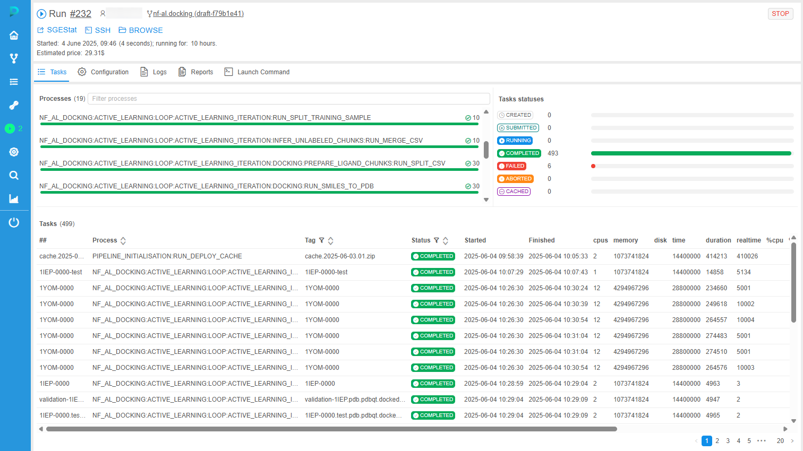

This page consists of several sections:

## General information

This section is located in the left-top corner of the page and displays general information about a pipeline run, e.g.:  
    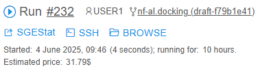

| Field/Control | Description |
|---|---|
| **State icon** | State of the run. Help tooltips are provided when hovering a run state icon, e.g.:<br />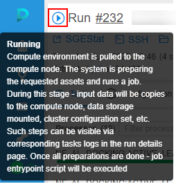 |
| **Run ID** | Unique ID of the run |
| **Owner** | Name of the user who started pipeline |
| **Pipeline name** | Name and version of the running pipeline |
| **Endpoint** | Endpoint hyperlink(s) for the interactive service(s) launched with the pipeline. For more details see [15. Interactive services](../15_Interactive_services/15._Interactive_services.md).<br>For example, here may be `SGEStat` endpoint to view SGE engine usage statistics (for corresponding runs). |
| **SSH** | Hyperlink to ssh to the running instance filesystem. See [15.2. Using Terminal access](../15_Interactive_services/15.2._Using_Terminal_access.md) for more details |
| **BROWSE** | Hyperlink to open the filesystem of the running instance in a Storage browser Web GUI - so the user can view, download, upload, delete files and folders for the current active run.<br>See [15.3. Expose node filesystem](../15_Interactive_services/15.3._Expose_node_filesystem.md) for more details. |
| **Timings** | Time points when a pipeline was: <ul><li>scheduled</li><li>started</li><li>finished or current duration for active run</li></ul>Click the row for more details:<br>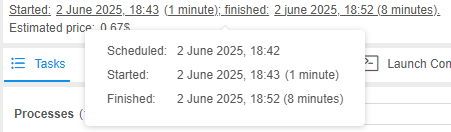 |
| **Estimated price** | Price of the pipeline run according to its duration and selected instance type |

## Controls

This section is located in the right-top corner of the page and includes a couple of controls that allow to manage the run lifecycle.

> **_Note_**: completed and active runs have different controls.

For example, controls of the running on-demand pipeline:  
    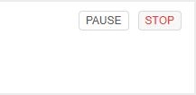

Possible controls in this section:

| Control | Description |
|---|---|
| **PAUSE** | allows to pause a run (_only for **On-demand** non-cluster runs_) |
| **RERUN** | allows to rerun completed runs |
| **RESUME** | allows to resume a paused run (_only for **On-demand** non-cluster runs_) |
| **STOP** | allows to stop a running pipeline |
| **TERMINATE** | allows to terminate a compute node of the paused run without its resuming (_only for **On-demand** non-cluster runs_) |

## Run details tabset

This section represents a set of tabs with all the main info about the pipeline run - Nextflow tasks and processes, run logs, instance info, run parameters and their values, detailed console output, etc.

### Tasks tab

Tab contains visualization of specific Nextflow pipeline execution details:  
    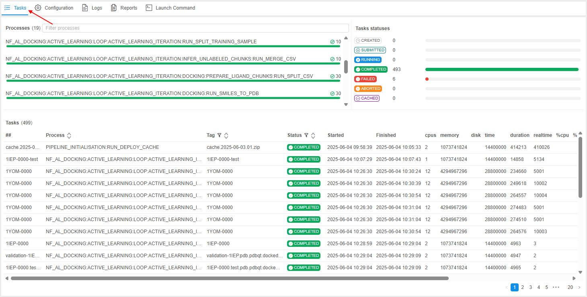

> **_Note_**: this tab is opened by default for the Nextflow pipeline runs. Content of the tab is refreshed automatically during the pipeline execution.

Tasks tab includes panel:

- [**Processes**](#processes) - displays the full list of Nextflow run processes
- [**Tasks statuses**](#tasks-statuses) - displays a summary over task statuses of all/selected processes
- [**Tasks**](#tasks) - displays list of tasks of all/selected processes and allows to view:
    - CPU, memory, disk and other utilization per task
    - command, metrics, and logs per task

#### Processes

This panel displays the full list of run processes and short summary over task statuses per each process:  
    

Each process in the list is presented via the following items:  
    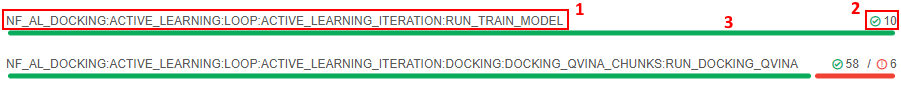

- **Name** (**1**) - full process name
- **Statuses summary** (**2**) - short summary over the task statuses in the process. Includes a status icon and a count of the task with that status in the current process. If there are tasks with different statuses in the process - their summary is shown separately divided by `/` - e.g., 58 completed tasks and 6 failed: 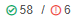
- **Statuses graph** (**3**) - horizontal bar graph showing summary over the task statuses in the process. Each status is displayed in its own color

Panel displays the total number of processes in the panel header.  
You can filter the displayed processes list using the corresponding bar above the list, e.g.:  
    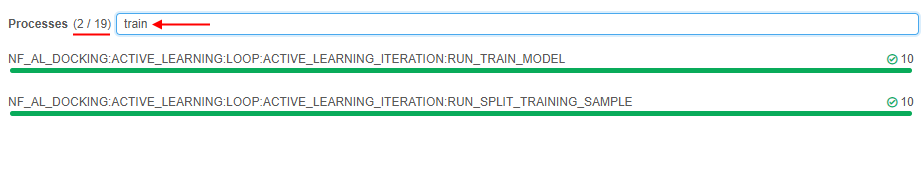

By default, **Tasks** tab displays tasks and their statuses for all Nextflow processes.  
You may view [Tasks](#tasks) and [Tasks statuses](#tasks-statuses) for a specific Nextflow process - click the process in the list and panels will correspondingly redrawn for only selected process tasks, e.g.:  
    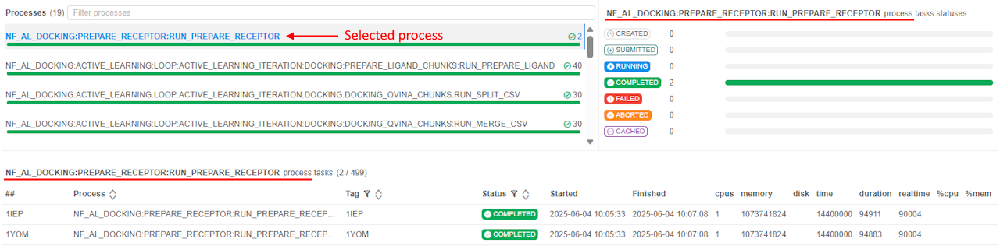

#### Tasks statuses

This panel displays the list of task statuses of all/selected processes as an horizontal bar graph:  
    

Each status in the list is presented via the following items:

- **Status name + icon** - each status is displayed in its own color
- **Tasks count** - number of tasks with this status in all/selected processes
- **Status graph** - horizontal bar displaying ratio of tasks count with this status to the total count of tasks in all/selected processes. Bar is displayed in status own color

#### Tasks

This panel displays list of tasks and their metrics of all/selected processes as a table:  
    

By default, panel displays the total number of tasks in all processes in the panel header.  
If you select any [process](#processes), selected process name and the number of tasks in that selected process, and the total number of tasks in all processes (divided by `/`) will be shown in the panel header, e.g.:  
    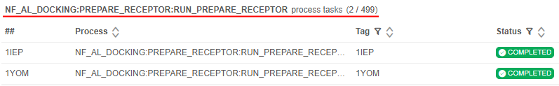

Table of task details contains the following columns:

- **\#\#** - task ID
- **Process** - name of the Nextflow process to which the task belongs
- **Tag** - user provided identifier associated with the task. Matches the task ID if not specified separately
- **Status** - task status
- **Started** - timestamp when task execution has started
- **Finished** - timestamp when task execution has completed
- _metrics_ - different task metrics, including CPU and memory usage, realtime of the task execution, disk usage (read/write processes), etc.  
    Description of possible task metrics you can find in the [Nextflow documentation](https://www.nextflow.io/docs/latest/reports.html#trace-fields).

Tasks table supports sorting by **Process**, **Tag** and **Status** columns.  
To sort the table by any of these columns, click its header. To sort in reverse order, click the column header again.

Tasks table supports filtering by **Tag** and **Status** columns.  
To filter the table by tag value:

- click the filter icon in the **Tag** column header
- specify the tag value by which you want to filter the table:  
    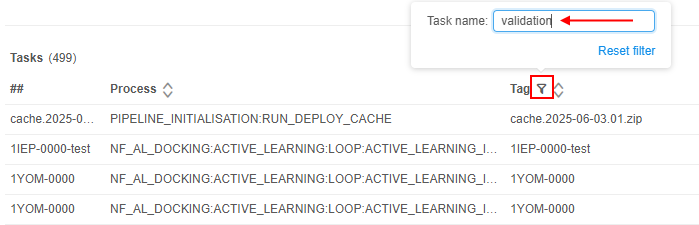
- press Enter key, table will be filtered, e.g.:  
    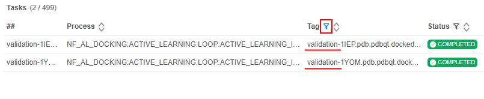

To filter the table by status value:

- click the filter icon in the **Status** column header
- select one or several statuses by which you want to filter the table
- table will be filtered automatically, e.g.:  
    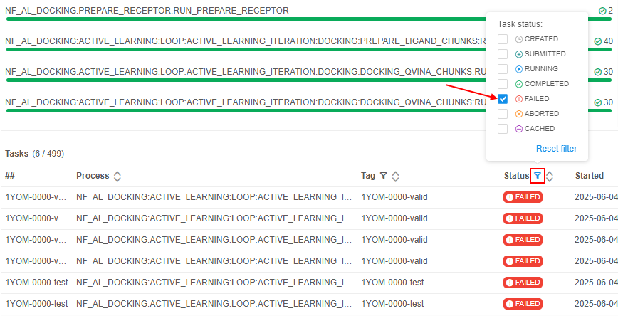

##### Task details

By click any task in the list, task details will be opened in a separate pop-up, e.g.:

- 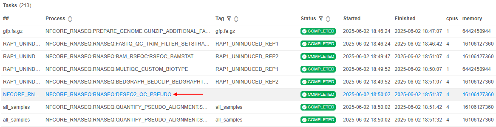
- 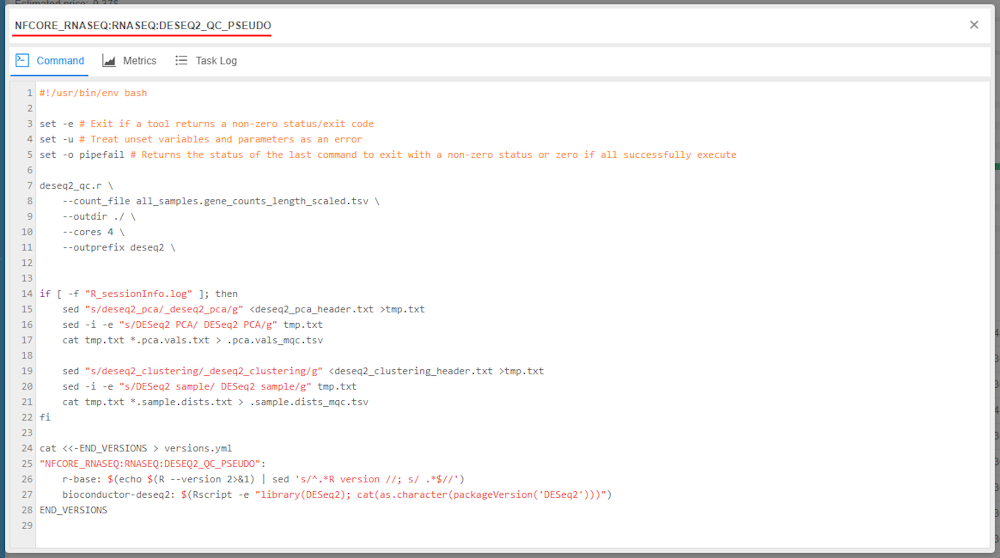

This pop-up contains tabs:

- **Command** (_see the image above_) - displays the command that is executed in the selected task
- **Metrics** - displays all non-empty task metrics like CPU and memory usage, realtime of the task execution, disk usage, etc.:  
      
    Description of possible metrics you can find in the [Nextflow documentation](https://www.nextflow.io/docs/latest/reports.html#trace-fields).
- **Task log** - displays task execution logs, e.g.:  
    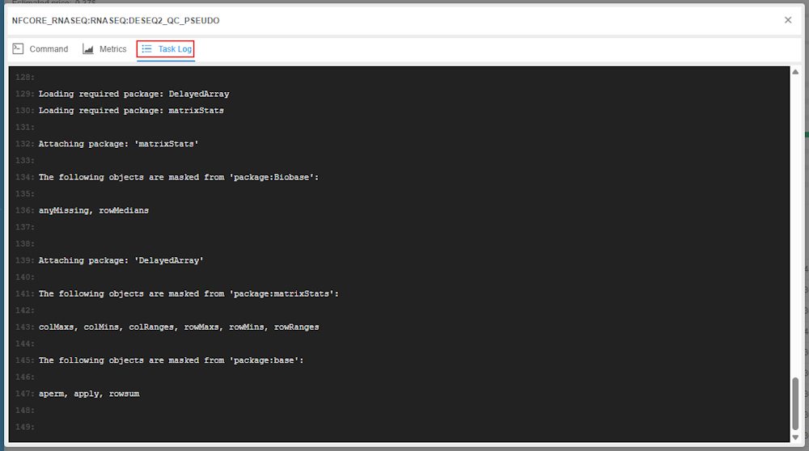

### Configuration tab

Tab contains details about the configuration used for the pipeline run and includes subsections:

- instance
- parameters

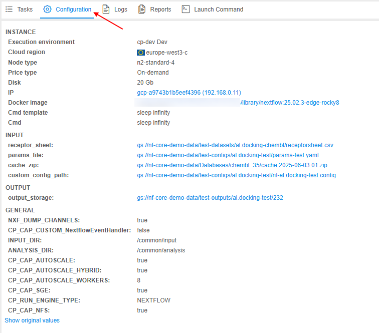

#### Instance

This subsection lists calculation node and execution environment details that were assigned to the run when it was launched, e.g.:  
    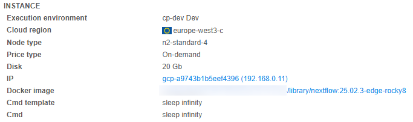

> **_Notes_**:
>
> - node IP is presented as a hyperlink. Click it if you want to navigate to the [node details](../09_Manage_Cluster_nodes/9._Manage_Cluster_nodes.md#node-information-page), where technical information and resources utilization is available.
> - Docker image name is presented as a hyperlink. Click it if you want to navigate to a specific [tool details](../10_Manage_Tools/10._Manage_Tools.md#description-tab) page.

#### Parameters

This subsection lists parameters and their values that were assigned to the run when it was launched, e.g.:  
    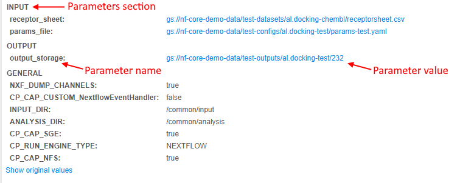

> **_Note_**: path parameters (with types `input`/`output`/`common`/`path`) are presented as hyperlinks. By click such hyperlinks, you will navigate to the appropriate location in datastorages hierarchy.

By default, all parameters values are shown in the resolved view, i.e. in view that will be used directly in the run execution.  
To view original (unresolved) parameter values, i.e. in view how these values were determined in the pipeline configuration before the launch, click the corresponding button in the bottom of the subsection, e.g.:  
    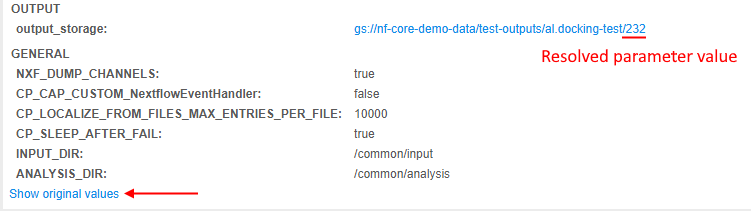  
Original values view:  
    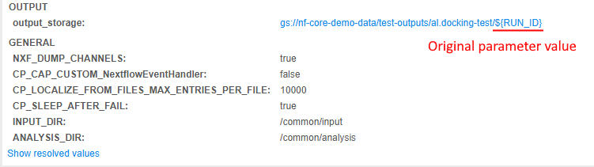

### Logs tab

Tab contains log details for all pipeline tasks (please not to be confused with Nextflow tasks).  
These tasks are platform tasks related to the node initialization and run - like environment launch, mount of datastorages to the environment, accessory services setup, etc.

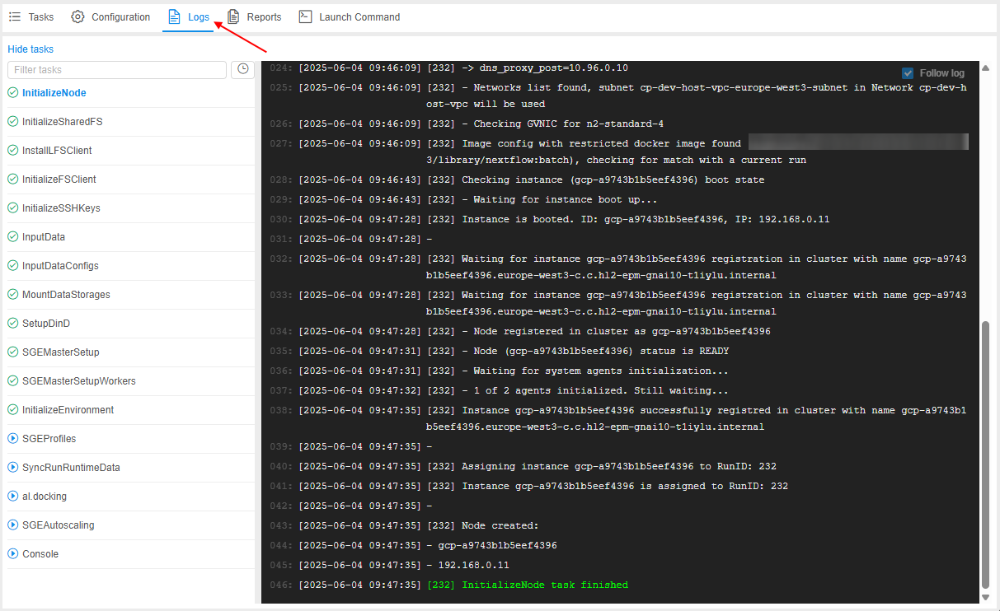

Here you can view console output from a whole pipeline or a selected task.  
It also shows a run failure cause if a run failed.

On the tab's left side, there is a list of all available tasks at the moment.  
Click the task, to view its specific logs, e.g.:  
    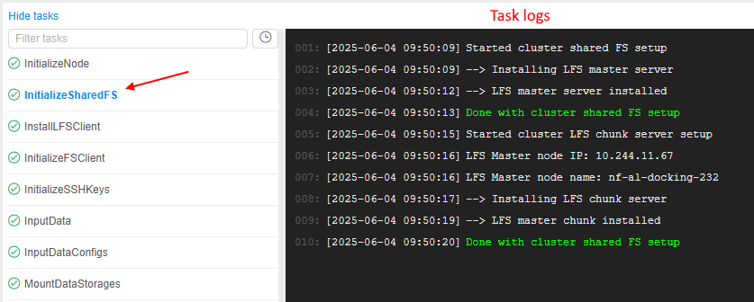

You can use the search bar above the task list, to filter tasks list, e.g.:  
    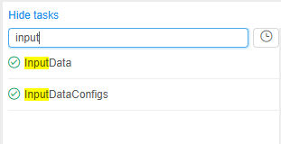

By default, task timings are hidden. But you can show/hide them using the **_clock_** button above the tasks list, e.g.:  
    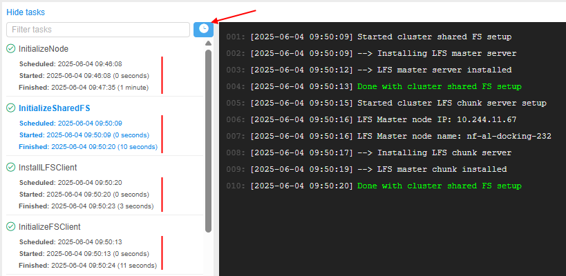

To hide the tasks panel, use the corresponding button above the list.  
When tasks are hidden, only console output is shown.

> **_Note_**: the **Follow log** control in the right-top corner of the console section enables auto scrolling of the console output.<br>It is useful for logs monitoring. Follow log is enabled by default, tick the box to turn it off.  
> 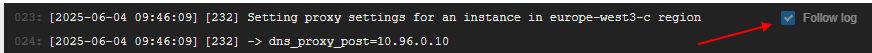

### Reports tab

Tab contains a list of documents retrieved from the pipeline's output directory after the pipeline has completed:  
    

> **_Note_**: list includes only documents loaded whithin special `Pipeline Results` storage rules, that are defined in the pipeline settings.  
> For more details about pipeline storage rules see [here](../06_Manage_Pipeline/6._Manage_Pipeline.md#storage-rules).  
> How to add a `Pipeline Results` storage rule that will allow to display pipeline output data in the **Reports** tab, see [here](../06_Manage_Pipeline/6.1._Create_and_configure_pipeline.md#adddelete-storage-rules-optional).

Documents list is presented in a table view with the following columns:

- **Name** - name of the `Pipeline Results` storage rule by which documents were loaded
- **Mask** - path mask from the `Pipeline Results` storage rule which was used to extract current documents from the whole pipeline output
- **Path** - list of full paths to documents loaded within the current `Pipeline Results` storage rule

If the list of documents for a single rule is too large, only several first documents are shown, other documents will be hidden. To view them, click the corresponding control and the full documents list will appear in a tooltip, e.g.:  
    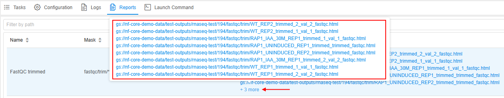

Table supports sorting by **Name** and **Mask** columns.  
To sort the table by any of these columns, click its header. To sort in reverse order, click the column header again.

#### Document preview

Each path in the documents table is presented as a hyperlink - by click it, a corresponding document will be opened in a preview pop-up.  

This pop-up includes:

- details section with fields/controls:
    - **Name** - label with the name of the `Pipeline Result` storage rule by which that document was loaded
    - **Path** - label with the full path to the document in the datastorage
    - **Open in a new tab** (_only for `HTML` documents_) - button to open the document in a new tab
    - **Download file** - button to download the document as a raw file to the local workstation
- preview section - main section with the document preview. According to the document type, view can vary:
    - `HTML` - report document is displayed as a formatted HTML-page inside a frame, e.g.:  
        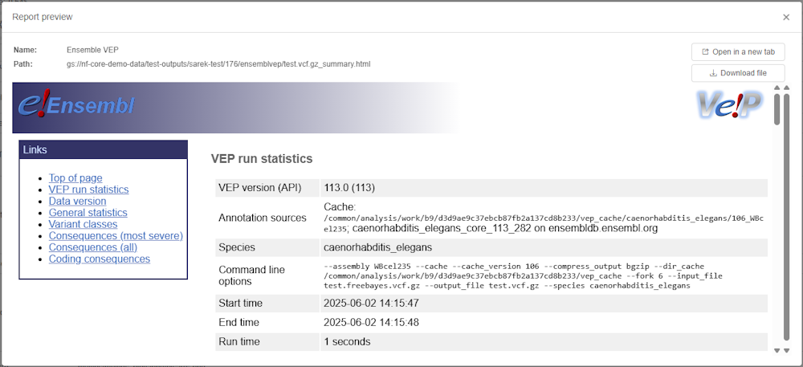
    - `PNG` - report document is displayed as an image, e.g.:  
        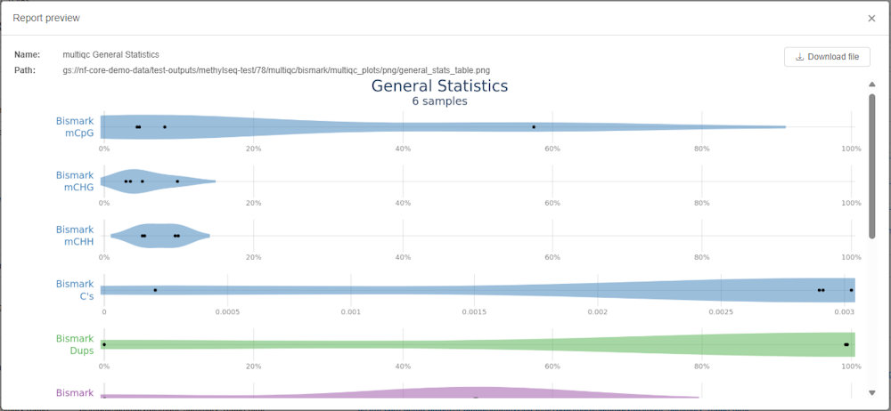
    - `CSV` / `TSV` - report document is displayed as a formatted table, e.g.:  
        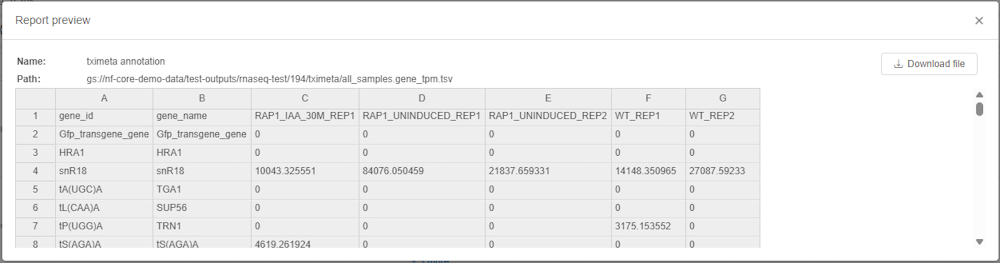
    - `JSON` - report document is displayed as a formatted JSON, e.g.:  
        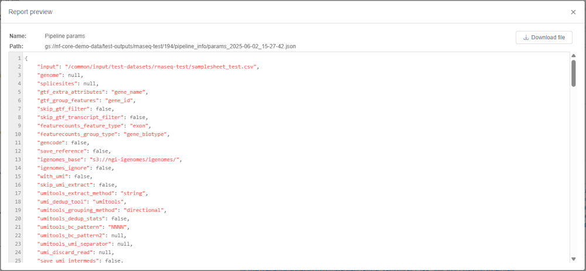
    - other text files - report document is displayed a plain text, e.g.:  
        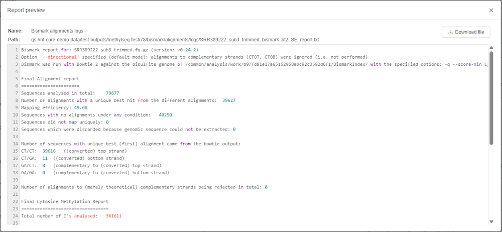
    - binary files - notification is shown about the impossibility of previewing, e.g.:
        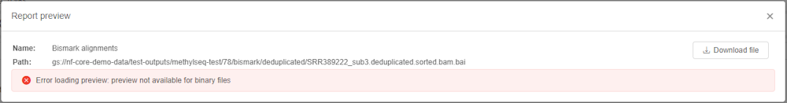

### Launch command tab

Tab allows to view the prepared CLI `pipe run` command/API POST request that can be used to run the identical pipeline as the current one.

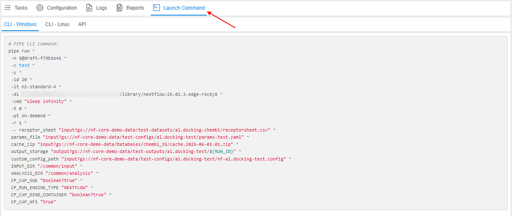

Tab contains subtabs:

- **CLI - Windows** - to get prepared `pipe run` CLI command for a pipeline launch for Windows OS
- **CLI - Linux** - to get prepared `pipe run` CLI command for a pipeline launch for Linux OS
- **API** - to get prepared API POST request for a pipeline launch

***

## Visualization setup

> User shall have **ROLE\_ADMIN** to perform configuration described in the current section.

Above described behavior and view of the **Run logs** page (_Nextflow-mode_) could be pre-configured during the platform deployment.  
It is not a default setting for all runs, this mode is automatically enabled only for launching Nextflow runs - in case, when Nextflow Docker image including the additional component `nf-weblog-handler` is deployed to the platform.  
This handler can utilize Nextflow feature `-with-weblog` to redirect events to Cloud Pipeline `run/{runId}/engine/tasks` API.

If necessary, ability to enable the _Nextflow-mode_ for any pipeline/tool run can be configured manually:

- Open [**System Preferences**](../12_Manage_Settings/12.10._Manage_system-level_settings.md).
- Find `launch.run.sync.runtime.data` system preference that allows to configure data runtime synchronization for the run.
- Add new value to this system preference specifying paths where to store the Nextflow trace (`NF_TRACE`) and task logs (`NF_TASK`), and make preference visible:

``` json
{
    "syncTimeout": 60,
    "data": {
        "NF_TRACE": {
            "runFolderPathPrefix": "<storage_folder_path>"
        },
        "NF_TASK": {
            "runFolderPathPrefix": "<storage_folder_path>",
            "dataPathPrefix": "workdir"
        }
    }
}
```
- Save changes, e.g.:  
    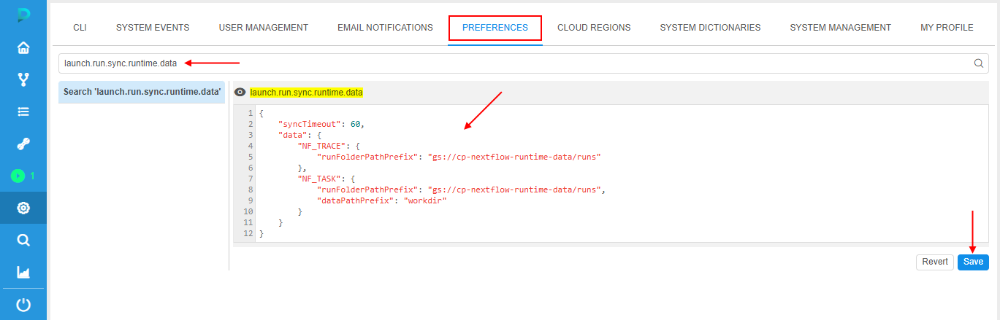
- Find `launch.capabilities` system preference that allows to create custom run capabilities.
- Add new capability in this system preference, and make it visible:

``` json
"NF_EVENT_HANDLER": {
    "description": "Enables Nextflow WebLog event handler.",
    "commands": [
        "[ -f /opt/nf-weblog-handler/nf-weblog-handler.sh ] && /opt/nf-weblog-handler/nf-weblog-handler.sh --start --enable-runtime-data -p $CP_NF_WEBLOG_HANDLER_PORT || exit 1"
    ],
    "params": {
        "CP_SYNC_TO_STORAGE_BATCH_MODE": "1",
        "CP_RUN_ENGINE_TYPE": "NEXTFLOW",
        "CP_NF_WEBLOG_HANDLER_ENABLED": "1",
        "CP_NF_WEBLOG_HANDLER_PORT": "8080",
        "CP_NF_WEBLOG_HANDLER_LOG_FILE": "/var/log/nf_weblog_handler.log"
    }
}
```
- Save changes:  
    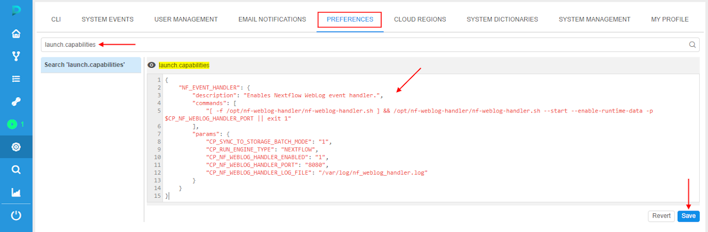

After that, user can easily enable _Nextflow-mode_ for the run:

1. For the particular tool or pipeline, select `NF_EVENT_HANDLER` capability before the run:
    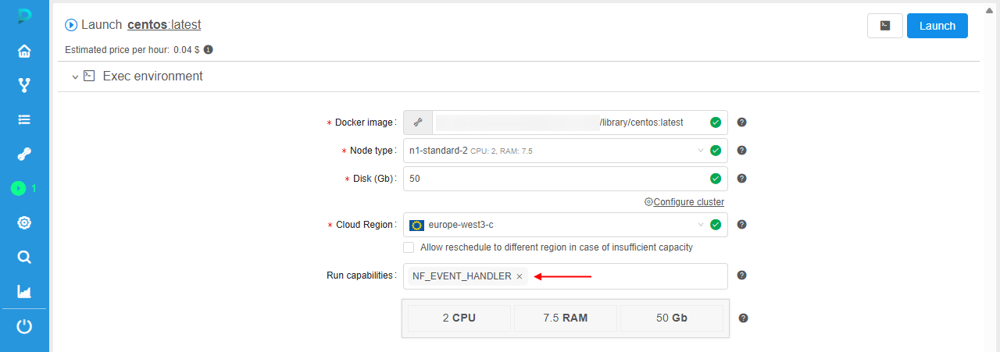
2. Launch workload and Nextflow wrapper will automatically start using it, even for non-Nextflow Docker images, e.g.:  
    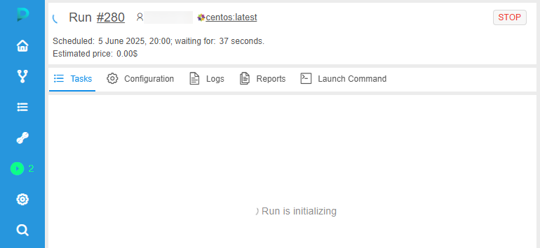

> For more details about Docker configuration to enable Nextflow visualization see [here](https://github.com/epam/cloud-pipeline/blob/develop/deploy/docker/cp-tools/base/nextflow/howto.md).
