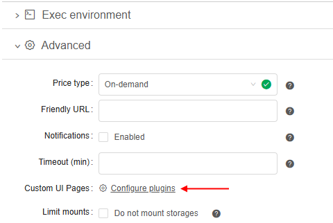
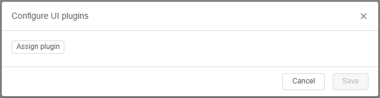
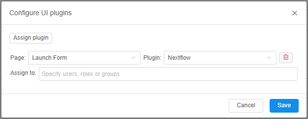
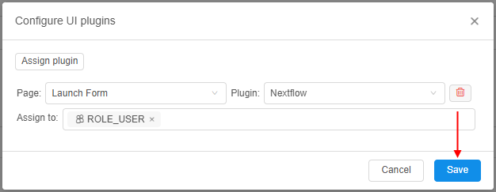
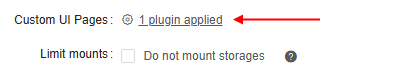
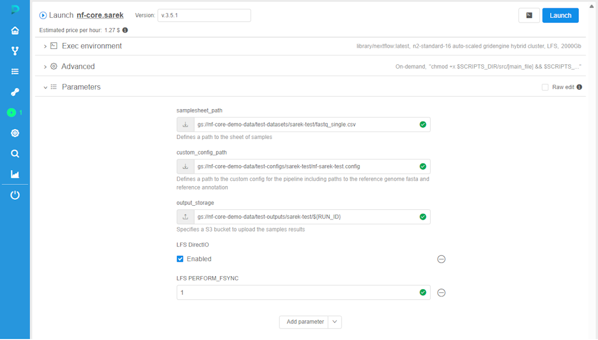
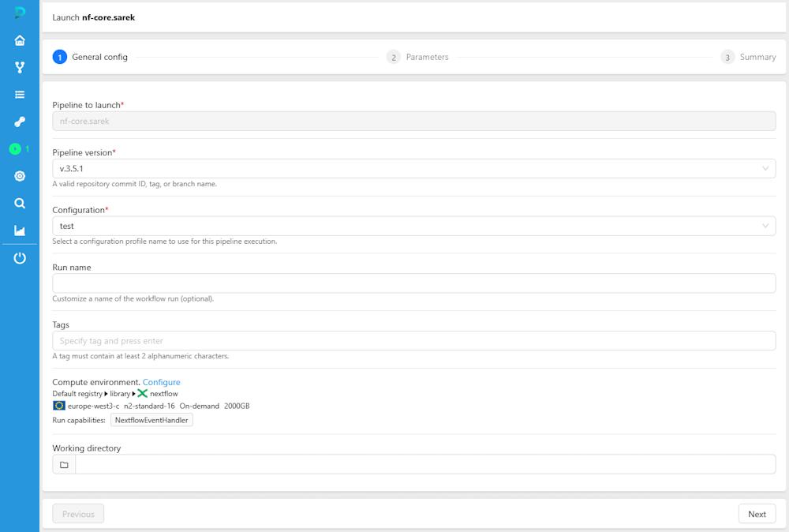

# GUI plugins for run pages

Cloud Pipeline provides a plugins framework that allows to customize GUI for different pages related to pipeline/tool launch or run.

GUI plugins framework implies the following usage mechanism:

- System administrator adds a new custom UI "page" (i.e. set of necessary scripts for GUI customization, and a description config file) to the server side.  
    Config file shall contain at least the plugin name and the name of the base UI page that is customized via this plugin.
- Then, in the Platform GUI, administrator or user with enough permissions:
    - opens settings of the tool/pipeline for which a custom UI shall be configured  
    - selects custom UI that will be used for the selected tool/pipeline
    - selects user(s)/user group(s) for which chosen custom UI will be used for the selected tool/pipeline
- After, when any user (from the assigned ones at the previous step) tries to launch this tool/pipeline and opens the corresponding page for which the custom UI was configured - user will see that custom UI of the page, not the base UI.

> Currently, customization for the only one base page is supported - the **Launch form** page (i.e. page that appears before the pipeline/tool launch with custom settings).

## Custom UI develop

For requirements and details how to create a GUI plugin supported by the Cloud Pipeline platform, see [here](../../operation/plugins_development.md).

## Custom UI setup

To setup a custom UI for a Cloud Pipeline page:

1. Open a pipeline/tool for which launch/run a custom UI shall be set.
2. For a tool, open the **EXECUTION ENVIRONMENT** section of the tool [Settings](../10_Manage_Tools/10._Manage_Tools.md#settings-tab):  
      
    Or in case of a pipeline, open the **Advanced** section of the [CONFIGURATION](../06_Manage_Pipeline/6._Manage_Pipeline.md#configuration):  
    
3. Click the **Configure plugins** button near the **Custom UI Pages** label.
4. Pop-up will be opened:  
    
5. Click the **Assign plugin** button.
6. The following fields will appear:  
      
    - **Page** - base page of the Cloud Pipeline platform which UI shall be replaced by the plugin
    - **Plugin** - name of the custom UI plugin
    - **Assign to** - field to specify user(s)/user group(s) for which assigned custom UI will be displayed
7. Select the base page from the dropdown list.
8. Select the plugin from the dropdown list.
9. Specify user(s)/group(s)/role(s) for which selected custom UI plugin will be applied.
10. Confirm specified values, e.g.:  
      
    PLease note, you can add several plugins via this form, repeating steps 5-9.  
    To remove assigned plugin - use the remove button near the plugin field - 
11. In the tool/pipeline settings, the **Configure plugins** button will change its view:  
    

So, we configured that for any user with the `ROLE_USER` role the custom UI plugin **Nextflow** will be used instead the base **Launch Form** page - but for only that tool/pipeline, which settings were changed.

### Usage example

Suggest that for some pipeline, the **Nextflow** plugin was assigned for the **Launch Form** - by the manual [above](#custom-ui-setup).  
In that case, for some user to which that plugin was assigned as well, instead of the following base **Launch Form** before this pipeline run:  
      
    a custom plugin UI will be displayed, prepared by the System Administrator, e.g.:  
      
