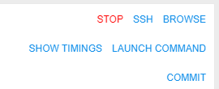

# 11. Manage Runs

- [Overview](#overview)
- [ACTIVE RUNS](#active-runs)
    - [Active run states](#active-run-states)
    - [Active run controls](#active-run-controls)
- [COMPLETED RUNS](#completed-runs)
    - [Completed run states](#completed-run-states)
    - [Completed run controls](#completed-run-controls)
- [Run information page](#run-information-page)
    - [General information](#general-information)
    - [Instance](#instance)
    - [Parameters](#parameters)
    - [Tasks](#tasks)
    - [Console output](#console-output)
    - [Controls](#controls)
- [Automatically rerun if a spot instance is terminated](#automatically-rerun-if-a-spot-instance-is-terminated)

## Overview

"**Runs**" provides a list of active and completed pipeline runs. You can get parameters and logs of specific run and stop run here.

"**Runs**" **space** has two tabs:

- Active runs view
- Completed runs view.

Runs are organized in a table which is the same for both tabs:

- **"State" icon** - state of the run.
- **Run** - run ID.
- **Parent run** - parent run ID, if a run was launched by another run.
- **Pipeline** - include:
    - _pipeline name_ (upper row) - a name of a pipeline
    - _version name_ (bottom row) - a name of a pipeline version
- **Docker image** - a name of docker image.
- **Started** - time when a run was started.
- **Completed** - time when a run was finished.
- **Elapsed** - include:  
    - _elapsed time_ (upper row) - a duration of a run
    - _estimated price_ (bottom row) - estimated price of run, which is calculated based on the run duration and selected instance type. This field is updated interactively (i.e. each 5 - 10 seconds).
- **Owner** - a user, which launched a run.

## ACTIVE RUNS

This tab displays a list of all pipelines that are currently running.  

### Active run states

-  - **Sandglass** - a run is waiting in the queue for the available compute node.
-  - **Rotating** - a run is being initialized, at this stage a new compute node will be created or an existing node will be reused.
-  - **Download** - now pipeline **Docker image** is downloaded to the node.
-  - **Play** - a pipeline is running. The node is appearing and pipeline input data is being downloaded to the node before the "**InitializeEnvironment**" service task appears.
- Blinking  - **Pausing** - a run is being paused. At this moment compute node will be stopped (but persisted) and the docker image state will be kept as well.
-  - **Pause** - a run is paused. At this moment compute node is already stopped but keeps it's state. Such run may be resumed.
- Blinking  - **Resuming** - a paused run is being resumed. At this moment compute node is starting back from the stopped state.

Help tooltips are provided when hovering a run state icon, e.g.:

- 
- 

Tooltips contain a state name in bold (e.g. **Queued**) and a short description of the state and info on the next stage.

### Active run controls

| Control | Description |
|---|---|
| **PAUSE/RESUME** | Pauses/resumes a run. Available for **on-demand** instances only. Learn more about feature [here](11.1._Manage_runs_lifecycles.md#pauseresume-run). |
| **TERMINATE** | Terminates compute node of a paused run without its resuming. Available for **on-demand** instances only. Learn more about feature [here](11.1._Manage_runs_lifecycles.md#stopterminate-run). |
| **STOP** | This control stops a run execution. |
| **LOG** | To open a **Run information** page, press **LOG** button. |

## COMPLETED RUNS

This tab displays a list of all pipelines runs that are already finished.

### Completed run states

-  - **OK** - successful pipeline execution.
-  - **Caution** - unsuccessful pipeline execution.
-  - **Clock** - a pipeline manually stopped.

Help tooltips are also provided when hovering a completed run state icon, e.g.:

- 

### Completed run controls

| Control | Description |
|---|---|
| **LINKS** | This control show input/output links of the pipeline |
| **RERUN** | This control allow rerunning of a completed run. The **Launch a pipeline** page will be open. |
| **LOG** | To open a **Run information** page, press **LOG** button. |

## Run information page

Click a row within a run list, **"Run information"** page will appear.  

It consists of several sections:

### General information

This section displays general information about a run:

| Field | Description |
|---|---|
| **State icon** | state of the run. Help tooltips are provided when hovering a run state icon, e.g.:  |
| **Run ID** | unique ID of the run. |
| **Endpoint** | (_available only for tools runs_) endpoint hyperlink for the service launched in an interactive tool. For more details see [15. Interactive services](../15_Interactive_services/15._Interactive_services.md). |
| **Share with** | (_available only for tools runs_) list of users/groups with whom an interactive tool application is shared. For more details see [11.3 Sharing with other users or groups of users](11.3._Sharing_with_other_users_or_groups_of_users.md). |
| **Owner** | a name of the user who started pipeline. |
| **Scheduled** | time when a pipeline was launched. |
| **Waiting for/Running for** | time a pipeline has been running. |
| **Started** | time when the node is initialized and a pipeline has started execution. |
| **Finished** | time when a pipeline finished execution. |
| **Estimated price** | price of a run according to a run duration and selected instance type. |

### Instance

The "**Instance**" section lists calculation node and execution environment details that were assigned to the run when it was launched.  
**_Note_**: node IP is presented as a hyperlink. Clicking it will navigate to the node details, where technical information and resources utilization is available.  
**_Note_**: Docker image name link leads to a specific Tool's detail page.  

### Parameters

The parameters that were assigned to the run when it was launched are contained in this section.  
**_Note_**: parameters with types input/output/common/path are presented as hyperlinks, and will navigate to appropriate location in a **Data Storage** hierarchy.  

**_Note_**: if a user specifies system environment variables in parameter (e.g. **RUN\_ID**), GUI will substitute these variables with their values automatically in the "**Run information**" page.  

### Tasks

Here you can find a list of tasks of pipeline that are being executed or already finished.
Clicking a task and its console output will be loaded in the right panel.  

### Console output

Console output shows console output from a whole pipeline or a selected task. It also shows a run failure cause if a run failed.  

**_Note_**: the Follow log control enables auto scrolling of the console output. It is useful for logs monitoring. Follow log is enabled by default, tick the box to turn it off.  

### Controls

**_Note_**: Completed and active runs have different controls.  
**Example**: controls of completed Luigi pipeline.

Here's the list of all existing buttons

| Control | Description |
|---|---|
| **PAUSE** | Allows to pause a run. (_only for On-demand runs_) |
| **RESUME** | Allows to resume a paused run. (_only for On-demand runs_) |
| **TERMINATE** | Allows to terminate compute node of a paused run without resuming. (_only for On-demand runs_) |
| **STOP** | Allows to stop a run. |
| **SHOW TIMINGS**/**HIDE TIMINGS** | Allows to show/hide duration of each task. |
| **COMMIT** | Allows modifying an existing tool that has been changed via ssh. See [10.4. Edit a Tool](../10_Manage_Tools/10.4._Edit_a_Tool.md#commit-a-tool). |
| **GRAPH VIEW** | For Luigi and WDL pipelines GRAPH VIEW is available along with a usual plain view of tasks. See [6.1.1 Building WDL pipeline with graphical PipelineBuilder](../06_Manage_Pipeline/6.1.1_Building_WDL_pipeline_with_graphical_PipelineBuilder.md). |
| **SSH** | Allows to shh to the instance running "sleep infinity" mode. See [6.1. Create and configure pipeline](../06_Manage_Pipeline/6.1._Create_and_configure_pipeline.md). |
| **RERUN** | Allows to rerun completed runs. |
| **EXPORT LOGS** | Allows to export logs. |

## Automatically rerun if a spot instance is terminated

In certain cases - Cloud Provider may terminate a node, that is used to run a job or an interactive tool. It may be in cases:

- Spot prices changed
- Cloud Provider experienced a hardware issue

These cases aren't a Cloud Platform bug. In these cases:

1. If a job fails due to server-related issue, special message is displayed, describing a reason for the hardware failure:  
    
2. If a **batch** job fails due to server-related issue and Cloud Provider reports one of the following instance status codes:
    - Server.SpotInstanceShutdown - a spot instance was stopped due to price changes,
    - Server.SpotInstanceTermination - a spot instance was terminated due to price changes,
    - Server.InternalError - Cloud Provider hardware issue,  
    batch job will be restarted from scratch automatically.

    **Note**: this behavior will occur, only if administrator applied and configured it (for more information see [12.10. Manage system-level settings](../12_Manage_Settings/12.10._Manage_system-level_settings.md#cluster)).