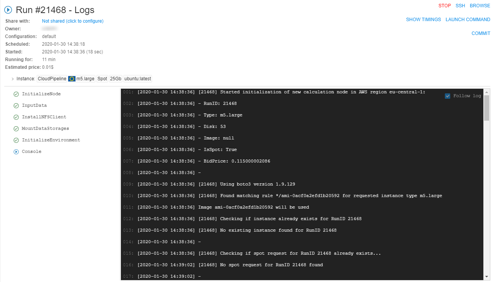
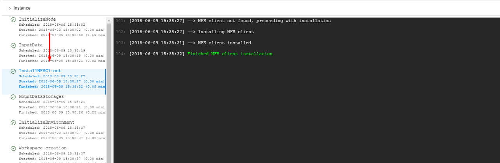

# 11. Manage Runs

- [Overview](#overview)
- [ACTIVE RUNS](#active-runs)
    - [Active run states](#active-run-states)
    - [Active run controls](#active-run-controls)
    - [Active cluster runs](#active-cluster-runs)
    - [Displaying additional node metrics](#displaying-additional-node-metrics)
- [COMPLETED RUNS](#completed-runs)
    - [Completed run states](#completed-run-states)
    - [Completed run controls](#completed-run-controls)
    - [Completed cluster runs](#completed-cluster-runs)
- [Run information page](#run-information-page)
    - [General information](#general-information)
    - [Instance](#instance)
    - [Parameters](#parameters)
    - [Tasks](#tasks)
    - [Console output](#console-output)
    - [Controls](#controls)
- [Automatically rerun if a spot instance is terminated](#automatically-rerun-if-a-spot-instance-is-terminated)

## Overview

"**Runs**" provides a list of active and completed pipeline runs. You can get parameters and logs of specific run and stop run here.

"**Runs**" **space** has two tabs:

- Active runs view
- Completed runs view.

Runs are organized in a table which is the same for both tabs:

- **"State" icon** - state of the run.
- **Run** - include:
    - _run name_ (upper row) - pipeline name and run id
    - _Cloud Region_ (bottom row)

> **_Note_**: if a specific platform deployment has a number of Cloud Providers registered (e.g. `AWS`+`Azure`, `GCP`+`Azure`) - corresponding text information also has a Provider name, e.g.:  
> 

- **Parent run** - parent run ID, if a run was launched by another run.
- **Pipeline** - include:
    - _pipeline name_ (upper row) - a name of a pipeline
    - _version name_ (bottom row) - a name of a pipeline version
- **Docker image** - a name of docker image.
- **Started** - time when a run was started.
- **Completed** - time when a run was finished.
- **Elapsed** - include:  
    - _elapsed time_ (upper row) - a duration of a run
    - _estimated price_ (bottom row) - estimated price of run, which is calculated based on the run duration and selected instance type. This field is updated interactively (i.e. each 5 - 10 seconds).
- **Owner** - a user, which launched a run.

> **_Note_**: also you can view information about runs via CLI. See [here](../14_CLI/14.5._Manage_pipeline_executions_via_CLI.md#view-pipeline-runs).

## ACTIVE RUNS

This tab displays a list of all pipelines that are currently running.  

### Active run states

-  - **Queued** state ("sandglass" icon) - a run is waiting in the queue for the available compute node.
-  - **Initializing** state ("rotating" icon) - a run is being initialized, at this stage a new compute node will be created or an existing node will be reused.
-  - **Pulling** state ("download" icon) - now pipeline **Docker image** is downloaded to the node.
-  - **Running** state (stable "play" icon) - a pipeline is running. The node is appearing and pipeline input data is being downloaded to the node before the "**InitializeEnvironment**" service task appears.
- **Pausing** state (blinking "pause" icon) - a run is being paused. At this moment compute node will be stopped (but persisted) and the docker image state will be kept as well.
-  - **Paused** state (stable "pause" icon) - a run is paused. At this moment compute node is already stopped but keeps it's state. Such run may be resumed.
- **Resuming** state (blinking "play" icon) - a paused run is being resumed. At this moment compute node is starting back from the stopped state.

Also, help tooltips are provided when hovering a run state icon, e.g.:

- 
- 

Tooltips contain a state name in bold (e.g. **Queued**) and a short description of the state and info on the next stage.

### Active run controls

| Control | Description |
|---|---|
| **PAUSE/RESUME** | Pauses/resumes a run. Available for **On-demand** non-cluster instances only. Learn more about feature [here](11.1._Manage_runs_lifecycles.md#pauseresume-run). |
| **TERMINATE** | Terminates compute node of a paused run without its resuming. Available for **On-demand** non-cluster instances only. Learn more about feature [here](11.1._Manage_runs_lifecycles.md#stopterminate-run). |
| **STOP** | This control stops a run execution. |
| **LOG** | To open a **Run information** page, press **LOG** button. |

### Active cluster runs

Cluster is a collection of instances which are connected so that they can be used together on a task.  
If launched run uses a cluster or an auto-scaled cluster (see sections [here](../06_Manage_Pipeline/6._Manage_Pipeline.md#configuration)), it has a certain designation:  

By default, only master-run is displaying at the table. To view nested runs (child-runs) click the **Expand** control in front of the muster-run ID:  

So, you can view an information about each child-run and its state, also you can stop specific nested run without stopping a parent run. You can open **Run logs** page (see [below](#run-information-page)) for any of the cluster runs by click it or **LOG** button next to run ID.

> **_Note_**: you can't pause cluster runs even with **On-demand** price type.  
> **_Note_**: stopping a parent run will stop execution of all nested runs too.

For runs with the **auto-scaled cluster** not all of the child-runs appear in the list immediately after parent run was launched, "scale-up" runs will appear only of necessity.

### Displaying additional node metrics

According to the run states and system-level settings, additional metrics (labels) could be displayed for active runs:

-  - **Idle** label - displays only for runs in **Running** state, for which node's CPU consumption level is below than a certain threshold for a certain period of time or longer.
-  - **Pressure** label - displays only for runs in **Running** state, for which node's Memory/Disk consumption level is higher than a certain threshold.

Values of these thresholds and time period are specified by admins via system-level settings (see [here](../12_Manage_Settings/12.10._Manage_system-level_settings.md#system) for more details).

## COMPLETED RUNS

This tab displays a list of all pipelines runs that are already finished.

### Completed run states

-  - **Success** state ("OK" icon) - successful pipeline execution.
-  - **Failed** state ("caution" icon) - unsuccessful pipeline execution.
-  - **Stopped** state ("clock" icon) - a pipeline manually stopped.

Help tooltips are also provided when hovering a completed run state icon, e.g.:

- 

### Completed run controls

| Control | Description |
|---|---|
| **LINKS** | This control show input/output links of the pipeline |
| **RERUN** | This control allow rerunning of a completed run. The **Launch a pipeline** page will be open. |
| **LOG** | To open a **Run information** page, press **LOG** button. |

### Completed cluster runs

If completed run used a cluster or an auto-scaled cluster (see sections [here](../06_Manage_Pipeline/6._Manage_Pipeline.md#configuration)), it has a certain designation. Displaying of such runs on the **COMPLETED RUNS** tab is similar to the active cluster runs. You can view an information about each child-run and its state, also you can rerun specific nested run without a parent run. You can open **Run logs** page (see [below](#run-information-page)) for any of the cluster runs by click it or **LOG** button next to run ID:  

## Run information page

Click a row within a run list, **"Run information"** page will appear.  

It consists of several sections:

### General information

This section displays general information about a run:

| Field | Description |
|---|---|
| **State icon** | state of the run. Help tooltips are provided when hovering a run state icon, e.g.:  |
| **Run ID** | unique ID of the run. |
| **Endpoint** | (_available only for tools runs_) endpoint hyperlink for the service launched in an interactive tool. For more details see [15. Interactive services](../15_Interactive_services/15._Interactive_services.md). |
| **Share with** | (_available only for tools runs_) list of users/groups with whom an interactive tool application is shared. For more details see [11.3 Sharing with other users or groups of users](11.3._Sharing_with_other_users_or_groups_of_users.md). |
| **Owner** | a name of the user who started pipeline. |
| **Scheduled** | time when a pipeline was launched. |
| **Waiting for/Running for** | time a pipeline has been running. |
| **Started** | time when the node is initialized and a pipeline has started execution. |
| **Finished** | time when a pipeline finished execution. |
| **Estimated price** | price of a run according to a run duration and selected instance type. |
| **Nested runs** | the child-runs list in cases when a run has a number of children (e.g. a cluster run or any other case with the parent-id specified) |

> **Nested runs** list is displaying only for master runs.
> It is the list with short informations about cluster child-runs:  
>   
> Each child-run record contains:
>
> - State icons with help tooltips when hovering over them
> - Pipeline name and version or docker image and version
> - Run time duration
>
> Similar as a parent-run state, states for nested runs are automatically updated without page refreshing. To open any child-run log page - click its name in the list.  

### Instance

The "**Instance**" section lists calculation node and execution environment details that were assigned to the run when it was launched.  
**_Note_**: node IP is presented as a hyperlink. Clicking it will navigate to the node details, where technical information and resources utilization is available - for more details see [here](../09_Manage_Cluster_nodes/9._Manage_Cluster_nodes.md#node-information-page).  
**_Note_**: Docker image name link leads to a specific Tool's detail page (see an [example](../10_Manage_Tools/10._Manage_Tools.md#description-tab)).  

> **_Note_**: if a specific platform deployment has a number of Cloud Providers registered (e.g. `AWS`+`Azure`, `GCP`+`Azure`) - corresponding auxiliary Cloud Provider icon is additionally displayed, e.g.:  
> 

> **_Note_**: if specific run CPU/Memory/Disk consumption is lower or higher specified in the configurations values, the **IDLE** or **PRESSURE** labels will be displayed respectively:  
> 

### Parameters

The parameters that were assigned to the run when it was launched are contained in this section.  
**_Note_**: parameters with types input/output/common/path are presented as hyperlinks, and will navigate to appropriate location in a **Data Storage** hierarchy.  

**_Note_**: if a user specifies system environment variables in parameter (e.g. **RUN\_ID**), GUI will substitute these variables with their values automatically in the "**Run information**" page.  

### Tasks

Here you can find a list of tasks of pipeline that are being executed or already finished.
Clicking a task and its console output will be loaded in the right panel.  

### Console output

Console output shows console output from a whole pipeline or a selected task. It also shows a run failure cause if a run failed.  

**_Note_**: the Follow log control enables auto scrolling of the console output. It is useful for logs monitoring. Follow log is enabled by default, tick the box to turn it off.  

Also, during a pipeline run an extended **_node-level_** logging is maintained:

- `kubelet` logs (from all compute nodes) are written to the files
- Log files are streamed to the storage, identified by the **`storage.system.storage.name`** preference

Users with the **ROLE\_ADMIN** role can find the corresponding node logs (e.g. by the `hostname` or `ip` that are attached to the run information) in that storage by the path `logs/nodes/{hostname}`:

1. Open the **Run logs** page of the run you want to see `kubelet` logs
2. Select the **InitializeNode** task, find a node hostname in the console output:  
      
    Copy the found hostname's value.
3. Check the storage path specified at the **`storage.system.storage.name`** preference:  
      
    Open in the Library that storage.
4. Navigate in the opened storage to the path `logs/nodes/`:  
    
5. Click the "breadcrumbs" control at the upper side of the page, enter `/` into the end of the path and after it paste the hostname value, copied at step 2:  
      
      
    Press the **Enter** key.
6. The folder with `kubelet` logs for the specified node will be opened:  
      
    You can open it and see the list of logs files, divided by the messages type:  
      
    You can view any of these files using Cloud Pipeline facilities or download them to your local machine:  
    

### Controls

**_Note_**: Completed and active runs have different controls.  
**Example**: controls of completed Luigi pipeline.

Here's the list of all existing buttons

| Control | Description |
|---|---|
| **PAUSE** | Allows to pause a run (_only for **On-demand** non-cluster runs_). |
| **RESUME** | Allows to resume a paused run (_only for **On-demand** non-cluster runs_). |
| **TERMINATE** | Allows to terminate compute node of a paused run without resuming (_only for **On-demand** non-cluster runs_). |
| **STOP** | Allows to stop a run. |
| **SHOW TIMINGS**/**HIDE TIMINGS** | Allows to show/hide duration of each task. |
| **COMMIT** | Allows modifying an existing tool that has been changed via ssh. See [10.4. Edit a Tool](../10_Manage_Tools/10.4._Edit_a_Tool.md#commit-a-tool). |
| **GRAPH VIEW** | For Luigi and WDL pipelines GRAPH VIEW is available along with a usual plain view of tasks. See [6.1.1. Building WDL pipeline with graphical PipelineBuilder](../06_Manage_Pipeline/6.1.1._Building_WDL_pipeline_with_graphical_PipelineBuilder.md). |
| **SSH** | Allows to shh to the instance running "sleep infinity" mode. See [6.1. Create and configure pipeline](../06_Manage_Pipeline/6.1._Create_and_configure_pipeline.md). |
| **RERUN** | Allows to rerun completed runs. |
| **EXPORT LOGS** | Allows to export logs. |
| **BROWSE** | Allows to open the run instance filesystem in a Storage browser Web GUI - so the user can view, download, upload, delete files and directories for the current active run. |

## Automatically rerun if a spot instance is terminated

In certain cases - Cloud Provider may terminate a node, that is used to run a job or an interactive tool. It may be in cases:

- Spot prices changed
- Cloud Provider experienced a hardware issue

These cases aren't a Cloud Platform bug. In these cases:

1. If a job fails due to server-related issue, special message is displayed, describing a reason for the hardware failure:  
    
2. If a **batch** job fails due to server-related issue and Cloud Provider reports one of the following instance status codes:
    - Server.SpotInstanceShutdown - a spot instance was stopped due to price changes,
    - Server.SpotInstanceTermination - a spot instance was terminated due to price changes,
    - Server.InternalError - Cloud Provider hardware issue,  
    batch job will be restarted from scratch automatically.

    **Note**: this behavior will occur, only if administrator applied and configured it (for more information see [12.10. Manage system-level settings](../12_Manage_Settings/12.10._Manage_system-level_settings.md#cluster)).
