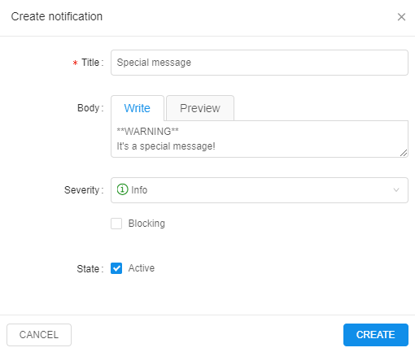

# 12.1. Add a new system event

> An administrator can add **System event notification** only.

1. Navigate to **System events** tab.
2. Click **+ADD**.  
    
3. Enter a **Title** of notification.
4. Enter **Body** of the notification (optional).
5. Rank notification **Severity** ("_info_", "_warning_" or "_critical_").
6. Mark as **blocking** (_optional_). Blocking event emerges in the middle of the window and requires confirmation from the user to disappear.
7. Mark as **active** (_optional_). Active notifications will be shown for all users of the Cloud Pipeline until admin sets them inactive.
8. Click **Create**.  
    