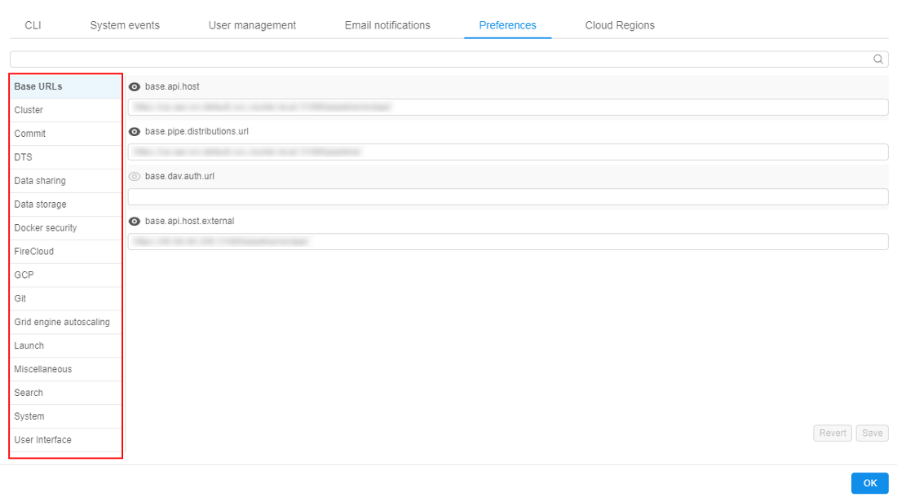
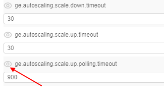

# 12.10. Manage system-level settings

> User shall have **ROLE\_ADMIN** to read and update system-level settings.

- [Read system-level settings](#read-system-level-settings)
    - [Base URLs](#base-urls)
    - [Billing Reports](#billing-reports)
    - [Cluster](#cluster)
    - [Commit](#commit)
    - [DTS](#dts)
    - [Data sharing](#data-sharing)
    - [Data Storage](#data-storage)
    - [Docker security](#docker-security)
    - [FireCloud](#firecloud)
    - [GCP](#gcp)
    - [Git](#git)
    - [Grid engine autoscaling](#grid-engine-autoscaling)
    - [Launch](#launch)
    - [Miscellaneous](#miscellaneous)
    - [Search](#search)
    - [System](#system)
    - [User Interface](#user-interface)
- [Make system-level settings visible to all users](#make-system-level-settings-visible-to-all-users)
- [Update system-level settings](#update-system-level-settings)

## Read system-level settings

1. Hover to the **Settings** tab.
2. Select the **Preferences** section.
3. All system-level parameters are categorized into the several groups.  
    

### Base URLs

These settings define pipeline URLs:

| Setting name | Description |
|---|---|
| **`base.api.host`** | REST API endpoint |
| **`base.pipe.distributions.url`** | URL that is used to download pipeline scripts |
| **`base.dav.auth.url`** |  |
| **`base.api.host.external`** | REST API external endpoint |

### Billing Reports

These settings define parameters of **Billing reports** pages displaying:

| Setting name | Description |
|---|---|
| **`billing.reports.enabled`** | Defines whether "general" users can access personal billing information - runs/storages where the user is an owner |
| **`billing.reports.enabled.admins`** | Defines whether admins and users with the _ROLE\_BILLING\_MANAGER_ role can have full access to the Billing reports |
| **`billing.reports.user.name.attribute`** | Defines which user's attribute is used to display the users in the Billing reports (charts, tables, export reports) |

### Cluster

Settings in this tab define different cluster options:

| Setting name | Description |
|---|---|
| **`cluster.keep.alive.minutes`** | If node doesn't have a running pipeline on it for that amount of minutes, it will be shut down |
| **`cluster.random.scheduling`** | If this property is true, pipeline scheduler will rely on Kubernetes order of pods, otherwise pipelines will be ordered according to their parent (batch) ID |
| **`cluster.instance.type`** | Default instance type |
| **`cluster.reassign.disk.delta`** | This delta sets the max possible difference that could be between the disk size of the node from the hot pool and the _real_ disk size requested by the user for a job |
| **`cluster.max.size`** | Maximal number of nodes to be launched simultaneously |
| **`cluster.instance.hdd_extra_multi`** | Disk extra multiplier. Allows to add extra space, during a launch, to the disk size selected through the GUI. The size of that extra space is calculated as `(Unarchived docker image size) * (Disk extra multiplier)` |
| **`cluster.min.size`** | Minimal number of nodes to be launched at a time |
| **`cluster.allowed.instance.types`** | Allowed instance types. Can restrict available instance types for launching tools, pipelines, configurations |
| **`cluster.enable.autoscaling`** | Enables/disables Kubernetes autoscaler service |
| **`instance.restart.state.reasons`** | Instance status codes, upon receipt of which an instance tries automatically to restart |
| **`cluster.networks.config`** | Config that contains information to start new nodes in Cloud Provider |
| **`cluster.batch.retry.count`** | Count of automatically retries to relaunch a job, if one of the instance status codes from **`instance.restart.state.reasons`** returns, when a batch job fails |
| **`instance.offer.update.rate`** | How often instance cost is calculated (in milliseconds) |
| **`cluster.autoscale.rate`** | How often autoscaler checks what tasks are executed on each node (in milliseconds) |
| **`cluster.nodeup.max.threads`** | Maximal number of nodes that can be started simultaneously |
| **`cluster.spot.bid.price`** | The maximum price per hour that you are willing to pay for a Spot Instance. The default is the On-Demand price |
| **`cloud.provider.default`** | Sets a default CLoud Provider |
| **`cluster.spot`** | If this is true, spot instances will be launched by default |
| **`cluster.docker.extra_multi`** | Docker image extra multiplier. Allows to get an approximate size of the unarchived docker image. That size is calculated as `(Archived docker image size) * (Docker image extra multiplier)` |
| **`cluster.kill.not.matching.nodes`** | If this property is true, any free node that doesn't match configuration of a pending pod will be scaled down immediately, otherwise it will be left until it will be reused or expired. If most of the time we use nodes with the same configuration set this to true |
| **`cluster.instance.hdd`** | Default hard drive size for instance (in gigabytes) |
| **`cluster.allowed.price.types`** | Allowed price types. Can restrict available price types for launching tools, pipelines, configurations |
| **`cluster.allowed.price.types.master`** | Allowed price types for the cluster master node. Can restrict available price types for the master node of the cluster while launching tools, pipelines, detach configurations |
| **`cluster.spot.alloc.strategy`** | Parameter that sets the strategy of calculating the price limit for instance:<ul><li>**on-demand** - maximal instance price equals the price of the on-demand instance of the same type;</li><li>**manual** - uses value from the **`cluster.spot.bid.price`** parameter</li></ul> |
| **`cluster.allowed.instance.types.docker`** | Allowed instance types for docker images (tools). Can restrict available instance types for launching tools. Has a higher priority for a tool than **`cluster.allowed.instance.types`** |
| **`cluster.spot.max.attempts`** |  |
| **`cluster.nodeup.retry.count`** | Maximal number of tries to start the node |
| **`cluster.high.non.batch.priority`** | If this property is true, pipelines without parent (batch ID) will have the highest priority, otherwise - the lowest |

### Commit

This tab contains various commit settings:

| Setting name | Description |
|---|---|
| **`commit.pre.command.path`** | Specifies a path to a script within a docker image, that will be executed in a currently running container, before docker commit occurs |
| **`commit.username`** | Git username |
| **`commit.deploy.key`** | Used to SSH for COMMIT. Key is stored in a DB |
| **`commit.timeout`** | Commit will fail if exceeded (in seconds) |
| **`commit.post.command.path`** | Specifies a path to a script within a docker image, that will be executed in a committed image, after docker commit occurs |

### DTS

These settings define DTS parameters:

| Setting name | Description |
|---|---|
| **`dts.launch.cmd`** |  |
| **`dts.launch.script.url`** |  |
| **`dts.dist.url`** |  |

### Data Sharing

These settings define data sharing parameters:

| Setting name | Description |
|---|---|
| **`data.sharing.base.api`** | Specifies a format of the generating URL to the data storage with enabled sharing |
| **`data.sharing.disclaimer`** | Allows to set a warning text for the "Share storage link" pop-up |

### Data Storage

These settings define storage parameters:

| Setting name | Description |
|---|---|
| **`storage.mounts.per.gb.ratio`** | This preference allows to specify the "safe" number of storages per Gb of `RAM`. When launching a job - the user's available object storages count is being calculated and checked that it does not exceed selected instance type `RAM` value multiplied by this preference value. If it's exceeded - the user is being warned |
| **`storage.fsbrowser.enabled`** | Allows to enable FSBrowser |
| **`storage.fsbrowser.wd`** | Allows to set a work directory for FSBrowser (this directory will be opened by default and set as `root`) |
| **`storage.fsbrowser.transfer`** | Allows to specify intermediate object storage for data transfer operations in FSBrowser (this is actual for "heavy" transfer operations to not reduce performance) |
| **`storage.fsbrowser.port`** | Allows to set a port for FSBrowser |
| **`storage.fsbrowser.tmp`** | A path to the directory where the temporary archive shall be created (when the folder is downloading). Archive is being removed when download is finished |
| **`storage.user.home.auto`** | Controls whether the home storages will be created automatically for new users |
| **`storage.user.home.template`** | Describes a template that shall be used for the automatic home storage creation for new users |
| **`storage.fsbrowser.black.list`** | List of directories/files which shall not be visible via FSBrowser |
| **`storage.temp.credentials.duration`** | Temporary credentials lifetime for Cloud Provider's operations with data storages (in seconds) |
| **`storage.transfer.pipeline.id`** | Pipeline ID that is used to automated data transfers from the external sites |
| **`storage.system.storage.name`** | Configures a system data storage for storing attachments from e.g. issues |
| **`storage.mount.black.list`** | List of directories where Data Storages couldn't be mounted |
| **`storage.transfer.pipeline.version`** | Pipeline version that is used to automated data transfers from the external sites |
| **`storage.max.download.size`** | Chunk size to download (bytes) |
| **`storage.object.prefix`** | A mandatory prefix for the new creating data storages |
| **`storage.listing.time.limit`** | Sets the timeout (in milliseconds) for the processing of the size getting for all input/common files before the pipeline launch. Default: 3000 milliseconds (3 sec). If computation of the files size doesn't end in this timeout, accumulated size will return as is |

### Docker security

This tab contains settings related to Docker security checks:

| Setting name | Description |
|---|---|
| **`security.tools.scan.all.registries`** | If this is true, all registries will be scanned for Tools vulnerability |
| **`security.tools.scan.clair.root.url`** | Clair root URL |
| **`security.tools.docker.comp.scan.root.url`** |  |
| **`security.tools.jwt.token.expiration`** |  |
| **`security.tools.scan.clair.connect.timeout`** | Sets timeout for connection with Clair (in seconds) |
| **`security.tools.policy.max.high.vulnerabilities`** | Denies running a Tool if the number of high vulnerabilities exceeds the threshold. To disable the policy, set to -1 |
| **`security.tools.grace.hours`** | Allows users to run a new docker image (if it is not scanned yet) or an image with a lot of vulnerabilities during a specified period. During this period user will be able to run a tool, but an appropriate message will be displayed. Period lasts from date/time since the docker version became vulnerable or since the docker image's push time (if this version was not scanned yet) |
| **`security.tools.scan.clair.read.timeout`** | Sets timeout for Clair response (in seconds) |
| **`security.tools.policy.deny.not.scanned`** | Allow/deny execution of unscanned Tools |
| **`security.tools.scan.enabled`** | Enables/disables security scan |
| **`security.tools.policy.max.medium.vulnerabilities`** | Denies running a Tool if the number of medium vulnerabilities exceeds the threshold. To disable the policy, set to -1 |
| **`security.tools.policy.max.critical.vulnerabilities`** | Denies running a Tool if the number of critical vulnerabilities exceeds the threshold. To disable the policy, set to -1 |
| **`security.tools.scan.schedule.cron`** | Security scan schedule |

### FireCloud

These settings define FireCloud parameters:

| Setting name | Description |
|---|---|
| **`google.client.settings`** |  |
| **`firecloud.base.url`** |  |
| **`firecloud.billing.project`** |  |
| **`google.client.id`** |  |
| **`firecloud.launcher.cmd`** |  |
| **`firecloud.instance.disk`** |  |
| **`firecloud.launcher.tool`** |  |
| **`google.redirect.url`** |  |
| **`firecloud.api.scopes`** |  |
| **`firecloud.instance.type`** |  |
| **`firecloud.enable.user.auth`** |  |

### GCP

These settings define specific Google Cloud Platform parameters:

| Setting name | Description |
|---|---|
| **`gcp.sku.mapping`** |  |
| **`gcp.regions.list`** |  |

### Git

These settings define Git parameters:

| Setting name | Description |
|---|---|
| **`ui.git.cli.configure.template`** | Template for the message of the Git config that would be displayed for user in the "**Git CLI**" section of the System Settings |
| **`git.user.name`** | User name to access Git with pipelines |
| **`git.external.url`** |  |
| **`git.repository.hook.url`** |  |
| **`git.token`** | Token to access Git with pipelines |
| **`git.repository.indexing.enabled`** | Allows to enable the indexing of Git repository with pipelines |
| **`git.user.id`** | User id to access Git with pipelines |
| **`git.host`** | IP address where Git service is deployed |

### Grid engine autoscaling

> See [Appendix C. Working with autoscaled cluster runs](../Appendix_C/Appendix_C._Working_with_autoscaled_cluster_runs.md) for details. 

These settings define auto-scaled cluster parameters:

| Setting name | Description |
|---|---|
| **`ge.autoscaling.scale.down.timeout`** | If jobs queue is empty or all jobs are running and there are some idle nodes longer than that timeout in seconds - auto-scaled cluster will start to drop idle auto-scaled nodes ("scale-down") |
| **`ge.autoscaling.scale.up.timeout`** | If some jobs are in waiting state longer than that timeout in seconds - auto-scaled cluster will start to attach new computation nodes to the cluster ("scale-up") |
| **`ge.autoscaling.scale.up.polling.timeout`** | Defines how many seconds GE autoscaler should wait for pod initialization and run initialization |

### Launch

Settings in this tab contains default Launch parameters:

| Setting name | Description |
|---|---|
| **`launch.jwt.token.expiration`** | Lifetime of a pipeline token (in seconds) |
| **`launch.max.scheduled.number`** | Controls maximum number of scheduled at once runs |
| **`launch.env.properties`** | Sets of environment variables that will be passed to each running Tool |
| **`launch.docker.image`** | Default Docker image |
| **`launch.cmd.template`** | Default cmd template |
| **`launch.container.cpu.resource`** |  |
| **`launch.run.visibility`** | Allow to view foreign runs based on pipeline permissions (value `INHERIT`) or restrict visibility of all non-owner runs (value `OWNER`) |
| **`launch.dind.enable`** | Enables Docker in Docker functionality |
| **`launch.dind.container.vars`** | Allows to specify the variables, which will be passed to the DIND container (if they are set for the host environment) |
| **`launch.dind.mounts`** | List of mounts that shall be added to k8s pod for Docker in Docker |
| **`launch.task.status.update.rate`** | Sets task status update rate, on which application will query kubernetes cluster for running task status, ms. Pod Monitor |
| **`launch.pods.release.rate`** |  |
| **`launch.system.parameters`** | System parameters, that are used when launching pipelines |

### Miscellaneous

| Setting name | Description |
|---|---|
| **`misc.max.tool.icon.size.kb`** | Sets maximum size (in Kb) of the uploaded icon for the tool |
| **`system.events.confirmation.metadata.key`** | Sets the **KEY** for the user's attribute displaying information about "blocking" notifications confirmation |

### Search

Settings in this tab contains Elasticsearch parameters:

| Setting name | Description |
|---|---|
| **`search.elastic.scheme`** |  |
| **`search.elastic.allowed.users.field`** |  |
| **`search.elastic.denied.users.field`** |  |
| **`search.elastic.denied.groups.field`** |  |
| **`search.elastic.type.field`** |  |
| **`search.elastic.host`** |  |
| **`search.elastic.index.type.prefix`** |  |
| **`search.elastic.port`** |  |
| **`search.elastic.search.fields`** |  |
| **`search.elastic.index.common.prefix`** |  |
| **`search.elastic.allowed.groups.field`** |  |

### System

The settings in this tab contain parameters and actions that are performed depending on the system monitoring metrics:

| Setting name | Description |
|---|---|
| **`system.max.idle.timeout.minutes`** | Specifies a duration in minutes. If CPU utilization is below **`system.idle.cpu.threshold`** for this duration - notification will be sent to the user and the corresponding run will be marked by the "IDLE" label |
| **`system.idle.action.timeout.minutes`** | Specifies a duration in minutes. If CPU utilization is below **`system.idle.cpu.threshold`** for this duration - an action, specified in **`system.idle.action`** will be performed |
| **`system.resource.monitoring.period`** | Specifies period (in seconds) between the users' instances scanning to collect the monitoring metrics |
| **`system.monitoring.time.range`** | Specifies time delay (in sec) after which the notification "HIGH\_CONSUMED\_RESOURCES" would be sent again, if the problem is still in place |
| **`system.disk.consume.threshold`** | Specifies disk threshold (in %) above which the notification "HIGH\_CONSUMED\_RESOURCES" would be sent and the corresponding run will be marked by the "PRESSURE" label |
| **`system.idle.cpu.threshold`** | Specifies percentage of the CPU utilization, below which action shall be taken |
| **`system.resource.monitoring.stats.retention.period`** | Specifies the time period (in days) during which resources utilization data is stored |
| **`system.memory.consume.threshold`** | Specifies memory threshold (in %) above which the notification "HIGH\_CONSUMED\_RESOURCES" would be sent and the corresponding run will be marked by the "PRESSURE" label |
| **`system.idle.action`** | Sets which action to perform on the instance, that showed low CPU utilization (that is below **`system.idle.cpu.threshold`**): <ul><li>**_NOTIFY_** - only send notification</li><li>**_PAUSE_** - pause an instance if possible (e.g. instance is On-Demand, Spot instances are skipped)</li><li>**_PAUSE\_OR\_STOP_** - pause an instance if it is On-Demand, stop an instance if it is Spot</li><li>**_STOP_** - Stop an instance, disregarding price-type</li></ul> |
| **`system.long.paused.action`** | Sets which action to perform on the instance, that is in the "paused" state for a long time: <ul><li>**_NOTIFY_** - only send `LONG_PAUSED` notification(s)</li><li>**_STOP_** - send `LONG_PAUSED_STOPPED` notification and terminate the run</li></ul> |
| **`system.notifications.exclude.instance.types`** | Defines a list of node types. If a job runs on any node from that list - `IDLE_RUN`, `LONG_PAUSED`, `LONG_RUNNING` email notifications will not be submitted for that job |
| **`system.external.services.endpoints`** |  |

### User Interface

Here different user interface settings can be found:

| Setting name | Description |
|---|---|
| **`ui.pipeline.deployment.name`** | UI deployment name |
| **`ui.pipe.cli.install.template`** | CLI install templates for different operating systems |
| **`ui.pipe.drive.mapping`** |  |
| **`ui.project.indicator`** | These attributes define a Project folder |
| **`ui.pipe.cli.configure.template`** | CLI configure templates for different operating systems |
| **`ui.support.template`** | Markdown-formatted text that will be displayed in tooltip of the "support" info in the main menu. If nothing is specified (empty), support icon in the main menu will not be displayed |
| **`ui.controls.settings`** | JSON file that contains control settings |

## Make system-level settings visible to all users

1. Hover to the **Settings** tab.
2. Select the **Preferences** section.
3. Choose one of the tabs with system level settings (e.g. **Grid engine autoscaling**).  
    
4. Press the "**Eye**" button near any setting. Now it will be visible to all users by using the API.  
    **_Note_**: press "**Eye**" button again to hide it from all users.  
    

## Update system-level settings

1. Choose any system-level setting and change its value (e.g. change **`cluster.keep.alive.minutes value`** from 10 to 15).  
    
2. Press the **Save** button.  
    **_Note_**: before saving you can press the **Revert** button to return setting's value to the previous state.  
    
