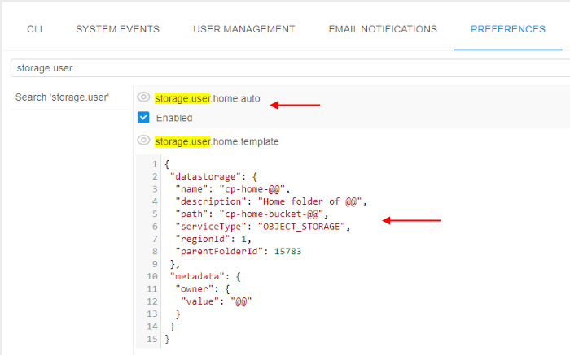
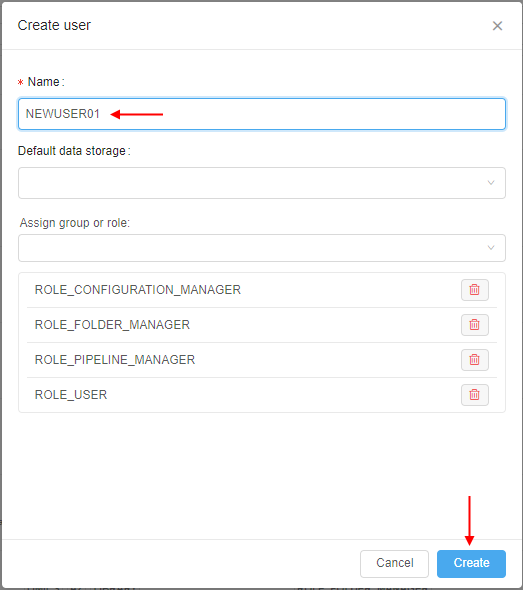
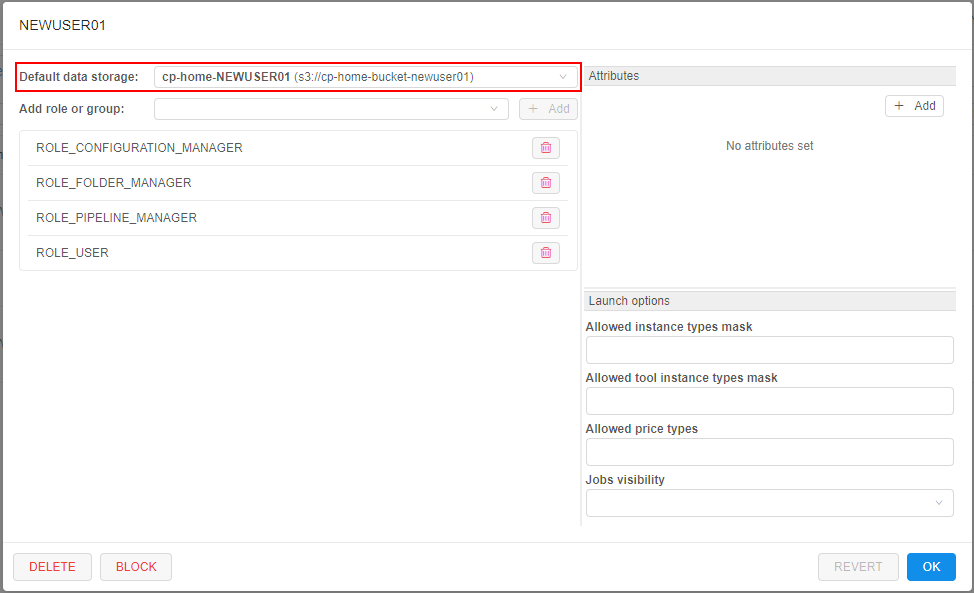
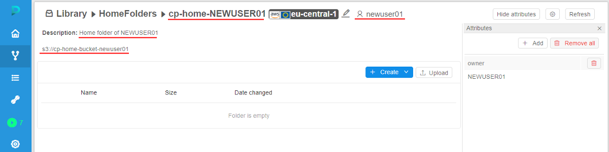

# 12.11. Advanced features via System Preferences

- [Setup swap files for the Cloud VMs](#setup-swap-files-for-the-cloud-vms)
- [Home storage for each user](#home-storage-for-each-user)

> User shall have **ROLE\_ADMIN** to configure system-level settings.

## Setup swap files for the Cloud VMs

In certain cases jobs may fail with unexpected errors if the compute node runs _Out of memory_.

Admin users can configure a default **swap** file to the compute node being created.
This allow to avoid runs failures due to memory limits.

To configure the size and the location of the **swap**:

1. Open the **Settings** pop-up
2. Click the **Preference** tab
3. Select the **Cluster** section
4. Click in the field under the **`cluster.networks.config`** label  
    
5. Insert the similar `json` block into a region/cloud specific configuration:  
      
    Where:  
    - `swap_ratio` - defines a swap file size. It is equal the node RAM multiplied by that ratio. If ratio is 0, a swap file will not be created (default value: 0)
    - `swap_location` - defines a location of the swap file. If that option is not set - default location will be used (default: AWS will use `SSD/gp2` EBS, Azure will use [Temporary Storage](https://blogs.msdn.microsoft.com/mast/2013/12/06/understanding-the-temporary-drive-on-windows-azure-virtual-machines/))
6. Click the **Save** button
7. Click the **OK** button  
    
8. Now, while launch any pipeline, you can see specified swap settings in the run logs:  
    
9. To check that settings were applied, open SSH session and input the `swapon` command:  
    

## Home storage for each user

**Cloud Pipeline** allows creating home storages for the newly created users in automatic mode. It could be conveniently when multiple users are being created (otherwise this task can be really tedious - create each user/create storage for the user/grant permissions on the storage).

This behavior is controlled by the system preference **`storage.user.home.auto`** (_Boolean_, default value is `false`).  
It controls whether the home storages shall be created automatically.  
If it is set to `true` - new storage will be created for the user automatically simultaneously with the user creation. Also the just-created user is being granted **_OWNER_** permissions for the new storage. And the newly created storage is being set as a "default" storage in the user's profile.

The "home" storage automatic creation is being driven by a template. The template is being described as `JSON` element in the other system preference - **`storage.user.home.template`**.  
In this preference for the template, being described:

- settings for the storage
- permissions on the storage

To different storage types there are different templates.

### Object storage template

The template for object storages has the following view:

``` json
{
 "datastorage": {
    "name": "<storage_alias>",
    "description": "<storage_description>",
    "path": "<storage_path>",
    "serviceType": "OBJECT_STORAGE",
    "regionId": <region_ID>,
    "parentFolderId": <parent_folder_ID>
 },
 "metadata": {
    "owner": {
        "value": "@@"
    }
 }
}
```

Where:

- "**datastorage**" sub-block defines settings of the creating storage:
    - `<storage_alias>` - storage name
    - `<storage_description>` -  storage description
    - `<storage_path>` - full path to the storage
    - `<region_ID>` - Cloud Region **ID** in which the storage will be created
    - `<parent_folder_ID>` - the **ID** of the folder in the _Library_ in which the storage will be located once the creation
    - "**serviceType**" - defines the type of the storage:
- "**metadata**" sub-block defines permissions on the created storage (the **_OWNER_** permissions):
    - `@@` - designation that will be automatic replaced with the username during the storage creation

**_Note_**: designation `@@` should be used also in "**datastorage**" sub-block - to create storages with unique names and paths.

Example of the template for the object storage:

``` json
{
 "datastorage": {
    "name": "cp-home-@@",
    "description": "Home storage of @@",
    "path": "cp-home-storage-@@",
    "serviceType": "OBJECT_STORAGE",
    "regionId": 1,
    "parentFolderId": 123
 },
 "metadata": {
    "owner": {
        "value": "@@"
    }
 }
}
```

### FS storage template

The template for FS mounts has the following view:

``` json
{
 "datastorage": {
    "name": "<storage_alias>",
    "description": "<storage_description>",
    "path": "<storage_path>",
    "serviceType": "FILE_SHARE",
    "regionId": <region_ID>,
    "parentFolderId": <parent_folder_ID>,
    "fileShareMountId": <file_share_mount_ID>
 },
 "metadata": {
    "owner": {
        "value": "@@"
    }
 }
}
```

Where:

- "**datastorage**" sub-block defines settings of the creating FS mount:
    - `<storage_alias>` - FS mount's alias name
    - `<storage_description>` -  FS mount description
    - `<storage_path>` - full path of the FS mount
    - `<region_ID>` - Cloud Region **ID** in which the FS mount will be created
    - `<parent_folder_ID>` - the **ID** of the folder in the Library in which the FS mount will be located once the creation
    - "**serviceType**" - defines the type of the storage
    - `<file_share_mount_ID>` - the **ID** of the share mount which will be used for the FS mount creation
- "**metadata**" sub-block defines permissions on the created FS mount (the **_OWNER_** permissions):
    - `@@` - designation that will be automatic replaced with username during the FS mount creation

Designation `@@` should be used also in "**datastorage**" sub-block - to create FS mounts with unique names and paths.

Example of the template for the FS mount:

``` json
{
 "datastorage": {
    "name": "cp-home-@@",
    "description": "Home storage of @@",
    "path": "nfs://10.10.10.10:/home/@@",
    "serviceType": "FILE_SHARE",
    "regionId": 1,
    "parentFolderId": 123,
    "fileShareMountId": 10
 },
 "metadata": {
    "owner": {
        "value": "@@"
    }
 }
}
```

### Usage example

1. Open the **System Preference**.
2. Find the preference `storage.user.home.auto` and set the checkbox to "_enabled_".
3. Find the preference `storage.user.home.template` and fill in it suchlike as described [above](#object-storage-template), e.g.:  
    
4. Click the **Save** button.
5. Open the "**USER MANAGEMENT**" tab.
6. Click the "**+ Create user**" button:  
    
7. In the appeared pop-up, specify the user name and click the Create button, e.g.:  
    
8. After the creation, find and open the card of the just-created user:  
      
    See that the default storage for the user is already set and has name and path according to the template (from step 3)
9. Close the user card.
10. Open the library and navigate to the folder which **ID** was also specified in the template (from step 3):  
      
    See that the storage is already created and has name, path, description and the **_OWNER_** according to the template (from step 3)
11. Open the storage:  
    

### Additional notes

- If there were issues with the storage creation, the user creation doesn't fail too (but the system send a corresponding error message to the client).
- If the corresponding "home" storage already exists - the storage creation step will be skipped during the user creation. Default storage for the user isn't being set in that case. It can be set manually after the user creation.
- If the default storage is forcibly specified for the user before the creation - separate "home" storage will not be created independent to the value of **`storage.user.home.auto`** preference.
