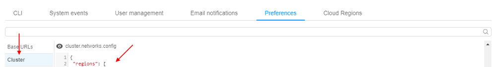
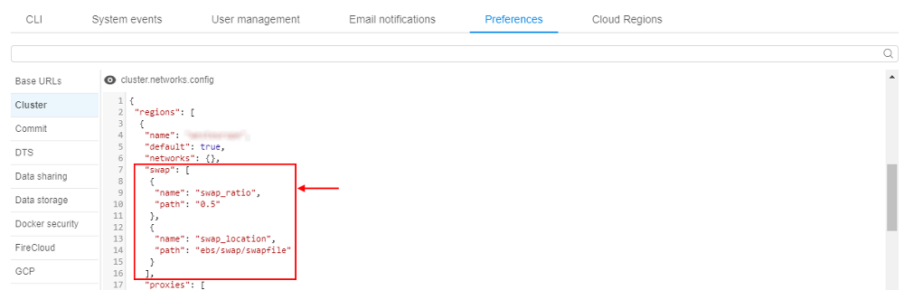
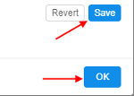
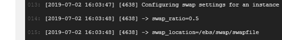
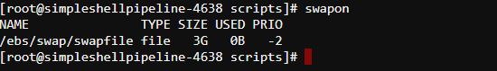

# Advanced features via System Preferences

> User shall have **ROLE\_ADMIN** to configure system-level settings.

## Setup swap files for the Cloud VMs

In certain cases jobs may fail with unexpected errors if the compute node runs _Out of memory_.

Admin users can configure a default **swap** file to the compute node being created.
This allow to avoid runs failures due to memory limits.

To configure the size and the location of the **swap**:

1. Open the **Settings** pop-up
2. Click the **Preference** tab
3. Select the **Cluster** section
4. Click in the field under the **`cluster.networks.config`** label  
    
5. Insert the similar `json` block into a region/cloud specific configuration:  
      
    Where:  
    - `swap_ratio` - defines a swap file size. It is equal the node RAM multiplied by that ratio. If ratio is 0, a swap file will not be created (default value: 0)
    - `swap_location` - defines a location of the swap file. If that option is not set - default location will be used (default: AWS will use `SSD/gp2` EBS, Azure will use [Temporary Storage](https://blogs.msdn.microsoft.com/mast/2013/12/06/understanding-the-temporary-drive-on-windows-azure-virtual-machines/))
6. Click the **Save** button
7. Click the **OK** button  
    
8. Now, while launch any pipeline, you can see specified swap settings in the run logs:  
    
9. To check that settings were applied, open SSH session and input the `swapon` command:  
    
