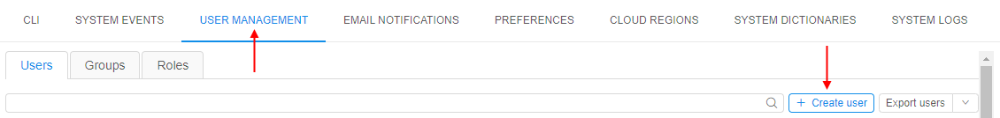
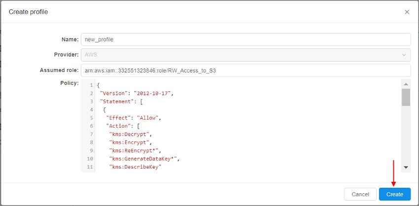
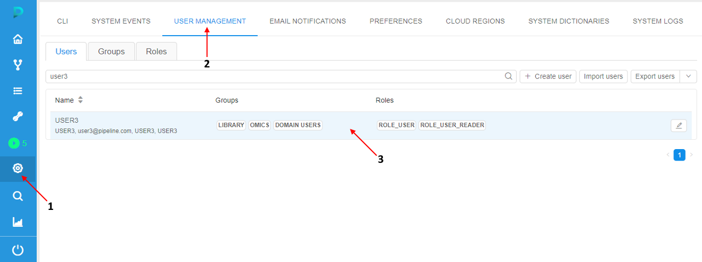
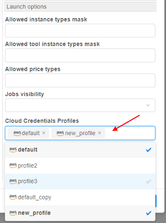

# 12.11. Advanced features via System Preferences

- [Setup swap files for the Cloud VMs](#setup-swap-files-for-the-cloud-vms)
- [Home storage for each user](#home-storage-for-each-user)
- [Seamless authentication in the Cloud Provider](#seamless-authentication-in-cloud-provider)

> User shall have **ROLE\_ADMIN** to configure system-level settings.

***

## Setup swap files for the Cloud VMs

In certain cases jobs may fail with unexpected errors if the compute node runs _Out of memory_.

Admin users can configure a default **swap** file to the compute node being created.
This allow to avoid runs failures due to memory limits.

To configure the size and the location of the **swap**:

1. Open the **Settings** pop-up
2. Click the **Preference** tab
3. Select the **Cluster** section
4. Click in the field under the **`cluster.networks.config`** label  
    
5. Insert the similar `json` block into a region/cloud specific configuration:  
      
    Where:  
    - `swap_ratio` - defines a swap file size. It is equal the node RAM multiplied by that ratio. If ratio is 0, a swap file will not be created (default value: 0)
    - `swap_location` - defines a location of the swap file. If that option is not set - default location will be used (default: AWS will use `SSD/gp2` EBS, Azure will use [Temporary Storage](https://blogs.msdn.microsoft.com/mast/2013/12/06/understanding-the-temporary-drive-on-windows-azure-virtual-machines/))
6. Click the **Save** button
7. Click the **OK** button  
    
8. Now, while launch any pipeline, you can see specified swap settings in the run logs:  
    
9. To check that settings were applied, open SSH session and input the `swapon` command:  
    

***

## Home storage for each user

**Cloud Pipeline** allows creating home storages for the newly created users in automatic mode. It could be conveniently when multiple users are being created (otherwise this task can be really tedious - create each user/create storage for the user/grant permissions on the storage).

This behavior is controlled by the system preference **`storage.user.home.auto`** (_Boolean_, default value is `false`).  
It controls whether the home storages shall be created automatically.  
If it is set to `true` - new storage will be created for the user automatically simultaneously with the user creation. Also the just-created user is being granted **_OWNER_** permissions for the new storage. And the newly created storage is being set as a "default" storage in the user's profile.

The "home" storage automatic creation is being driven by a template. The template is being described as `JSON` element in the other system preference - **`storage.user.home.template`**.  
In this preference for the template, being described:

- settings for the storage
- permissions on the storage

To different storage types there are different templates.

### Object storage template

The template for object storages has the following view:

``` json
{
 "datastorage": {
    "name": "<storage_alias>",
    "description": "<storage_description>",
    "path": "<storage_path>",
    "serviceType": "OBJECT_STORAGE",
    "regionId": <region_ID>,
    "parentFolderId": <parent_folder_ID>
 },
 "metadata": {
    "owner": {
        "value": "@@"
    }
 }
}
```

Where:

- "**datastorage**" sub-block defines settings of the creating storage:
    - `<storage_alias>` - storage name
    - `<storage_description>` -  storage description
    - `<storage_path>` - full path to the storage
    - `<region_ID>` - Cloud Region **ID** in which the storage will be created
    - `<parent_folder_ID>` - the **ID** of the folder in the _Library_ in which the storage will be located once the creation
    - "**serviceType**" - defines the type of the storage:
- "**metadata**" sub-block defines permissions on the created storage (the **_OWNER_** permissions):
    - `@@` - designation that will be automatic replaced with the username during the storage creation

**_Note_**: designation `@@` should be used also in "**datastorage**" sub-block - to create storages with unique names and paths.

Example of the template for the object storage:

``` json
{
 "datastorage": {
    "name": "cp-home-@@",
    "description": "Home storage of @@",
    "path": "cp-home-storage-@@",
    "serviceType": "OBJECT_STORAGE",
    "regionId": 1,
    "parentFolderId": 123
 },
 "metadata": {
    "owner": {
        "value": "@@"
    }
 }
}
```

### FS storage template

The template for FS mounts has the following view:

``` json
{
 "datastorage": {
    "name": "<storage_alias>",
    "description": "<storage_description>",
    "path": "<storage_path>",
    "serviceType": "FILE_SHARE",
    "regionId": <region_ID>,
    "parentFolderId": <parent_folder_ID>,
    "fileShareMountId": <file_share_mount_ID>
 },
 "metadata": {
    "owner": {
        "value": "@@"
    }
 }
}
```

Where:

- "**datastorage**" sub-block defines settings of the creating FS mount:
    - `<storage_alias>` - FS mount's alias name
    - `<storage_description>` -  FS mount description
    - `<storage_path>` - full path of the FS mount
    - `<region_ID>` - Cloud Region **ID** in which the FS mount will be created
    - `<parent_folder_ID>` - the **ID** of the folder in the Library in which the FS mount will be located once the creation
    - "**serviceType**" - defines the type of the storage
    - `<file_share_mount_ID>` - the **ID** of the share mount which will be used for the FS mount creation
- "**metadata**" sub-block defines permissions on the created FS mount (the **_OWNER_** permissions):
    - `@@` - designation that will be automatic replaced with username during the FS mount creation

Designation `@@` should be used also in "**datastorage**" sub-block - to create FS mounts with unique names and paths.

Example of the template for the FS mount:

``` json
{
 "datastorage": {
    "name": "cp-home-@@",
    "description": "Home storage of @@",
    "path": "nfs://10.10.10.10:/home/@@",
    "serviceType": "FILE_SHARE",
    "regionId": 1,
    "parentFolderId": 123,
    "fileShareMountId": 10
 },
 "metadata": {
    "owner": {
        "value": "@@"
    }
 }
}
```

### Usage example

1. Open the **System Preference**.
2. Find the preference `storage.user.home.auto` and set the checkbox to "_enabled_".
3. Find the preference `storage.user.home.template` and fill in it suchlike as described [above](#object-storage-template), e.g.:  
    
4. Click the **Save** button.
5. Open the "**USER MANAGEMENT**" tab.
6. Click the "**+ Create user**" button:  
    
7. In the appeared pop-up, specify the user name and click the Create button, e.g.:  
    
8. After the creation, find and open the card of the just-created user:  
      
    See that the default storage for the user is already set and has name and path according to the template (from step 3)
9. Close the user card.
10. Open the library and navigate to the folder which **ID** was also specified in the template (from step 3):  
      
    See that the storage is already created and has name, path, description and the **_OWNER_** according to the template (from step 3)
11. Open the storage:  
    

### Additional notes

- If there were issues with the storage creation, the user creation doesn't fail too (but the system send a corresponding error message to the client).
- If the corresponding "home" storage already exists - the storage creation step will be skipped during the user creation. Default storage for the user isn't being set in that case. It can be set manually after the user creation.
- If the default storage is forcibly specified for the user before the creation - separate "home" storage will not be created independent to the value of **`storage.user.home.auto`** preference.

***

## Seamless authentication in Cloud Provider

> Please note this functionality is currently available only for `AWS`

**Cloud Pipeline** supports the seamless _Cloud Provider_ authetication mechanism. It allows users to execute any request to the _Cloud Provider_’s API, from inside the **Cloud Pipeline** environment, without an authentication request.  

The following mechanism automates the _Cloud Provider_ authentication for the user’s scripts:

- Administrator is able to configure the user’s access permissions in the **Cloud Pipeline** account of the _Cloud Provider_ or provide credentials for the external _Cloud Provider_ account
- All the requests to the _Cloud Provider_ authentication are handled by the certain **Cloud Pipeline** service, which authenticates the user with the configured credentials
- Users are able to use the _Cloud Provider_ API without the authentication request

### How to configure

Administrator can create specific interfaces - _Cloud Credentials Profiles_.

Each profile includes the following fields:

- **Provider** - to specify the _Cloud Provider_
- **Name** - to specify the profile name
- **Assumed Role** - to specify the role of the _Cloud Provider_ that will be used for the authentication to the _Cloud Provider_ API
- **Policy** - to specify the _Cloud Provider_ policy of the objects access

#### Profiles management

To manage the _Cloud Credentials Profiles_, administrator should:

1. Open the **System Settings** of the application
2. Open the **CLOUD REGIONS** tab of the Settings
3. Click the _Cloud Provider_ label which Profiles shall be configured:  
    
4. The form of the _Cloud Credentials Profiles_ management will be opened:  
    

To create/edit a profile:

1. Click the "**+ Create profile**" button in the right-upper corner
2. In the appeared pop-up, fill in corresponding fields:  
    
3. After all fields are filled in, click the **Create** button to confirm creation:  
    
4. Just-created profile will appear in the list:  
    
5. To edit/remove a profile - click the button  next to the profile name. Then perform desired actions

#### Profiles assigning

To leverage created profiles, administrator assigns them to User/Role/Group entity.  
For each entity many profiles can be assigned.  
Also, from the profiles assigned to the certain User/Role/Group the one can be selected as _default_ - in such case, this profile will be used by default during the authentication operation in _Cloud Provider_. If the _default_ profile for the certain User/Role/Group isn't selected - during the authentication operation there shall be selected which profile from the available ones should be used.

Profiles assigning can be performed via the **USER MANAGEMENT** (at the section "**Launch options**" of the certain User or Group/Role card).

For example, to assign profiles to a user administrator shall:

1. Open the **System Settings** of the application
2. Open the **USER MANAGEMENT** tab of the Settings
3. Find the desired user and click it to open the user card, e.g.:  
    
4. Profiles assigning can be performed in the "**Launch options**" section:  
    
5. Click the "**Cloud Credential Profiles**" dropdown list and select one or several profiles to assign, e.g.:  
      
    In this list, all profiles added as described [above](#profiles-management) are available.
6. To select the profile which should be used as default - click the "**Default Credential Profile**" dropdown list and select the desired profile, e.g.:  
      
    **_Note_**: this action is optional
7. Click the **OK** button to save changes

> For assigning profile to the Group/Role, similar actions should be performed in the corresponding cards

#### Profiles usage during the run

Now, we have _Cloud Credentials Profiles_ (with their own Providers' roles and policies), we assigned them to the certain User/Role/Group.  
How to allow their usage during the run?

It is being configured at the **CLOUD REGIONS** tab (for each _Cloud Region_ separately).

There is a special field - "**Mount Credentials Rule**" with the following allowed values:

- **NONE** - for runs in this region, do not configure credentials
- **SAME CLOUD** - for runs in this region, configure credentials allowed for user of the same _Cloud Provider_ only
- **ALL** - for runs in this region, configure all credentials allowed for user

Example:  
    

### Example: seamless authentication in `AWS`

In the example below, we will create the Profile with Read/Write access to `AWS` data storage (`S3` bucket) and will access it from the run via `AWS` CLI directly.

1. Open the **System Settings**
2. Open the **CLOUD REGIONS** tab of the Settings
3. Click the **AWS** label in the _Cloud Provider_ list
4. Click the "**+ Create profile**" button:  
    
5. In the pop-up, specify the profile name, e.g.:  
    
6. In the pop-up, specify the `AWS` role you wish to use for the current profile (role shall be received from the `AWS` support), e.g.:  
      
    The role, used in our example, allows all operations with `AWS` buckets (read/write)
7. In the pop-up, specify the policy you wish to use with the current profile, e.g.:  
      
    Please note although the role allows all operations with any bucket - we will restrict access to only one bucket - via the specified policy
8. Save the profile - click the **Create** button. The profile will appear in the list:  
      
9. Open the "**USER MANAGEMENT**" tab, find the user for whom you wish to use the created profile. Click the user tile
10. Click the "**Cloud Credentials Profiles**" dropdown list and select the profile created at step 8:  
    
11. Click the "**Default Credentials Profile**" dropdown list and select the profile selected at step 10:  
    
12. Save changes:  
    
13. Open the **CLOUD REGIONS** tab of the Settings
14. Click the `AWS` Cloud Region from which the run will be launched
15. Click the "**Mount credentials rule**" dropdown list and select the item "**Same cloud**":  
    
16. Save changes
17. Launch the tool (in our example, we will use `library/ubuntu`) from the user you assigned the profile at steps 10-11, e.g.:  
    
18. Open the **Run logs** page of the just launched tool
19. Wait until the SSH hyperlink appears. Click it:  
    
20. In the opened web-terminal, perform the command `pip install awscli` to install `AWS` CLI. Then check that installation is successful:  
    
21. Now, you can use `AWS` CLI directly to the bucket specified at the Profile policy (at step 7) without extra-authentication.  
    For example, list the content:  
      
    Upload a file to the bucket:  
      
    Download a file from the bucket:  
      
22. But if you try to get access to the existing object on which the policy (specified at step 7) doesn't allow access - you will be rejected, e.g.:  
    
