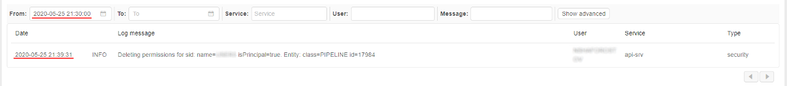
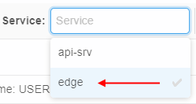
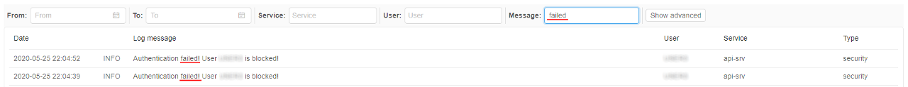
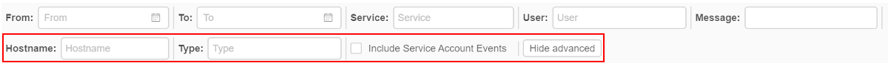
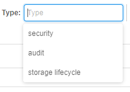
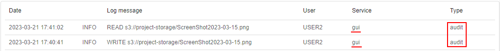
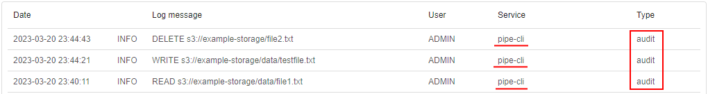
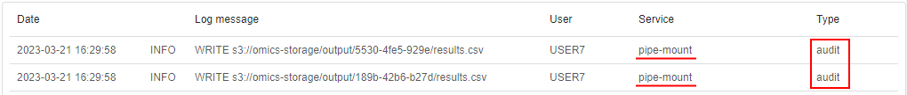

# 12.12. System logs

> User shall have **ROLE\_ADMIN** to view system security logs.

- [Filters](#filters)
    - [Date filter](#date-filter)
    - [Service filter](#service-filter)
    - [User filter](#user-filter)
    - [Message filter](#message-filter)
    - [Advanced filters](#advanced-filters)
        - [Hostname filter](#hostname-filter)
        - [Type filter](#type-filter)
        - [Show service account events](#show-service-account-events)

The System Logs tab contains the full list of security trail events.

Each record in the logs list contains:

| Field | Description |
|-|-|
| **Date** | The date and time of the log event |
| **Log status** | The status of the log message (`INFO`, `ERROR`, etc.) |
| **Log message** | Description of the log event |
| **User** | User name who performed the event |
| **Service** | Service name that registered the event (`api-srv`, `edge`) |
| **Type** | Log message type (currently, only `security` type is available) |

## Filters

By default, in the list all logs are displayed from new to old.  
For the more convenient search of the desired logs, there are filters over the logs list:  
    

You may combine them in any order for your needs.

### Date filter

To restrict the list of logs for a specific date/time interval - use the **From** and **To** controls.  
For example, to view logs for all events that were today after `21:30`:

- Click the **From** control:  
      
    Click the **Select time** button
- Select the desired time (the left column for hours, middle - for minutes, right - for secs):  
      
    Click the **Ok** button
- The logs list will be filtered:  
    

### Service filter

To restrict the list of logs for a specific service - use the **Service** control. You may select the desired service from the dropdown list, e.g.:  
    

The logs list will be filtered automatically:  
    

Multi-select is supported.

### User filter

To restrict the list of logs for a specific user(s) - use the **User** control. You may select the desired user from the dropdown list. Multi-select is supported.

### Message filter

To find the log by its event message (or its part) - use the **Message** field. Just click this field, specify the desired text and press the Enter key, e.g.:  
    

### Advanced filters

To open advanced filters click the **Show advanced** button. Additional filters will appear:  
    

#### Hostname filter

To restrict the list of logs for a certain service host(s) - use the **Hostname** control. You may select the desired host from the dropdown list.  
Multi-select is supported.

#### Type filter

To restrict the list of logs for a certain log message type(s) - use the **Type** control.  
You may select the desired type from the dropdown list. Multi-select is supported.

The following types can be here:  
    

- `security` - logs related to security events - e.g. authentication in the Platform/services or access to objects (granting permissions)  
    
- `audit` - logs related to any access to the data stored in the object storages. All operations (_READ_/_WRITE_/_DELETE_) excluding only listing are being logged.  
    The following sources are being logged:  
    - data access operations from the Platform GUI. These logs are accumulated from services `api-srv` or `gui`. Operations may be like these - via the GUI in an Object storage, user opened a file-preview, user created a new file, user deleted a file, etc.:  
        
    - data access operations from the `pipe` CLI. These logs are accumulated from the `pipe-cli` service. Operations may be like these - via the `pipe` CLI in a console or web SSH-terminal, user opened a file content from an Object storage, user copied/moved a file to an Object storage, etc.:  
        
    - data access operations performed in mounted Object storages - all Object storages that mounted via the Platform for using in runs (`~/cloud-data` folder in each run) or storages that were mounted manually by user via [`pipe storage mount`](../14_CLI/14.3._Manage_Storage_via_CLI.md#mount-a-storage) command. These logs are accumulated from the `pipe-mount` service. Operations may be like these - user mounted an Object storage as a folder and uploaded a file into the mounted folder, user opened the web SSH-terminal and read a file content from one of the Object storages mounted into `~/cloud-data` folder, etc.:  
        
- `storage lifecycle` - logs related to management events with [storage lifecycle rules](../08_Manage_Data_Storage/8.10._Storage_lifecycle.md#create-transition-rule) (_CREATE_/_EDIT_/_DELETE_ operations for rules), e.g.:  
    

#### Show service account events

The **Include Service Account Events** checkbox allows to show/hide log message from the service account (main admin user). Since from this account many messages are received, much more than from other users, by default these messages are hidden.
