# 12.13. System dictionaries

> User shall have the **ROLE\_ADMIN** to view/use system dictionaries.

- [Dictionary management](#dictionary-management)
    - [Create dictionary](#create-dictionary)
    - [Edit dictionary](#edit-dictionary)
    - [Remove dictionary](#remove-dictionary)
    - [Manage links between dictionaries](#manage-links-between-dictionaries)
- [Using dictionaries](#using-dictionaries)

## Dictionary management

### Create dictionary

Open the **System dictionaries** tab of the **System-level Settings**.

1. Click the "**+ Add dictionary**" button to create a new dictionary.
2. Specify the dictionary name, e.g.:  
    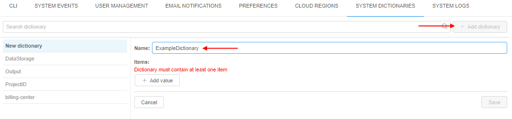
3. Add values for the dictionary. For that, click the "**+ Add value**" button and specify the value in the appeared field, e.g.:  
    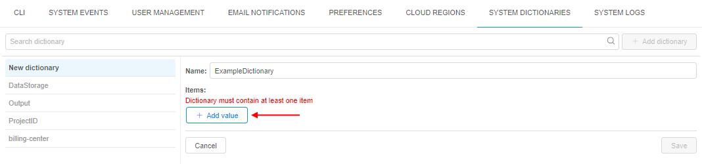  
    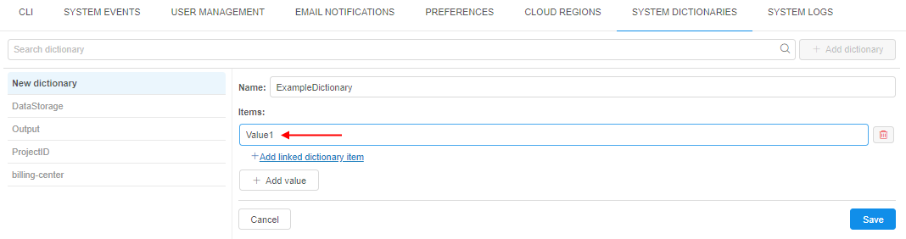
4. Repeat previous step to add more values.
5. After all values are specified, click the "**Save**" button:  
    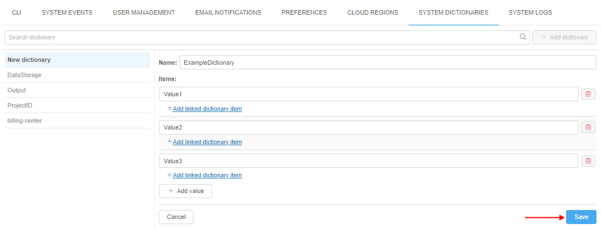
6. Just-created dictionary will appear in the dictionary list:  
    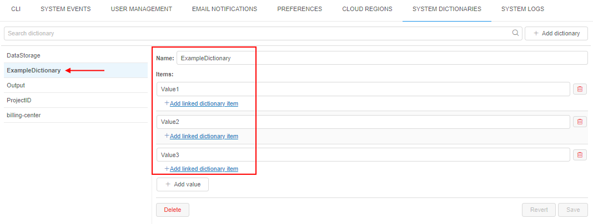

### Edit dictionary

To edit the dictionary values:

1. Find the appropriate dictionary in the list, click it.
2. To rename a dictionary - click the field with the dictionary name, then change the name, e.g.:  
    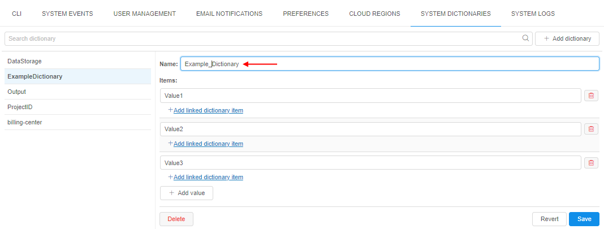
3. To rename any dictionary value - click it, then change the value, e.g.:  
    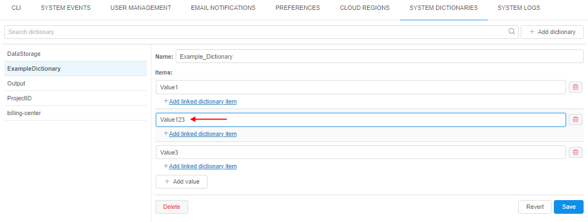
4. To delete any dictionary value - click the corresponding icon near it, e.g.:  
    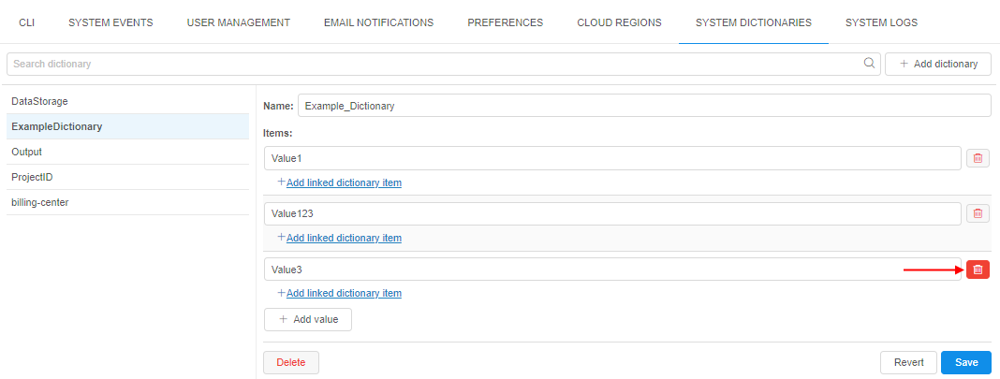
5. To add a new dictionary value - click the "**+ Add value**" button and specify a new value, e.g.:  
    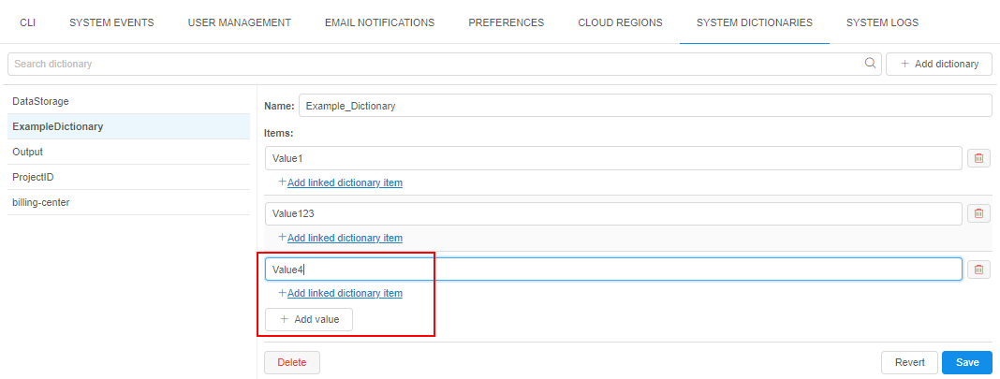
6. After all changes were done, click the "**Save**" button to confirm them.

### Remove dictionary

To remove the dictionary:

1. Find the appropriate dictionary in the list, click it.
2. Click the "**Delete**" button:  
    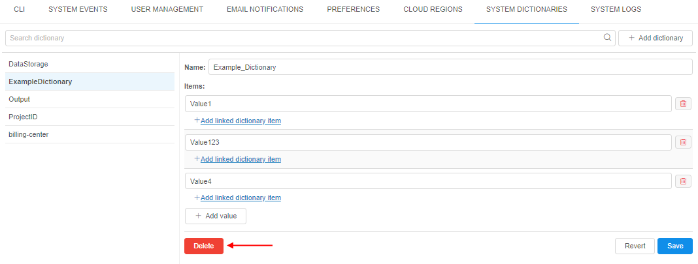
3. Click the "**OK**" button to confirm the deletion:  
    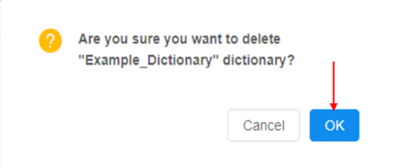

### Manage links between dictionaries

1. To create a link from one value to another dictionary, click the corresponding link under the appropriate value:  
    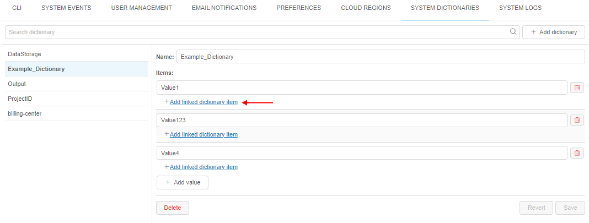
2. In the appeared pop-up, select the existing dictionary and its value that shall be auto filled, then click the "Add" button to confirm, e.g.:  
    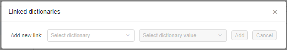  
    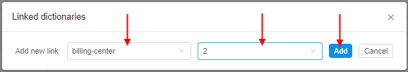  
    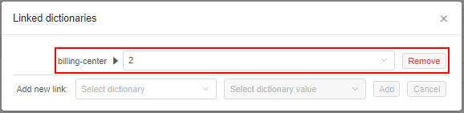
3. By the same way, you can add several links to one or more dictionaries.
4. Link can be deleted by the corresponding button near ("**Remove**" button):  
    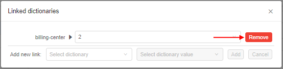
5. After all links are added, close the pop-up. Links will be displayed near the source value, for which they are linked:  
    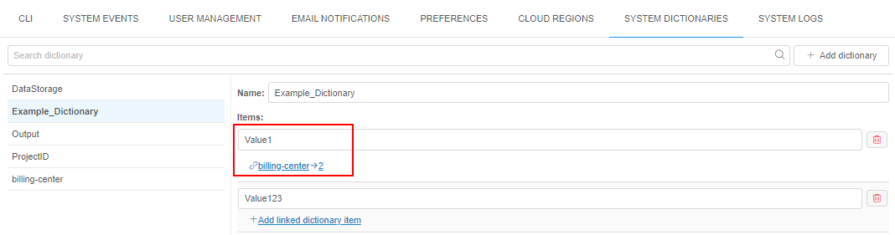
6. Click the "**Save**" button to confirm changes

## Using dictionaries

We will use the following dictionary:  
    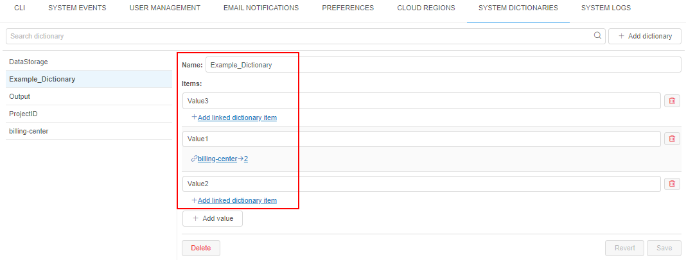

1. Open the attributes section for the entity you wish to add an attribute (in our example, we will add the attribute for the user).
2. Click the "**+ Add**" button in the "**Attributes**" section:  
    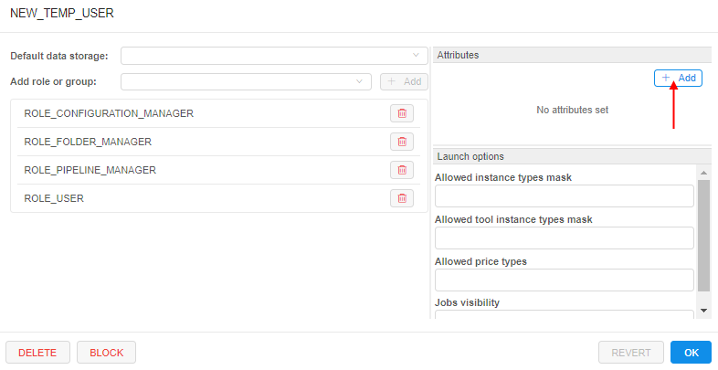
3. Into the "_Key_" field specify the dictionary name that you wish to use as categorical attribute:  
    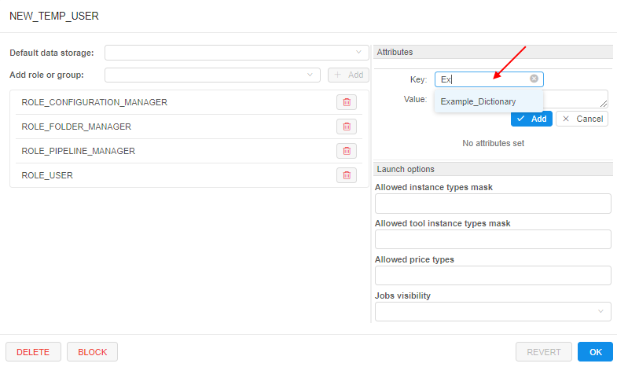  
    **_Note_**: as you start typing into the "_Key_" field, possible dictionaries names will appear in the dropdown list
4. When the existing dictionary name will be specified into the "_Key_" field, the "_Value_" field "transforms" to the dropdown list with the all values of the corresponding dictionary:  
    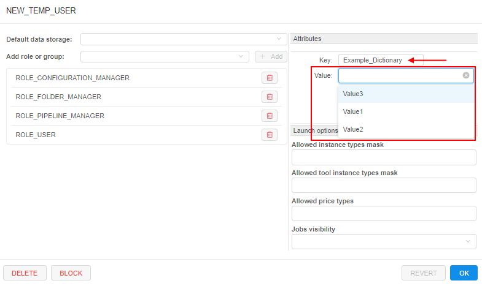
5. Any value from the list can be selected. Click the "Add" button to confirm the selection:  
    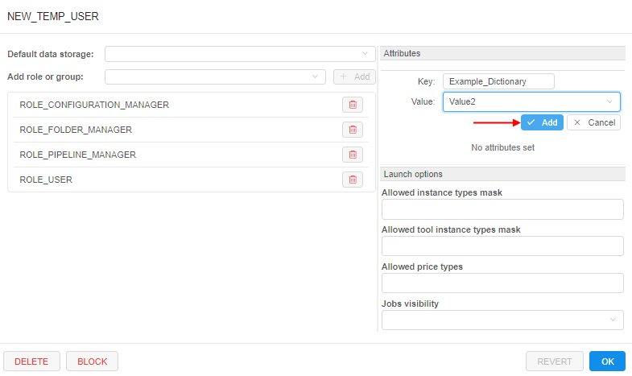
6. Added attribute will appear:  
    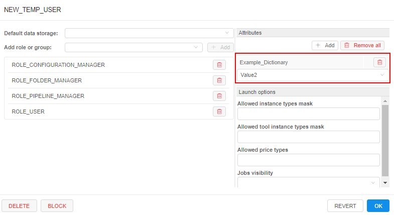
7. Later, the attribute value can be edit - in the same way (via the dropdown list with possible dictionary values).
8. Also, the attribute name ("_Key_" field) can be renamed - in the same way as "regular" attributes. If the "_Key_" will be changed to any value that doesn't matches with any existing dictionary - the "_Value_" field will be automatically transform to the plain text field.
9. If at step 5, the value with "links" will be selected, the linked dictionaries and their predefined values, will appear automatically:  
    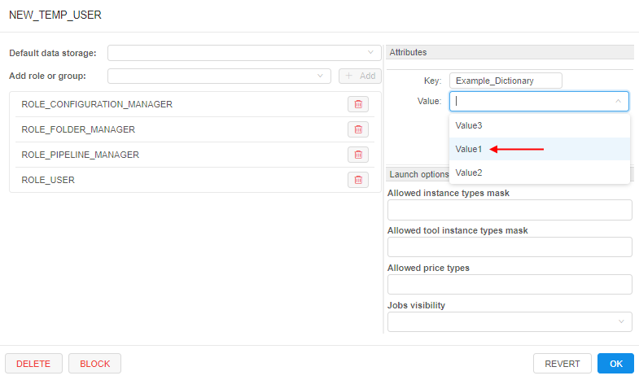  
    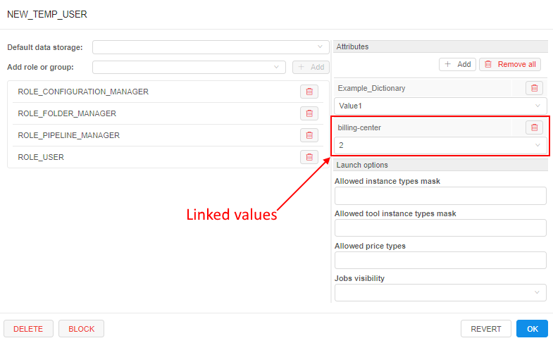

Please note, all functionality described above is available only for admins. "General" users can't view/edit System Dictionaries.  
Also, if non-admin user tries to specify any existing dictionary as the attribute "_Key_" - it will be displayed as plain text attribute. No dictionary values will be loaded/displayed.
