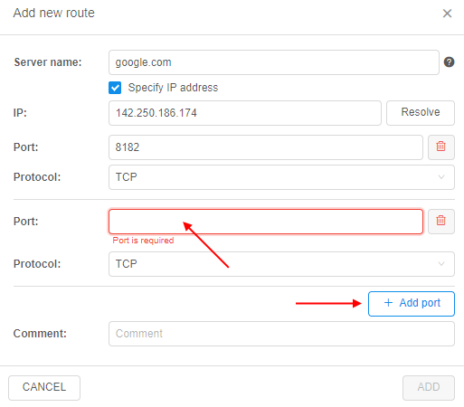
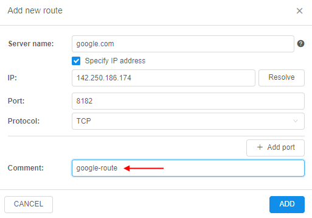

# 12.14. NAT gateway

> User shall have **ROLE\_ADMIN** to manage network routes.

- [Add route](#add-new-route)
- [Remove route](#remove-existing-route)

Via the **NAT gateway** subtab, admin can configure network routing:  
    

This form displays the list of previously created routes (port forwarding map).  
Each route record contains:

- info about external resource:
    - icon with the route status
    - server name
    - IP
    - port(s)
    - transfer protocol
- info about corresponding internal config (mapping details):
    - service name
    - service IP
    - port(s)
    - comment field
- button to remove the route

## Add new route

To add a new route, administrator shall:

1. Click the **ADD ROUTE** button:  
    
2. The pop-up to specify external server details will appear:  
    
3. Specify the external server name, e.g.:  
    
4. If you need to specify IP address of the external server - set the **Specify IP address** checkbox:  
      
    The system will try to resolve the IP automatically.  
    You can click the **Resolve** button to auto-detect the external server IP.  
    **_Note_**: if the IP is not resolved or resolved incorrectly - you can specify it manually.
5. Specify the port from which you wish to route, e.g.:  
    
6. Several ports for the same server can be specified simultaneously.  
    To add a port - click the "**+Add port**" button and specify another port, e.g.:  
      
    Repeat if necessary.  
    To remove extra-added port from the list, click the button  near the port.
7. Select the protocol for the data transfer from the dropdown list:  
      
    **_Note_**: TCP is selected by default.
8. Optionally, you can add a comment/description for the created route, e.g.:  
    
9. Once all details are specified, click the **ADD** button:  
    
10. Just-added external server will appear in the list:  
    
11. We've added a temporary record in external resources list. Unsaved routes are displayed in blue color.  
    Also:  
    - if necessary, any other server(s) or new ports for the existing servers can be added in the same way as described. To add a new record, click the button 
    - to cancel all made changes, click the button 
11. Click the **SAVE** button to confirm made changes:  
    
12. Until the route creation procedures will not be finished, the scheduling icon will be displayed near the corresponding record:  
    
13. The route table is updated automatically every few seconds. But if you need to refresh the table manually, use the corresponding button  above the table.
14. Once the route creation is done, the route details will appear in the **_INTERNAL CONFIG_** fields and the route status will be changed to _ACTIVE_:  
    

## Remove existing route

To remove an existing route, administrator shall:

1. Click the remove button for the desired route, e.g.:  
    
2. The route to remove will be strikethroughed and be highlighted in gray:
    
3. To permanently remove the route, click the **SAVE** button.  
    **_Notes_**:
    - to cancel removing of the route, click the button  in the route row
    - to cancel all made changes, click the button 
4. Once the **SAVE** button is clicked, removing procedures will be started.  
    Until the route removing procedures will not be finished, the waiting icon will be displayed near the corresponding record:  
    
5. The route table is updated automatically every few seconds. But if you need to refresh the table manually, use the corresponding button  above the table.
6. Once the removing is done, the route will disappear from the table:  
    
