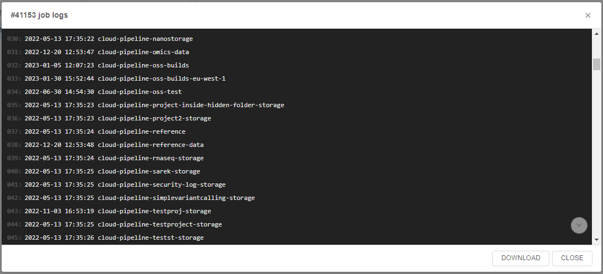

# 12.15. System jobs

> User shall have **ROLE\_ADMIN** to any access to the System jobs.

- [Overview](#overview)
    - [Configuration](#configuration)
    - [Create system job](#create-a-new-system-job)
- [System jobs panel](#system-jobs-panel)
    - [Run system job and view results](#run-a-script-and-view-results)

System jobs allow admins to create and easily launch system scripts for different needs:

- to get some system statistics or system information about the current Platform state (for example, collect information about all storages that have specific size, list all unattached EBS volumes, set some s3 bucket policy to all storages, etc.)
- to create some sort of automation scripts - with help of `Kubectl`, `pipe` CLI, Cloud Pipeline API, Cloud CLI

## Overview

System jobs solution uses the existing Cloud-Pipeline infrastructure, to reduce number of preparation steps to be done to get desire output.  
In a nutshell, the approach to perform the System jobs is the following:

1. There are:
    - prepared system pipeline that contains system jobs scripts. Admin can add new scripts or edit/delete existing ones. Also, pipeline config contains:
        - `Kubernetes` service account to perform `kubectl` commands from such pipeline during the system job run
        - special assign policy that allows to assign the pipeline to one of the running system node (`MASTER` node, for example). It is convenient as no additional instances (waiting or initializing ones) are required to perform a job
    - prepared special docker image that includes pre-installed packages such as system packages (`curl`, `nano`, `git`, etc.), `kubectl`, `pipe` CLI, Cloud CLI (`AWS`/`Azure`/`GCP`), `LustreFS` client
2. When admin launches a system job - the system instance according to specified assign policy (`MASTER` instance, by default) is found for the system job pipeine performing
3. At the selected system instance, the docker-container is launched from the special docker-image for system jobs
4. In the launched docker-container, the system job script is being performed

### Configuration

The following System Preferences are currently used to configure the System jobs behavior:

- **`system.jobs.pipeline.id`** - ID of the prepared system pipeline that contains system jobs scripts
- **`system.jobs.scripts.location`** - path to the system scripts directory inside the pipeline repo. Default value is `src/system-jobs`
- **`system.jobs.output.pipeline.task`** - name of the task at the **Run logs** page of the system pipeline that is launched for the system job. Task contains system job output results. Default value is `SystemJob`

For example:  
    

### Create a new System job

To create a new System job, admin shall:

1. Open the pipeline defined in the [**`system.jobs.pipeline.id`**](#configuration) System Preference, e.g.:  
    
2. Open the **CODE** tab inside the pipeline:  
      
    Navigate to the folder defined as the folder for system jobs scripts (specified via [**`system.jobs.scripts.location`**](#configuration) System Preference)
3. In the opened folder, you can view previously created scripts:  
    
4. Add a new system script - you can create it manually or upload the existing one from the local workstation.  
    We will create a new script manually.  
    Click the "**+ NEW FILE**" button:  
    
5. In the appeared pop-up, specify a new script name and commit message for the pipeline changes (_optionally_).  
    For our example, we will create a simple bash script that lists `s3` object storages using AWS Cloud CLI or outputs storage content if the storage name was specified as a parameter. So, the script will be called `storages_listing`:  
      
    Click the **OK** button to confirm.
6. Click the just-created file to edit it:  
    
7. In the appeared pop-up, specify the script itself and save changes:  
      
    Specify a commit message, e.g.:  
    
8. New system script is created:  
    

## System jobs panel

Entry point for the usage of existing System script jobs is the **System jobs** subtab of the **SYSTEM MANAGEMENT** tab in the System settings:  
    

Here, admin can view the whole list of stored system scripts, select any script and launch it or observe script's runs history.

This panel contains:  
    

- **a** - list of all stored scripts. Click any to select it
- **b** - selected script name
- **c** - list of selected script's runs history
- **d** - button to refresh runs history
- **e** - button to launch the script:  
    - click the button itself to launch the script as is
    - click **v** button near to launch the script with specifying parameters  
    
- **f** - view output logs of the script's specific launch
- **g** - view run's details that used for the script launch

### Run a script and view results

> For our example, we will use a simple bash script created in the section [above](#create-a-new-system-job).

To run a script from the **System jobs** panel:

1. Click the script in the list.  
2. Click the **LAUNCH** button to perform a script as is (without parameters), e.g.:  
    
3. Just-launched script run will appear in the runs history:  
      
    Jobs states are similar to [pipelines states](../06_Manage_Pipeline/6._Manage_Pipeline.md#pipeline-runs-states).
4. Once the script is performed, the state will be changed to **Success**:  
    
5. Click the script run's row or the button **LOG** to view the script performing output:  
    
6. Script logs will appear:  
    
7. If needed, you may download these logs as a text file by click the corresponding button - **DOWNLOAD**:  
    

To run a script with parameters:

1. Click the script in the list.  
2. Click the **v** button near the **LAUNCH** and select the item **Launch with parameters**, e.g.:  
    
3. In the appeared form, specify parameters for the script separated by spaces (in the format `<parameter_1> <parameter_2> ...`) and click the **LAUNCH** button:  
    
4. Just-launched script will appear in the runs history:  
    
5. Script performing logs can be viewed in the same way as was described in the example above.

To view run's details that was used for the script launch:

1. Click the **DETAILS** button in the script run's row:  
    
2. The **Run logs** page will be opened:  
    
3. Here you can also view system job results - click the task `SystemJob` (default name, it can be changed via the System Preference [**`system.jobs.output.pipeline.task`**](#configuration)):  
    
