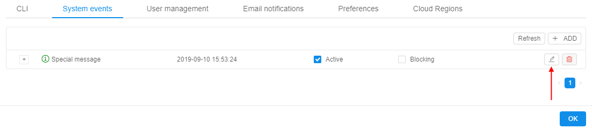

# 12.2. Edit a system event

> An administrator can edit **System events** notifications only.

1. Navigate to **System events tab**.
2. Click the **Edit** button.  
    
3. Change any field:
    - **Title** of the notification.
    - **Body** of the notification.
    - Notification **Severity** ("_info_", "_warning_" or "_critical_").
    - **Blocking** box. Blocking event emerges in the middle of the window and requires confirmation from the user to disappear.
    - **Active** box. Active notifications will be shown for all users of the Cloud Pipeline until admin sets them inactive.
4. Click **Save**.  
    

To delete a system event:

1. Click the **Delete** button.  
    
2. Confirm the deletion.  
    
