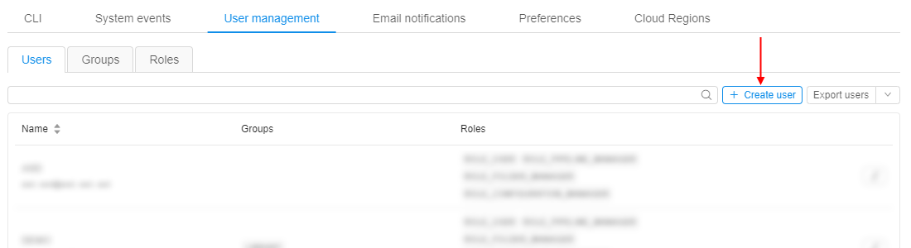

# 12.3. Create a new user

> User shall have **ROLE\_ADMIN** to create a new user.

1. Navigate to **User management** tab.
2. Click **+ Create user** control.  
    
3. The **Create user** form will be opened. This form contains the following sections:
    - **Name** - a new user's name.
    - **Default data storage** - drop-down list suggested a default data storage to the created user.
    - **Assign group or role** - drop-down list suggested the existing roles and groups assign.
    - View of roles and groups that are assigned to a new user.  
        **_Note_**: the groups and roles, marked as default, will be shown.  
        
4. Enter a name for the new user.  
    **_Note_**: there is no restriction to username format, but it is highly recommended to name a user according to your SSO scheme.
5. Select a default data storage if it is necessary.
6. Select desired groups and roles to assign the new user.  
    
7. Click the **Create** button and the new user will be displayed in the **Users** tab table.  
    
