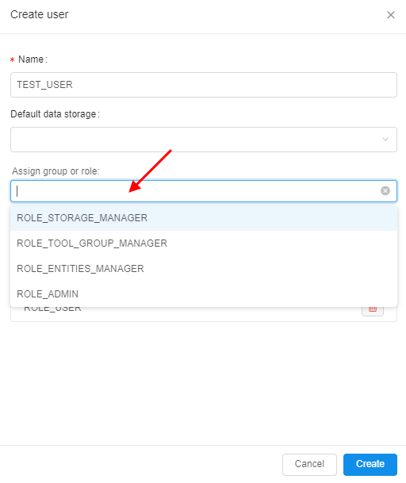

# 12.3. Create a new user

- [Create a new user manually](#create-a-new-user-manually)
- [Users batch import](#users-batch-import)
    - [CSV format](#csv-format)
    - [Batch import approach](#batch-import-approach)
    - [Example CSV](#example-csv)
    - [Import users](#import-users)
    - [Import results review](#import-results-review)

> User shall have **ROLE\_ADMIN** to create a new user.

## Create a new user manually

1. Navigate to **User management** tab.
2. Click **+ Create user** control.  
    
3. The **Create user** form will be opened. This form contains the following sections:
    - **Name** - a new user's name.
    - **Default data storage** - drop-down list suggested a default data storage to the created user.
    - **Assign group or role** - drop-down list suggested the existing roles and groups assign.
    - View of roles and groups that are assigned to a new user.  
        **_Note_**: the groups and roles, marked as default, will be shown.  
        
4. Enter a name for the new user.  
    **_Note_**: there is no restriction to username format, but it is highly recommended to name a user according to your SSO scheme.
5. Select a default data storage if it is necessary.
6. Select desired groups and roles to assign the new user.  
    
7. Click the **Create** button and the new user will be displayed in the **Users** tab table.  
    

## Users batch import

Described [above](#create-a-new-user-manually) mechanism allows creating users one-by-one via the GUI. If a number of users shall be created - it can be quite complicated to perform those operation multiple times.

To address this, the special ability is implemented in the **Cloud Pipeline** - an import users from a `CSV` file using GUI and CLI.

### CSV format

`CSV` format of the file for the batch import (with examples):

``` csv
UserName,Groups,<AttributeItem1>,<AttributeItem2>,<AttributeItemN>
<user1>,<group1>,<Value1>,<Value2>,<ValueN>
<user2>,<group2>|<group3>,<Value3>,<Value4>,<ValueN>
<user3>,,<Value3>,<Value4>,<ValueN>
<user4>,<group4>,,,
```

Where:

- **UserName** (_mandatory_ column) - contains the user name. This column can't contain empty values
- **Groups** (_mandatory_ column) - contains the "permission" groups, which shall be assigned to the user. This column may contain empty values for the users (in this case - no groups will be added). Also this column may contain several values for one user separated by vertical line (`|`)
- **`<AttributeItem1>`**, **`<AttributeItem2>`**, **`<AttributeItemN>`** - set of other _optional_ columns, which correspond to the user attributes (they could be existing or new)

### Batch import approach

The import process takes a number of inputs:

- `CSV` file
- _Users/Groups/Attributes creation options_, which control if a corresponding object shall be created if not found in the database. If a creation option is not specified - the object creation won't happen:
    - "`create-user`"
    - "`create-group`"
    - "`create-<ATTRIBUTE_ITEM_NAME>`"

The inputs are then processed in the following manner:

- If the user with **UserName** does not exist:
    - If "`create-user`" is specified - the user shall be created
    - Otherwise - skip such user
- If the user is not a member of one of the groups, listed in **Groups** - the user shall be added to the group(s)
- If one of the group(s) does not exist:
    - If "`create-group`" is specified - the group shall be created and a user shall be assigned to that group
    - Otherwise - skip the group
- For each of the **`<AttributeItemX>`** the following actions shall be performed:
    - If the user does not have an attribute with the name **`<AttributeItemX>`** and the attribute's name does not match any existing "[**SYSTEM DICTIONARY**](12.13._System_dictionaries.md)" - it shall be added with a corresponding value
    - If an attribute already exists, but the value is different - it shall be updated with a corresponding value (for the cases, when the attribute's name does not match any existing "**SYSTEM DICTIONARY**")
    - If an attribute is an existing "**SYSTEM DICTIONARY**" and a value is linked to another dictionary - this link shall be handled in the same manner as GUI does (i.e. another attribute shall be added/updated, according to the link)
    - If an attribute is an existing "**SYSTEM DICTIONARY**" and a value does not exist in that dictionary:
        - If "`create-<ATTRIBUTE_ITEM_NAME>`" is specified (where "`<ATTRIBUTE_ITEM_NAME>`" shall match the column name) - the value shall be added as a new dictionary entry
        - Otherwise - skip the Attribute item
- If one of the values is empty (i.e. **Groups**, **`<AttributeItemX>`**) for a specific user - this field shall be skipped (like "_user3_" and "_user4_" in the example above)

### Example CSV

The following `CSV` file will be used for the further import example:

``` csv
UserName,Groups,billing-center,import_attr1
IMPORT_USER1,IMPORT_GROUP1,Center1,import_attr1_val1
IMPORT_USER2,IMPORT_GROUP2,Center1,import_attr1_val2
IMPORT_USER3,IMPORT_GROUP1|IMPORT_GROUP2,Center2,import_attr1_val3
```

Let's assume that the **System Dictionaries** configuration contains two dictionaries:

- `billing-group`
    - `Group1`
    - `Group2`
- `billing-center`
    - `Center1` → `Group1`
    - `Center2` → `Group1`
    - `Center3` → `Group2`


### Import users

1. Open the **USER MANAGEMENT** tab of the **System Settings** page.
2. Click the "**Import users**" button:  
    
3. You will be prompted to select a `CSV` file for the import (_here we use the example CSV, shown above_)
4. The GUI will ask to the creation options selection (see [Processing logic](#batch-import-approach) section for the details):  
    
5. Select the creation options (_here we are ok to create everything: users, groups, billing centers and assign new attribute to the users_) and click the **IMPORT** button:  
    

> **_Note_**: to import users via CLI see [here](../14_CLI/14.9._User_management_via_CLI.md#batch-import).

### Import results review

Once the import is done (via GUI or CLI) - review the import results:

- Users and groups have been created
- Users were assigned to the newly create groups  
    
- Attributes were assigned to the users as well:
    - A random **`import_attr1`** attribute was assigned as a plain text value, as there is no corresponding **SYSTEM DICTIONARY**
    - **`billing-center`** attribute was assigned from the corresponding **SYSTEM DICTIONARY**
    - **`billing-group`** was assigned as well even if it is not specified in the CSV file, as the `Center1` is mapped to the `Group1` (see [example CSV](#example-csv) description section above)  
    
