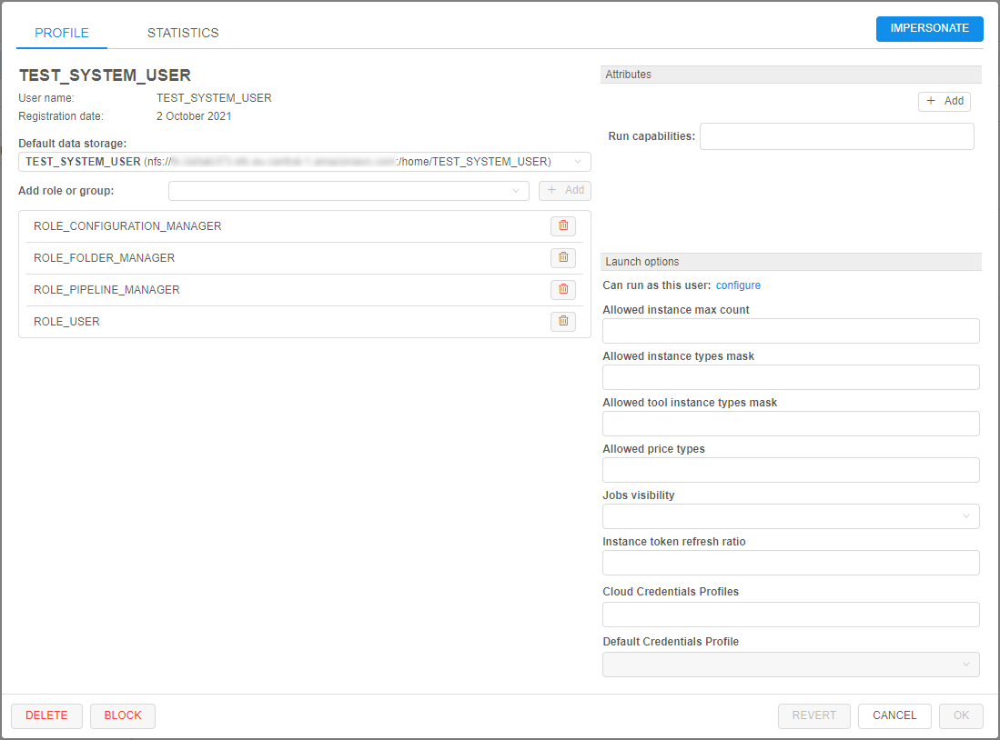
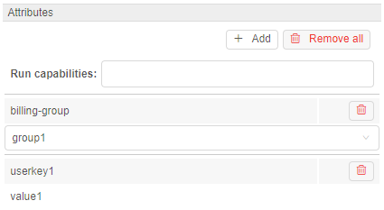
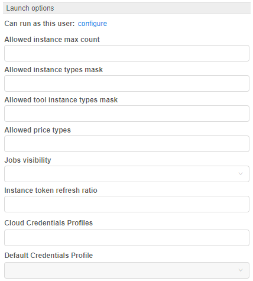
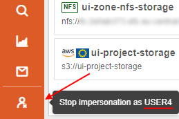
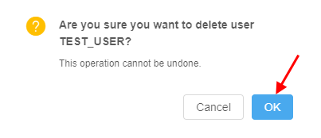

# 12.4. Edit/delete a user

- [Edit a user](#edit-a-user)
    - [Default data storage](#default-data-storage)
    - [Groups (roles) management](#groups-roles-management)
    - [Attributes](#attributes)
    - [Launch options](#launch-options)
    - [Possibility to revert changes](#possibility-to-revert-changes)
- [Block/unblock a user](#blockunblock-a-user)
- [GUI impersonation](#gui-impersonation)
- [Delete a user](#delete-a-user)

> User shall have **ROLE\_ADMIN** to edit/delete users.

## Edit a user

For edit a user:

1. Open the **Users** subtab in the **User management** section of the system-level settings.
2. Find a user.
3. Click the **Edit** button in the row opposite the user name:  
    
4. Pop-up window will appear:  
    

At this form, there are several blocks of details/settings for a user.

### User info

Main details' section about the user, that contain general info fields like user name, date of the user registration in the Platform, user email address, first and last names, e.g.:  
    

### Default data storage

Here you can select default data storage for a user:  

### Groups (roles) management

In this block you can set groups and roles for the selected user:  

For more information about changing a set of the roles/groups for the specific user see [12.8. Change a set of roles/groups for a user](12.8._Change_a_set_of_roles_groups_for_a_user.md#change-a-set-of-roles-and-groups-to-a-selected-user).

### Attributes

In this block you can set metadata tags (attributes) for a user. These tags represent key/value pairs, same as pipeline/folder tags. For more information see [17. CP objects tagging by additional attributes](../17_Tagging_by_attributes/17._CP_objects_tagging_by_additional_attributes.md).

#### "Blocking" notifications track

One of the special attribute that is set automatically - information about the notifications confirmation:  
      
Via that attribute you can view, which "blocking" notifications were confirmed by the user (about system notifications see [here](12._Manage_Settings.md#system-events)).  
This attribute is shown only for users that confirmed at least one "blocking" notification.  
By default, this attribute has the following pair:

- _KEY_ - `confirmed_notifications` (that name could be changed via the system-level preference **`system.events.confirmation.metadata.key`**)
- _VALUE_ - link that shows summary count of confirmed notifications for the user

To open the detailed table with confirmed notifications for the user:

1. Click the _VALUE_ link:  
      
2. Here you can view detailed information about confirmed notifications - their titles, messages and datetime of the confirmation:  
      
3. Also you can open "raw" `JSON` view of the detailed table, if necessary. For that, click the **EDIT** button under the detailed table:  
      
4. Here you can edit the contents. Click the **SAVE** button to save changes:  
      

### Launch options

In this block you can specify some restrictions for a specific user on allowed instance types, price types, jobs visibility, etc.  
To apply configured launch options for a user, click  button in the right bottom corner of the pop-up. This action will save all made changes in the user settings (not only launch options) and close the pop-up.

#### Allowed instance count

This setting (**Allowed instance max count**) allows to restrict the number of instances a user can run at the same time.  
This is useful to address any bugs as the users' scripts may spawn hundreds of machines without a real need.

> **_Note_**: this restriction is not applied to the users with the **ROLE\_ADMIN** role.

Behavior is configured by the following way: for example, if this setting for the user is specified to 5 - they can launch 5 jobs at a maximum. This includes worker nodes of the clusters.  

If the user tries to launch a job, but it exceeds a current limit - the warning and errors will be shown.  
Imagine that user has already launched 5 jobs with the set limit also equal 5.  
The user starts a new instance (which is going to be a 6th job):

- GUI will warn the user at the **Launch** page:  
    
- GUI will warn the user, before submitting a job:  
    
- If the user confirms a run operation - it will be rejected:  
    

Similar warnings are shown if the user will try to start a cluster or an autoscaled cluster.  
In this case, even if there are some spare slots, but the preparing cluster may exceed it eventually - the corresponding warning will appear. E.g., imagine that user has already launched 3 from 5 allowed jobs and tries to start an autoscaled cluster:  
    

> **_Note_**: if user has reached the limit, warning will be also shown in case when the user will try to start a new job via `pipe` CLI. Job will be rejected, e.g.:  
>      
> Via `pipe` CLI, user can view the allowed instances count to be launched - using the command [`pipe users instances`](../14_CLI/14.9._User_management_via_CLI.md#instances-usage).

Such restrictions could be set not only for a user, but on another levels too.  
Next hierarchy is set for applying of instances max count (in descending order of priority):

- **User-level** - i.e. specified for a user - as described above. This overrides any other limit for a particular user.
- **User group level** - i.e. specified for a group/role. Count of jobs of each member of the group/role is summed and compared to this parameter. If a number of jobs exceeds a limit - the job submission is rejected. How to configure see [here](12.6._Edit_a_group_role.md#allowed-instance-count). This overrides a global limit for a specific user group.
- _(global)_ **`launch.max.runs.user.global`** - can be used to set a global default restriction for all the users. I.e. if it set to 5, each Platform user can launch 5 jobs at a maximum. See [12.10. Manage system-level settings](12.10._Manage_system-level_settings.md#launch) for details.

#### Allowed instance types

Here, there are two settings that can restrict allowed instance types for a specific user:

- **Allowed instance types mask** - this mask restricts allowed instance types for launching tools, pipelines and configurations (i.e. any user's runs).  
    _Example of usage_: If you want the user to be able to launch runs with only "m5..." instances types, mask would be **`m5*`**:  
      
    In that case, before that user will launch any tool/pipeline/configuration, dropdown list of available node types for them will be like this:  
    
- **Allowed tool instance types mask** - this mask restricts allowed instance types only for tools' runs.  
    This mask has higher priority for launching tool than **Allowed instance types mask**. I.e. when both masks are set - for the launching tool, **Allowed tool instance types mask** will be applied.  
    _Example of usage_: if you want the user to be able to launch tools with only "large m5..." instances types, mask would be **`m5*.large*`**:  
      
    In that case, before that user will launch any tool, dropdown list of available node types for them will be like this:  
    

Setting restrictions on allowed instance types is a convenient way to minimize a number of invalid configurations' runs.  
Such restrictions could be set not only for a user, but on another levels too.  
Next hierarchy is set for applying of specified allowed instance types (in descending order of priority):

- **User level** - i.e. specified for a user - as described above.
- **User group level** - i.e. specified for a group/role of a user. If user is a member of several groups - list of allowed instances will be summarized across all the groups. How to configure see [here](12.6._Edit_a_group_role.md#allowed-instance-types).
- **Tool level** - i.e. specified for a tool, that a user tries to launch. How to configure see [10.5. Launch a Tool](../10_Manage_Tools/10.5._Launch_a_Tool.md#instance-management).
- _(global)_ **`cluster.allowed.instance.types.docker`** - system preference that defines allowed instance types for tools. See [12.10. Manage system-level settings](12.10._Manage_system-level_settings.md#cluster) for details.
- _(global)_ **`cluster.allowed.instance.types`** - system preference that defines allowed instance types for pipelines/tools/configurations. See [12.10. Manage system-level settings](12.10._Manage_system-level_settings.md#cluster) for details.

After specifying allowed instance types, all GUI forms that allow to select the list of instance types (configurations/launch forms) - will display only valid instance types, according to hierarchy above.  

#### Allowed price types

This field may restrict, what price types are allowed for a specific user (for launching any job).

_Example of usage_: if you want the user to be able to launch only "On-demand" runs, select it:  
      
In that case, before that user will launch any run, dropdown list of price types for them will be like this:  
    

Setting restrictions on allowed price types is a convenient way to minimize a number of invalid configurations' runs.  
Such restrictions could be set not only for a user, but on another levels too.  
Next hierarchy is set for applying of specified allowed price types (in descending order of priority):

- **User level** - i.e. specified for a user - as described above.
- **User group level** - i.e. specified for a group/role of a user. If user is a member of several groups - list of allowed price types will be summarized across all the groups. How to configure see [here](12.6._Edit_a_group_role.md#allowed-price-types).
- **Tool level** - i.e. specified for a tool, that a user tries to launch. How to configure see [10.5. Launch a Tool](../10_Manage_Tools/10.5._Launch_a_Tool.md#instance-management).

#### Jobs visibility

This field may restrict the visibility of runs at the **Active Runs** page for users who are non-owners of these runs.

> **_Note_**: this restriction is not applied to the users with the **ROLE\_ADMIN** role.

_Example of usage_: if you want the user to be able to view all pipeline runs (for that pipelines on which user has corresponding permissions), select "_Inherit_":  
      
    Therefore USER4, that is owner of the pipeline, will view all runs of that pipeline, e.g.:  
    

If you want the user to be able to view only **_own_** runs launched, select "_Only owner_":  
      
    Therefore USER4, that is owner of the pipeline, will view only own runs of that pipeline, e.g.:  
    

If this setting is not specified for a user - for them "_Inherit_" behavior is applied by default.

Next hierarchy is set for applying of jobs visibility (in descending order of priority):

- **User level** - i.e. specified for a user - as described above.
- **Group level** - i.e. specified for a group/role. How to configure see [here](12.6._Edit_a_group_role.md#jobs-visibility).
- _(global)_ **`launch.run.visibility`** - system preference that defines jobs visibility globally. See [12.10. Manage system-level settings](12.10._Manage_system-level_settings.md#launch) for details.

#### Credentials profiles

In these fields, specific interfaces can be specified for a user:

- **Cloud Credentials Profiles** - here, specific interfaces can be assigned for a user. Such interfaces allow to use seamless authentication in _Cloud Provider_ services.  
    For details and examples see [here](12.11._Advanced_features.md#seamless-authentication-in-cloud-provider).
- **Default Credentials Profile** - setting allows to select one of **Cloud Credentials Profiles** assigned to the user as the default profile.  
    For details and examples see [here](12.11._Advanced_features.md#seamless-authentication-in-cloud-provider).

### Possibility to revert changes

In certain cases, there could be convenient to undo all changes in a user profile when modifying it - without closing the form.

The admin has such ability:

- open the **User management** tab
- select the desired user to modify, click the **Edit** button to open the popup with the user's settings
- edit some settings
- if needed to revert done changes - click the **REVERT** button at the bottom of the form (**_Note_**: it's possible only before saving!):  
    
- all done unsaved changes are reverted. The **REVERT** button becomes disabled:  
    

**_Note_**: in such way all unsaved changes of user settings could be reverted - _Default data storage_, _Roles & Groups_ list, _Attributes_ and _Launch options_.

## Block/unblock a user

To block user:

1. Open the **Users** subtab in the **User management** section of the system-level settings.
2. Find a user.
3. Click **Edit** button in the row opposite the user name.
4. In the opened pop-up window click the **BLOCK** button in the left bottom corner.  

5. Confirm the blocking:  

To unblock user:

1. Open the **Users** subtab in the **User management** section of the system-level settings.
2. Find a user.
3. Click **Edit** button in the row opposite the user name.
4. In the opened pop-up window click the **UNBLOCK** button in the left bottom corner.  

5. Confirm the unblocking:  

## GUI Impersonation

**Cloud Pipeline** supports "Impersonation" feature. It allows admins (users with the **_ROLE\_ADMIN_** role) to login as a selected user into the **Cloud Pipeline** GUI and have the same permissions/level of access as the user.

> **_Note_**: while running any job in the "impersonated" mode - the [costs](../Appendix_D/Appendix_D._Costs_management.md#user-report) will go to that user and a linked billing-group.

### Start/Stop impersonation

1. Login to the **Cloud Pipeline** using an administrative account
2. Open the **Users** subtab in the **User management** section of the system-level settings.
3. Find a user.
4. Click the **Edit** button in the row opposite the user name - to load a user's profile:  
      
    Click the **Impersonate** button in the top-right corner.
5. **Cloud Pipeline** GUI will be reloaded using the selected user:  
    
6. While in the "Impersonation" mode, the following changes happen to the GUI:  
    - Main menu will turn orange, indicating that the impersonation mode is _ON_
    - **Logout** button will be changed to the **Stop impersonation** button:  
    
    - Hovering over the **Stop impersonation** button will bring the ID of the user, whose account is currently active, e.g.:  
    
7. To stop the impersonation and revert back to the own admin account - click the **Stop impersonation** button.

## Delete a user

To delete a user:

2. Open the **Users** subtab in the **User management** section of the system-level settings.
2. Find a user.
3. Click the **Edit** button in the row opposite the user name.
4. In the opened pop-up window click the **Delete** button in the left bottom corner.
5. Confirm the deletion:  
