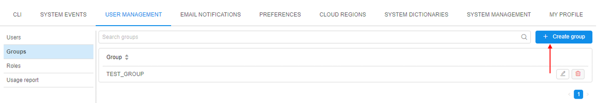

# 12.5. Create a group

> User shall have **ROLE\_ADMIN** to create a new group.

1. Navigate to **User management** tab.
2. Click **Groups** tab.
3. Click **+ Create group** button.  
    
4. Enter a name for the new group (e.g. **NEW\_GROUP**).
5. If you want to grant the group and its permissions to all new users mark the group as **Default**.
6. Select a default data storage for the created group if it is necessary.
7. Click the **Create** button.  
    
