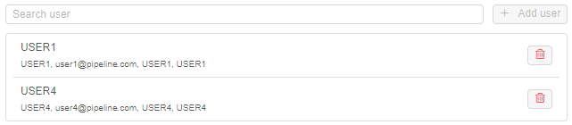
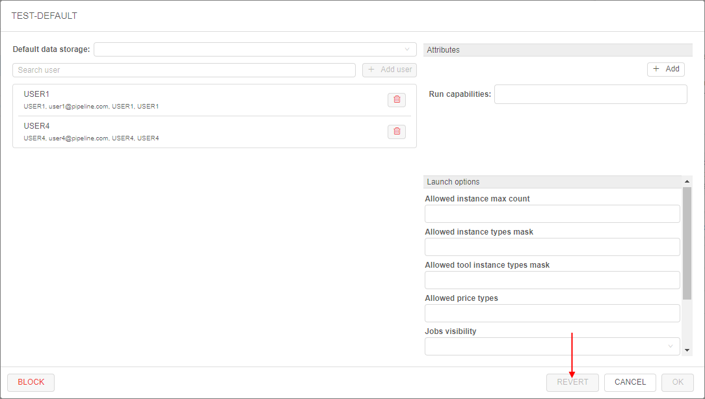
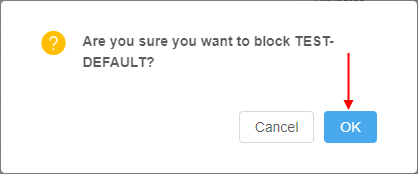

# 12.6. Edit a group (role)

- [Edit a group (role)](#edit-a-group-role)
    - [Default data storage](#default-data-storage)
    - [User management](#user-management)
    - [Attributes](#attributes)
    - [Launch options](#launch-options)
    - [Possibility to revert changes](#possibility-to-revert-changes)
- [Block/unblock a group](#blockunblock-a-group)

> User shall have the **ROLE\_ADMIN** role to edit groups/roles.

## Edit a group (role)

For edit a group/role:

1. Open the **Groups/Roles** subtab in the **User management** section of the system-level settings.
2. Find a group (role).
3. Click the **Edit** button in the row opposite the group/role name:  
    
4. Pop-up window will be shown:  
    

At this form, there are several blocks of the settings for a group/role.

### Default data storage

Here you can select default data storage for a group/role:  

### User management

In this block, you can change a members list of the opened group/role:  

For more information see [12.8. Change a set of roles/groups for a user](12.8._Change_a_set_of_roles_groups_for_a_user.md#change-a-member-list-for-a-selected-role-or-group).

### Attributes

  
In this block you can set metadata tags (attributes) for a group. These tags represent key/value pairs, same as pipeline/folder tags. For more information see [17. CP objects tagging by additional attributes](../17_Tagging_by_attributes/17._CP_objects_tagging_by_additional_attributes.md).

### Launch options

In this block you can specify some restrictions for a group of users/role on allowed instance types, price types, jobs visibility, etc.  
To apply configured launch options for a group/role, click  button in the right bottom corner of the pop-up. This action will save all made changes in the group/role settings (not only launch options) and close the pop-up.

#### Allowed instance count

This setting (**Allowed instance max count**) allows to restrict the number of instances that members of a particular group/role can run at the same time.  
This is useful to address any bugs as the users' scripts may spawn hundreds of machines without a real need.

> **_Note_**: this restriction is not applied to the users with the **ROLE\_ADMIN** role.

Behavior is configured by the following way: for example, if this setting for the group/role is specified to 5 - then each member of that group/role can launch only 5 jobs simultaneously. This includes worker nodes of the clusters.  

If the member of the group/role tries to launch a job, but it exceeds a current limit for members of a such group/role - the warning and errors will be shown.  
Imagine that the member of a group has already launched 5 jobs with the set groups's limit also equal 5.  
That user starts a new instance (which is going to be a 6th job from this user):

- GUI will warn the user at the **Launch** page:  
    
- GUI will warn the user, before submitting a job:  
    
- If the user confirms a run operation - it will be rejected:  
    

Similar warnings are shown if the member of that group will try to start a cluster or an autoscaled cluster.  
In this case, even if there are some spare slots, but the preparing cluster may exceed it eventually - the corresponding warning will appear. E.g., imagine that member of the group has already launched 3 from 5 allowed jobs and tries to start an autoscaled cluster:  
    

> **_Note_**: if user has reached the group/role limit, warning will be also shown in case when that user will try to start a new job via `pipe` CLI. Job will be rejected, e.g.:  
>   

Such restrictions could be set not only for a group/role, but on another levels too.  
Next hierarchy is set for applying of instances max count (in descending order of priority):

- **User-level** - i.e. specified for a user. This overrides any other set limits for a particular user. How to configure see [here](12.4._Edit_delete_a_user.md#allowed-instance-count).
- **User group level** - i.e. specified for a group/role. Count of jobs of each member of the group/role is summed and compared to this parameter. If a number of jobs exceeds a limit - the job submission is rejected. How to configure - described above.
- _(global)_ **`launch.max.runs.user.global`** - can be used to set a global default restriction for all the users. I.e. if it set to 5, each Platform user can launch 5 jobs at a maximum. See [12.10. Manage system-level settings](12.10._Manage_system-level_settings.md#launch) for details.

#### Allowed instance types

Here, there are two settings that can restrict allowed instance types for a specific group/role:

- **Allowed instance types mask** - this mask restricts allowed instance types for launching tools, pipelines and configurations (i.e. for any run from the member of this group/role).  
    _Example of usage_: if you want members of the group/role to be able to launch runs with only "m5..." instances types, mask would be **`m5*`**:  
      
    In that case, before the member of such group/role will launch any tool/pipeline/configuration, dropdown list of available node types for them will be like this:  
    
- **Allowed tool instance types mask** - this mask restricts allowed instance types only for tools' runs.  
    This mask has higher priority for launching tool than **Allowed instance types mask**. I.e. when both masks are set - for the launching tool, **Allowed tool instance types mask** will be applied.  
    _Example of usage_: if you want members of the group/role to be able to launch tools with only "large m5..." instances types, mask would be **`m5*.large*`**:  
      
    In that case, before the member of such group/role will launch any tool, dropdown list of available node types for them will be like this:  
    

Setting restrictions on allowed instance types is a convenient way to minimize a number of invalid configurations' runs.  
Such restrictions could be set not only for a group/role, but on another levels too.  
Next hierarchy is set for applying of specified allowed instance types (in descending order of priority):

- **User level** - i.e. specified for a particular user. How to configure see [here](12.4._Edit_delete_a_user.md#allowed-instance-types).
- **User group level** - i.e. specified for a group/role of a particular user. If user is a member of several groups - list of allowed instances will be summarized across all the groups. How to configure - described above.
- **Tool level** - i.e. specified for a tool, that a particular user tries to launch. How to configure see [10.5. Launch a Tool](../10_Manage_Tools/10.5._Launch_a_Tool.md#instance-management).
- _(global)_ **`cluster.allowed.instance.types.docker`** - system preference that defines allowed instance types for tools. See [12.10. Manage system-level settings](12.10._Manage_system-level_settings.md#cluster) for details.
- _(global)_ **`cluster.allowed.instance.types`** - system preference that defines allowed instance types for pipelines/tools/configurations. See [12.10. Manage system-level settings](12.10._Manage_system-level_settings.md#cluster) for details.

After specifying allowed instance types, all GUI forms that allow to select the list of instance types (configurations/launch forms) - will display only valid instance types, according to hierarchy above.  

#### Allowed price types

This field may restrict, what price types are allowed for users of a specific group/role (for launching any job).

_Example of usage_: if you want members of the group/role to be able to launch only "On-demand" runs, select it:  
      
In that case, before members of that group/role will launch any run, dropdown list of price types for them will be like this:  
    

Setting restrictions on allowed price types is a convenient way to minimize a number of invalid configurations' runs.  
Such restrictions could be set not only for a group/role, but on another levels too.  
Next hierarchy is set for applying of specified allowed price types (in descending order of priority):

- **User level** - i.e. specified for a particular user. How to configure see [here](12.4._Edit_delete_a_user.md#allowed-price-types).
- **User group level** - i.e. specified for a particular group/role. If user is a member of several groups - list of allowed price types will be summarized across all the groups. How to configure - described above.
- **Tool level** - i.e. specified for a tool, that a user tries to launch. How to configure see [10.5. Launch a Tool](../10_Manage_Tools/10.5._Launch_a_Tool.md#instance-management).

#### Jobs visibility

This field may restrict the visibility of runs at the **Active Runs** page for users who are non-owners of these runs.

> **_Note_**: this restriction is not applied to the users with the **ROLE\_ADMIN** role.

_Example of usage_: if you want members of a particular group/role to be able to view all pipeline runs (for that pipelines on which members have corresponding permissions), select "_Inherit_":  
      
    Therefore USER4, that is owner of the pipeline, will view all runs of that pipeline, e.g.:  
    

If you want members of a particular group/role to be able to view only **_own_** runs, select "_Only owner_":  
      
    Therefore USER4, that is owner of the pipeline, will view only own runs of that pipeline, e.g.:  
    

If this setting is not specified for a group/role - for members of that group/role "_Inherit_" behavior is applied by default.

Next hierarchy is set for applying of jobs visibility (in descending order of priority):

- **User level** - i.e. specified for a user. How to configure see [here](12.4._Edit_delete_a_user.md#jobs-visibility).
- **Group level** - i.e. specified for a group/role - as decribed above.
- _(global)_ **`launch.run.visibility`** - system preference that defines jobs visibility globally. See [12.10. Manage system-level settings](12.10._Manage_system-level_settings.md#launch) for details.

#### Credentials profiles

In these fields, specific interfaces can be specified for a group/role:

- **Cloud Credentials Profiles** - here, specific interfaces can be assigned for members of a particular group/role. Such interfaces allow to use seamless authentication in _Cloud Provider_ services.  
    For details and examples see [here](12.11._Advanced_features.md#seamless-authentication-in-cloud-provider).
- **Default Credentials Profile** - setting allows to select one of **Cloud Credentials Profiles** assigned to members of a particular group/role as the default profile.  
    For details and examples see [here](12.11._Advanced_features.md#seamless-authentication-in-cloud-provider).

### Possibility to revert changes

In certain cases, there could be convenient to undo all changes in a group/role profile when modifying it - without closing the form.

The admin has such ability:

- open the **User management** tab and then the **Groups**/**Roles** tab
- select the desired group to modify, click the **Edit** button to open the popup with the group's settings
- edit some settings
- if needed to revert done changes - click the **REVERT** button at the bottom of the form (**_Note_**: it's possible only before saving!):  
      
- all done unsaved changes are reverted. The **REVERT** button becomes disabled:  
    

**_Note_**: in such way all unsaved changes of user settings could be reverted - _Default data storage_, _Users_ list, _Attributes_ and _Launch options_.

## Block/unblock a group

To block a group:

1. Open the **Groups** subtab at the **User management** section of the system-level settings.
2. Click the **Edit** button next to the group's name.  
    **_Note_**: system groups are created by the **SSO authentication system** automatically and can not be found here.
3. Pop-up with the group settings will be opened.
4. Click the **BLOCK** button in the left bottom corner:  
    
5. Confirm the blocking:  
    

To unblock a group:

1. Open the **Groups** subtab at the **User management** section of the system-level settings.
2. Click the **Edit** button next to the blocked group:  
    
3. Pop-up with the group settings will be opened.
4. Click the **UNBLOCK** button in the left bottom corner:  
    
5. Confirm the unblocking:  
    
