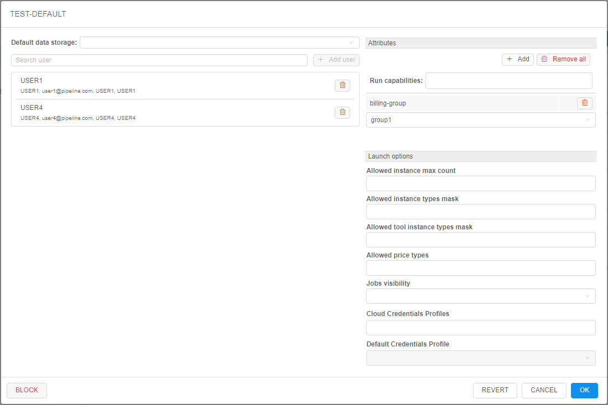
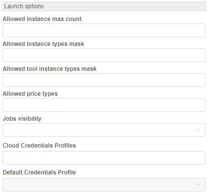
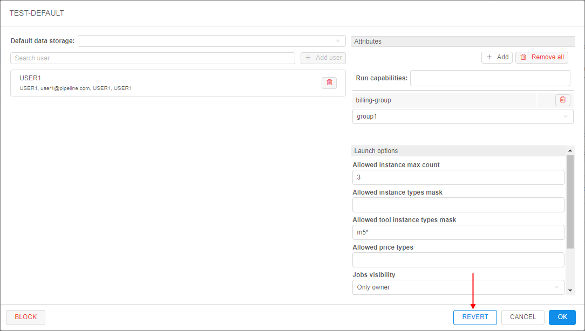

# 12.6. Edit a group (role)

- [Edit a group (role)](#edit-a-group-role)
    - [Default data storage](#default-data-storage)
    - [User management](#user-management)
    - [Attributes](#attributes)
    - [Launch options](#launch-options)
    - [Possibility to revert changes](#possibility-to-revert-changes)
- [Block/unblock a group](#blockunblock-a-group)

> User shall have **ROLE\_ADMIN** to edit groups/roles.

## Edit a group (role)

For edit a group/role:

1. Open **Groups/Roles** tab on **User management** section of the system-level settings.
2. Find a group (role).
3. Click **Edit** button in the row opposite the user name:  
    
4. Pop-up window will be shown:  
    

On this form there are several blocks of the settings for a group/role.

### Default data storage

Here you can select default data storage for a group/role:  

### User management

In this block you can change a member list of the selected group/role:  

For more information see [12.8. Change a set of roles/groups for a user](12.8._Change_a_set_of_roles_groups_for_a_user.md#change-a-member-list-for-a-selected-role-or-group).

### Attributes

  
In this block you can set metadata tags (attributes) for a group. These tags represent key/value pairs, same as pipeline/folder tags. For more information see [17. CP objects tagging by additional attributes](../17_Tagging_by_attributes/17._CP_objects_tagging_by_additional_attributes.md).

### Launch options

In this block you can specify some restrictions for a group of users/role on allowed instance types and price types.
Here you can specify:

| Field | Description | Example |
|---|---|---|
| **Allowed instance types mask** | This mask restrict for a specific group/role allowed instance types for launching tools, pipelines and configurations | If you want members of a certain group/role will be able to launch runs with only "m5..." instances types, mask would be **`m5*`**:  In that case, before launching tool, pipeline or configuration, dropdown list of available node types will be look like this:  |
| **Allowed tool instance types mask** | This mask restrict for a specific group/role allowed instance types only for tools - launching from tools menu or main dashboard. This mask has higher priority for launching tool than **Allowed instance types mask**. It's meaning that in case when both masks are set - for the launching tool will be applied **Allowed tool instance types mask**. | If you want members of a certain group/role will be able to launch tools with only some of "large" "m5..." instances types, mask would be **`m5*.large*`**:  In that case, before launching tool, dropdown list of available node types will be look like this:  |
| **Allowed price types** | In this field you may restrict, what price types will be allowed for a group/role. | If you want members of a certain group/role will be able to launch "On-demand" runs only, select it in the dropdown list:  In that case, before launching tool, dropdown list of price types will be look like this:  |
| **Jobs visibility** | In this field you may restrict the visibility of running jobs on the **Active Runs** page for non-owner users. | If you want users from that group (role) will be able to view all pipeline runs (for that pipelines on which users have corresponding permissions), select "Inherit" in this dropdown list:  If you want users from that group (role) can view only runs they launched, select "Only owner":  |

To apply set restrictions for a group/role click  button.

Setting restrictions on allowed instance types/price types is a convenient way to minimize a number of invalid configurations runs.  
Such restrictions could be set not only for a group/role, but on another levels too.  
In CP platform next hierarchy is set for applying of inputted allowed instance types (sorted by priority):

- User level (specified for a user on "User management" tab) (see [12.4. Edit/delete a user](12.4._Edit_delete_a_user.md#launch-options))
- User group level (specified for a group (role) on "User management" tab. If a user is a member of several groups - list of allowed instances will be summarized across all the groups) (see [above](#launch-options))
- Tool level (specified for a tool on "Instance management" panel) (see [10.5. Launch a Tool](../10_Manage_Tools/10.5._Launch_a_Tool.md#instance-management))
- _(global)_ **`cluster.allowed.instance.types.docker`** (specified on "Cluster" tab in "Preferences" section of system-level settings) (see [12.10. Manage system-level settings](12.10._Manage_system-level_settings.md#cluster))
- _(global)_ **`cluster.allowed.instance.types`** (specified on "Cluster" tab in "Preferences" section of system-level settings) (see [12.10. Manage system-level settings](12.10._Manage_system-level_settings.md#cluster))

After specifying allowed instance types, all GUI forms that allow to select the list of instance types (configurations/launch forms) - will display only valid instance type, according to hierarchy above.  
For price type specifying - if it is set for the user/group/tool - GUI will allow to select only that price type.

In CP platform next hierarchy is set for applying of jobs visibility (sorted by priority):

- User level - highest priority (specified for a user) (see [12.4. Edit/delete a user](12.4._Edit_delete_a_user.md#launch-options))
- Group level (specified for a group/role) (see [above](#launch-options))
- _(global)_ **`launch.run.visibility`** (specified as global defaults via system-level settings) (see [12.10. Manage system-level settings](12.10._Manage_system-level_settings.md#launch))

### Possibility to revert changes

In certain cases, there could be convenient to undo all changes in a group/role profile when modifying it - without closing the form.

The admin has such ability:

- open the **User management** tab and then the **Groups**/**Roles** tab
- select the desired group to modify, click the **Edit** button to open the popup with the group's settings
- edit some settings
- if needed to revert done changes - click the **REVERT** button at the bottom of the form (**_Note_**: it's possible only before saving!):  
      
- all done unsaved changes are reverted. The **REVERT** button becomes disabled:  
    

**_Note_**: in such way all unsaved changes of user settings could be reverted - _Default data storage_, _Users_ list, _Attributes_ and _Launch options_.

## Block/unblock a group

To block a group:

1. Open the **Groups** tab on the **User management** section of the system-level settings.
2. Click the **Edit** button next to the group's name.  
      
    **_Note_**: system groups are created by the **SSO authentication system** automatically and can not be found here.
3. Pop-up window will be displayed:  
    
4. Click the **BLOCK** button
5. Confirm the blocking:  
    

To unblock a group:

1. Open the **Groups** tab on the **User management** section of the system-level settings.
2. Click the **Edit** button next to the group's name.  
      
3. Pop-up window will be shown:  
    
4. Click the **UNBLOCK** button
5. Confirm the unblocking:  
    
