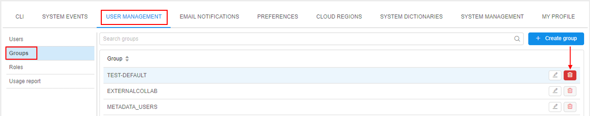

# 12.7. Delete a group

> User shall have **ROLE\_ADMIN** to delete a group.

1. Navigate to **User management** tab.
2. Move to **Groups** tab.
3. Click **Delete** button next to the group's name.  
    **_Note_**: system groups are created by the **SSO authentication system** automatically and can not be found/deleted here.  
    
4. Confirm the deletion:  
    
