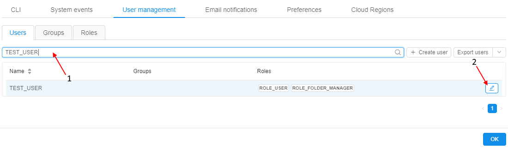
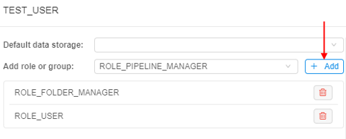
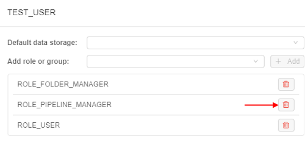
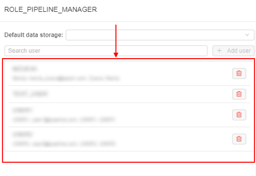
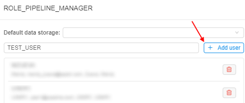

# 12.8. Change a set of roles/groups for a user

> User shall have **ROLE\_ADMIN** to change groups(roles) for a user.

There are two ways to set a role or group to a user:

1. [Change a set of roles and groups to a selected user from the **Users** tab](#change-a-set-of-roles-and-groups-to-a-selected-user).
2. [Change a member list for a selected role or group](#change-a-member-list-for-a-selected-role-or-group).

**_Note_**: the scenarios below shows a process using Roles as an example. Setting groups for a user happens in the same manner.

## Change a set of roles and groups to a selected user

1. Navigate to **User management** tab. Make sure that you are in the **Users tab** area.
2. Find user on the list (you can use **Search** field - see the picture below, **1**).
3. Click the **Edit** button (see the picture below, **2**).  
    
4. The editing form is open. To assign a role or group to the user, click on **"Add role or group"** field and select the desired item from the drop-down list.  
    
5. When the desired item is selected, the **+ Add** control will be enabled.  
    
6. To delete roles or groups, use the **Delete** button.  
    
7. Click OK and all changes will be saved and displayed in the Users tab table.  
    

## Change a member list for a selected role or group

1. Navigate to the **User management** tab.
2. Move to **Roles** tab.
3. Click the **Edit** button next to Role's name.  
    
4. You'll see a list of users assigned to the role.  
    
5. Look for the desired user via **Search** field.  
    
6. When the user is selected, the **+Add user** control will be enabled.
7. Click **+Add user** control to add a new user to the role member list.  
    
8. To delete a user from the role member list, click **Delete** button next to user's name.  
    
9. Click **OK** and all changes will be saved and displayed in the **Users** tab table.