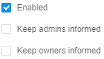
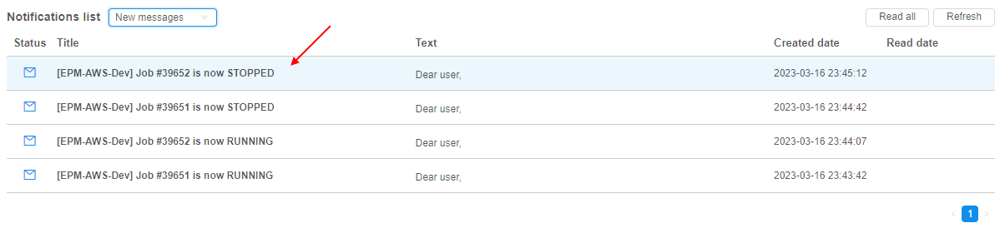

# 12.9. Email notifications

> User shall have **ROLE\_ADMIN** to manage Email notifications.

- [Change the email notification](#change-the-email-notification)
- [Configure automatic email notifications on users' runs](#configure-automatic-email-notifications-on-users-runs)
    - [IDLE runs](#idle-runs)
    - [Notifications for long paused runs](#notifications-for-long-paused-runs)
    - [Example of the scenario for automatic notifications for "idle" runs](#example-of-the-scenario-for-automatic-notifications-for-idle-runs)
    - [HIGH-CONSUMED runs](#high-consumed-runs)
- [Push notifications](#push-notifications)
    - [View push notifications](#view-push-notifications)
    - [Notifications section](#notifications-section)
    - [Settings](#settings)

## Change the email notification

1. Navigate to the **Settings** tab.
2. Select the **Email notifications** section.
3. Choose any of the email notification types (e.g. **LONG\_INIT**) on the left:  
    
4. Remove **Keep admins informed** and **Keep owners informed** options. This email notification type will no longer inform admins and owners.  
    
5. Add a new user to the **Informed users**. While typing system will suggest you users. When you selected all users, click outside this field.  
    
6. Change the **Threshold** parameter to e.g. 1400.  
    
7. Press the **Save** button to save all changes to the **LONG\_INIT** email notification template.  
    

## Configure automatic email notifications on users' runs

Here, the mechanism of automatic email notifications for **_IDLE_** and **_HIGH-CONSUMED_** runs will be described.

### IDLE runs

The system behavior for the **_IDLE_** runs is defined by the set of the following parameters:

| Setting | Preference-duplicate | Description |
| - | - | - |
| **Max duration of idle** (min) | **`system.max.idle.timeout.minutes`** | Specifies the duration in minutes after that the system should check node's activity. If after this duration node's CPU utilization will be below **CPU idle threshold** - email notification **`IDLE_RUN`** will be sent to the user and the run itself will be marked by  label |
| **Action delay** (min) | **`system.idle.action.timeout.minutes`** | Specifies the duration in minutes. If node's CPU utilization is still below **CPU idle threshold** for this duration after the **Max duration of idle** is over - an action, specified in **Action** field will be performed |
| **CPU idle threshold** (%) | **`system.idle.cpu.threshold`** | Specifies percentage of the node's CPU utilization, below which an **Action** shall be taken |
| **Action** | **`system.idle.action`**	| Sets which action to perform with the node, that has the CPU utilization below than **CPU idle threshold**: <ul><li>_NOTIFY_ - only send email notification **`IDLE_RUN`**. This action will be repeated every **Resend delay** if the node's CPU utilization will be still below than **CPU idle threshold**</li><li>_PAUSE_ - pause an instance if possible (only if the instance is `On-Demand`, `Spot` instances are skipped) and send single email notification **`IDLE_RUN_PAUSED`**</li><li>_PAUSE\_OR\_STOP_ - pause an instance if it is `On-Demand` or stop an instance if it is `Spot` and send the corresponding single email notification **`IDLE_RUN_PAUSED`** / **`IDLE_RUN_STOPPED`**</li><li>_STOP_ - Stop an instance, disregarding price-type, and send single email notification **`IDLE_RUN_STOPPED`**</li></ul> |
| **Resend delay** (sec) Only for **`IDLE_RUN`** notification | | Specifies the duration in seconds. Defines a delay after which the **`IDLE_RUN`** notification will be sent repeatedly in case when node's CPU utilization is still below **CPU idle threshold**. **`IDLE_RUN`** notifications will be repeated until **Action delay** is over. Then **Action** will be performed. **_Note_**: if **Action** is set as _NOTIFY_ - sending notifications will be continued every **Resend delay**. **Default value**: `-1`. In that case, **`IDLE_RUN`** notifications will not be resending. |
| | **`system.resource.monitoring.period`** | Specifies period (in milliseconds) between the scannings of running instances to collect the monitoring metrics. After each such period, it's defined to display  label for the specific instance or not |

Described parameters are configured in "common" panel for all **_IDLE_** notifications - **`IDLE_RUN`**, **`IDLE_RUN_PAUSED`**, **`IDLE_RUN_STOP`**, e.g.:  
    

Saving of the changes in described parameters values at the **EMAIL NOTIFICATIONS** form automatically changes the corresponding values in **PREFERENCES**, and vice versa.

### Notifications for long paused runs

There are two notification types for the runs that are in the **_PAUSED_** state for a long time:

**`LONG_PAUSED`** - this notification will be sent if the run has been paused for a long time.  
**`LONG_PAUSED_STOPPED`** - this notification will be sent if the run has been paused for a long time and should be terminated.

The system behavior for the "long paused" runs is defined by the set of the following parameters:

| Setting | Preference-duplicate | Description |
| - | - | - |
| **Action** _Common setting for both notification types_ | **`system.long.paused.action`** | Sets which action to perform with the node, that has been paused for a long time: <ul><li>_NOTIFY_ - only send email notification **`LONG_PAUSED`**. Then this action will be repeated every **Resend delay** if the run will be still paused</li><li>_STOP_ - terminate the paused run and send single email notification **`LONG_PAUSED_STOPPED`**</li></ul> |
| **Threshold** (sec) _Separately sets for each notification type_ | | Specifies the duration in seconds. Defines the delay after which an action, specified in **Action** field, will be performed and the corresponding notification will be sent if the run is still paused. |
| **Resend delay** (sec) Only for **`LONG_PAUSED`** notification type | | Specifies the duration in seconds. Defines a delay after which the **`LONG_PAUSED`** notification will be sent repeatedly in case when the run is still paused after a **Threshold** duration. **_Note_**: if **Action** is set as _NOTIFY_ - sending notifications will be continued every **Resend delay**. **Default value**: `-1`. In that case, **`LONG_PAUSED`** notifications will not be resending. |

Saving of the changes in described parameter value (for **Action**) at the **EMAIL NOTIFICATIONS** form automatically changes the corresponding value in **PREFERENCES**, and vice versa.

For example, **`LONG_PAUSED`** notification settings:  
    

### Example of the scenario for automatic notifications for "idle" runs

In general, the system behavior is the following:

1. User launches a run
2. After **Max duration of idle** (**`system.max.idle.timeout.minutes`**) period, the system starts to check the node's activity. Then, the state of the node is checked every **`system.resource.monitoring.period`**
3. If the node's CPU utilization becomes below the **CPU idle threshold** (**`system.idle.cpu.threshold`**):
    - email notification **`IDLE_RUN`** is being sent, the run itself is being marked by the  label
4. **`IDLE_RUN`** notification is being repeated every **Resend delay** (configured for **`IDLE_RUN`**) until the **Action delay** (**`system.idle.action.timeout.minutes`**) period is over.
5. After **Action delay** (**`system.idle.action.timeout.minutes`**), if the node's CPU utilization is still below **CPU idle threshold** (**`system.idle.cpu.threshold`**):
    - email notification **`IDLE_RUN`** is being sent (in case when **Action** (**`system.idle.action`**) is set as _NOTIFY_)
    - run is being paused/stopped and the corresponding email notification **`IDLE_RUN_PAUSED`** or **`IDLE_RUN_STOPPED`** is being sent (in case when **Action** (**`system.idle.action`**) is set as _PAUSE_ / _PAUSE\_OR\_STOP_ / _STOP_)
6. In case when **Action** (**`system.idle.action`**) is set as _NOTIFY_, email notifications **`IDLE_RUN`** continue to be sent every **Resend delay**, if the node's CPU utilization remains below the **CPU idle threshold** (**`system.idle.cpu.threshold`**).
7. In case when run has been paused:
    - if the **Action** (for Long Paused notifications - **`system.long.paused.action`**) is set as _NOTIFY_, and the run has been paused for a **Threshold** period (configured for **`LONG_PAUSED`**), the notification **`LONG_PAUSED`** is being sent.
        - and if **Resend delay** (for **`LONG_PAUSED`**) is configured, then email notifications **`LONG_PAUSED`** continue to be sent every **Resend delay**, if the run is still paused
    - if the **Action** (for Long Paused notifications - **`system.long.paused.action`**) is set as _STOP_, and the run has been paused for a **Threshold** period (configured for **`LONG_PAUSED_STOPPED`**), run is being stopped (terminated) and the corresponding email notification **`LONG_PAUSED_STOPPED`** is being sent.

**_Note_**: users can manually disable the automatic pausing of on-demand instances if they aren't used. For that the "**Auto pause**" checkbox at the Launch page shall be unchecked before the run:  
      
This action cancels only the auto pause, but the **`RUN_IDLE`** email notifications will be being sent (if the corresponding conditions will be met).

### HIGH-CONSUMED runs

All settings that configure actions/notifications for "high-consumed" runs are moved to the **EMAIL NOTIFICATIONS** section. These settings duplicate some System Preferences and also can be configured from the **PREFERENCES** section, but it is more comfortable to configure them from the **NOTIFICATIONS**.

**`HIGH_CONSUMED_RESOURCES`** notification settings:  
    

The system behavior for the "high-consumed" runs is defined by the set of the following System-level parameters (Preferences):

| Setting | Preference name | Description |
| - | - | - |
| **Threshold of disk consumption** (%) | **`system.disk.consume.threshold`** | Specifies the node's disk threshold (in %) above which the email notification **`HIGH_CONSUMED_RESOURCES`** will be sent and the corresponding run will be marked by  label |
| **Threshold of memory consumption** (%) | **`system.memory.consume.threshold`** | Specifies the node's memory threshold (in %) above which the email notification **`HIGH_CONSUMED_RESOURCES`** will be sent and the corresponding run will be marked by the  label |
| **`system.monitoring.time.range`** | | Specifies the threshold timeout (if a real average resource consumption is higher then any of the thresholds above for that timeout - a notification shall be sent). Also defines the period after which the notification will be sent again, if the problem is still in place |

So, when memory or disk consuming will be higher than a threshold value for a specified period of time (in average) - a notification will be sent (and resent after a delay, if the problem is still in place).

Saving of the changes in described parameters values at the **EMAIL NOTIFICATIONS** form automatically changes the corresponding values in **PREFERENCES**, and vice versa.

***

## Push notifications

All email notifications, that are sending by Cloud Pipeline platform, are also duplicated as push notifications. This allows to view notifications right in the platform GUI.  
Push notifications do not require additional configuring - they are fully the same as corresponding email notifications, i.e. have the same header, content, recipients list, frequency and trigger of sending, etc.  
Therefore, administrator shall only configure [email notifications](#change-the-email-notification) once - platform will automatically duplicate emails sending as push notifications on the GUI.

### View push notifications

Once any system event is occurred and its trigger for sending email notification has fired, email will be sent to the configured recipients (according to the notification template settings).  
Simultaneously, the push notification (with the same subject and body as in the email) will be "sent" to the same recipients.  
If these recipients are working in the Cloud Pipeline GUI at that moment or when they will open the platform GUI next time, they will view the corresponding push notification - in the right-upper corner, over any layout Cloud Pipeline page, e.g.:  
    

At the same moment, near the [**Notifications**](#notifications-section) icon in the main menu will appear a count of new unread messages:  
    

To view details and full notification body, click the notification tile. Notification will be opened in a pop-up:  
      
Once that pop-up is closed, the notification will be marked as "read", the counter near the [**Notifications**](#notifications-section) icon in the main menu will decrease.  
If you close the push notification by click the cross-button on it, such notification also will be marked as "read":  
    

If there are several push notifications were received, a couple of them will be shown with short details and the rest will be collapsed into a tile, e.g.:  
    

Such collapsed tile contains:

- a label with a count of collapsed notifications
- button **hide** - to hide all appeared push notifications but left them "_unread_"
- button **read all** - to hide all appeared push notifications and mark them as "_read_"

### Notifications section

**Notifications** section allows to view all push notifications/emails sent to the current user.  
To open the section, click the corresponding button in the main menu:  
    

This page allows to view notifications. By default, new "unread" notifications list will be shown (as on the picture above).  
To view "read" notifications list, select the corresponding item in the dropdown list near the page title:  
       
"Read" notifications list will appear:  
    

Notifications list has the following fields:

- **Status** - status of the notification ("unread" or "read", distinct by the icon color)
- **Title** - notification title - it corresponds to the original email subject
- **Text** - first row of the notification text - it corresponds to the beginning of the original email body
- **Created date** - date and time of the notification push
- **Read date** - date and time when the notification is read

Additionally, the page contains controls:

- **Read all** button - to mark all new "unread" notifications as "read"
- **Refresh** button - to refresh notifications lists and update a counter of "unread" notifications

To view the notification - click it in the list, e.g.:  
      
Notification will be opened in a pop-up:  
      
If the notification was new and "unread" - once that pop-up is closed, the notification will be marked as "read" and will be placed to the corresponding notifications list.

### Settings

#### Mute notifications

If user do not want to receive push notifications over all forms and pages in the platform GUI - they can be "muted".  
For that, user shall:

1. Open **System settings**
2. Select the tab **My profile**
3. In the **Profile** sub-tab, tick the checkbox "**Mute email notifications**":  
      

After, new notifications will be appearing only in the [**Notifications**](#notifications-section) section, but corresponding pushs will not be showing.

#### Storing period

Admins can configure the period for which described GUI notifications will be stored.  
It can be done via the system preference **`system.notifications.exp.period`**.  
This preference set the duration of the period in days after which old received notifications will be removed.  
The default value is not set (blank). This means that notifications are not being removed at all.
