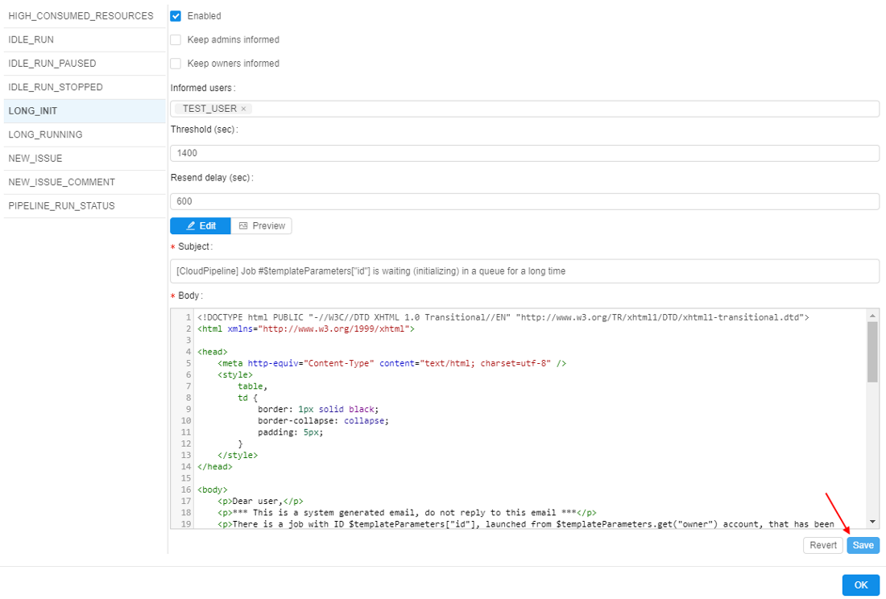

# 12.9. Change email notification

> User shall have **ROLE\_ADMIN** to manage Email notifications.

1. Navigate to the **Settings** tab.
2. Select the **Email notifications** section.
3. Choose any of the email notification types (e.g. **LONG\_INIT**) on the left:  
    
4. Remove **Keep admins informed** and **Keep owners informed** options. This email notification type will no longer inform admins and owners.  
    
5. Add a new user to the **Informed users**. While typing system will suggest you users. When you selected all users, click outside this field.  
    
6. Change the **Threshold** parameter to e.g. 1400.  
    
7. Press the **Save** button to save all changes to the **LONG\_INIT** email notification template.  
    